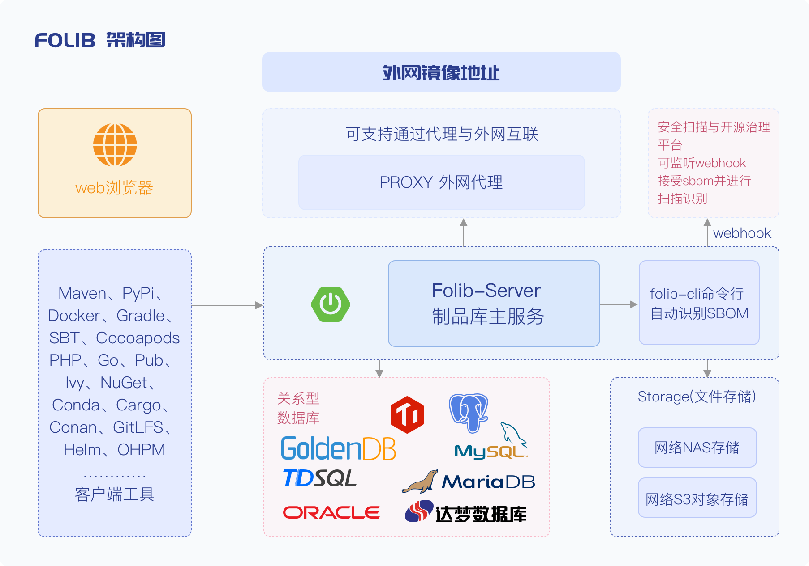

<p align="center"><a href="https://folib.com"></a></p>
<h3 align="center">一个为Ai研发而生的、全语言软件供应链服务平台</h3>
<p align="center">


<br>
</p>
<hr />

[English](./README_en.md) | 简体中文

FOLib 是一个为Ai研发而生的、全语言软件供应链服务平台。

-   **语言支持范围**：23+种全语言仓库，涵盖npm、Maven、PyPi、Docker、Gradle、SBT、Cocoapods、Swift、RPM、Debian、OPKG、PHP、Go、Pub、Ivy、NuGet、Conda、Cargo、Conan、Yarn、GitLFS、Helm、OHPM等主流工具；
-   **AI模型库与生态**：涵盖Huggingface、Ollama、ModelScope 等主流AI模型仓库的代理与同步， 并支持工具私有化上传与晋级分发；
-   **AIAgent与MCP支持**：支持元数据需求-服务-制品-安全漏洞-依赖证书等多维图数据的查询与展示，并支持MCP上下文协议，可通过AIAgent实现制品库的智能查询与推荐、安全漏洞的智能修复、智能晋级同步等功能；
-   **容器化与云原生支持**：支持Docker V1/V2/OCI镜像格式，支持nerdctl、crictl、ctr、podman等多客户端，支持分层传输，单层断点续传。 支持webdav为大文件提供云原生数据挂载能力。

## 快速开始

### 镜像部署

Tips: MYSQL需要先准备好
```
1、创建目录，以/data/folib为例
mkdir -p /data/folib/folib-data/logs

2、启动容器
docker run -itd -p 38080:38080 -p 7010:7010 -p 7011:7011 -p 7199:7199 -p 49142:49142 -p 8182:8182 \
--name folib-server \
--restart=always --privileged=true \
-e FOLIB_PORT=38080 \
-e FOLIB_JVM_XMX=8192m \
-e FOLIB_JVM_XMS=8192m \
-e FOLIB_JVM_XSS=512k \
-e FOLIB_MYSQL_HOST=127.0.0.1 \
-e FOLIB_MYSQL_PORT=3306 \
-e FOLIB_MYSQL_DB=folib \
-e FOLIB_MYSQL_USER=root \
-e FOLIB_MYSQL_PASSWORD=folib@v587 \
-e FOLIB_ARTIFACT_UPLOAD_RESTRICTIONS=true \
-v /data/folib/folib-conf:/opt/folib/folib-3.0-SNAPSHOT/etc/conf \
-v /data/folib/folib-data:/opt/folib/folib-data \
-v /data/folib/tmp:/opt/folib/folib-3.0-SNAPSHOT/tmp \
public.folib.com/oss/docker/folib-server:latest

3、查看日志
docker logs -f --tail 100 folib-server

4、重启
docker restart folib-server

docker logs -f --tail 100 folib-server

# 用户名: admin
# 密码: folib@v587
```

### 虚机启动

Tips: JAVA环境需要先准备好

1、将folib-build模块下的/target/folib-build-3.0-SNAPSHOT.tar.gz或者/target/folib-build-3.0-SNAPSHOT.zip解压

2、将解压后的folib-build-3.0-SNAPSHOT目录下的folib-3.0-SNAPSHOT、folib-data拷贝至部署机器的/opt/folib目录下

3、准备启动脚本
```
#!/bin/bash

# 配置环境变量
export FOLIB_PORT=38080                 # 服务对外访问端口
export FOLIB_JVM_XMX=8192m  
export FOLIB_JVM_XMS=8192m
export FOLIB_JVM_XSS=512k
export FOLIB_MYSQL_HOST=127.0.0.1       # 数据库IP
export FOLIB_MYSQL_PORT=3306            # 数据库端口
export FOLIB_MYSQL_DB=folib             # 数据库名称
export FOLIB_MYSQL_USER=root            # 数据库账号
export FOLIB_MYSQL_PASSWORD=folib@v587  # 数据库密码
export FOLIB_ARTIFACT_UPLOAD_RESTRICTIONS=true

# 启动folib-server
nohup /opt/folib/folib-3.0-SNAPSHOT/bin/folib console > folib-server.log 2>&1 &


4、将3步骤保存到folib-server-start.sh中

5、授权
chmod u+x folib-server-start.sh

6、启动folib-server
sh folib-server-start.sh

7、查看日志
tail -f -n 100 folib-server.log

8、启动完成后，重启
/opt/folib/folib-3.0-SNAPSHOT/bin/folib stop

sh folib-server-start.sh

tail -f -n 100 folib-server.log
```
> 用户名: admin  密码: folib@v587


你也可以通过 [HelmChat](https://artifacthub.io/packages/helm/folib/folib) 快速部署 Folib。

如果是内网环境，推荐使用 [离线安装包方式](https://folib.com/deployDoc) 进行安装部署。

如你有更多问题，可以通过论坛和技术交流群与我们交流。

-   [产品介绍与案例](https://folib.com/customers)

-   [演示环境](https://demo.folib.com)

### 技术交流群
欢迎加入我们的技术交流群，还有不定期的各种活动。
<p align="left"><a href="https://folib.com"></a></p>


## 版本说明

FOLib 会平均每个季度一个版本。
- v3.00：发布时间为 2025 年 8 月 1 日，持续更新中；
- v3.1：接下来会发布一些AI mcp相关的功能；


FOLib 产品版本分为社区版和企业版，详情请参见：[FOLib产品版本对比](https://folib.com/pricing)

## 技术栈与架构

-   后端: [Spring Boot3.x](https://spring.io/projects/spring-boot)
-   前端: [Vue.js](https://vuejs.org/)
-   关系型数据库: 大部分数据库都支持
-   基础设施: [Docker](https://www.docker.com/)
-   文件存储: NFS/S3协议均支持
>前端打包成静态资源文件后与后端放在一起进行打包。
<p align=""><a href="https://folib.com"></a></p>


## 开发编译说明
### 环境准备
-   安装 [OPENJDK 17](URL_ADDRESS-   安装 [OPENJDK 17](https://www.oracle.com/java/technologies
-   安装maven 3.8.6 
-   安装node 14.21.3
### 编译执行
在代码根路径下找到folib-package.sh文件并进行执行
```shell
  sh folib-package.sh
```


## License & Copyright

Folib - [新一代AI制品仓库]
Copyright (C) 2025 bocloud.com.cn <folib@beyondcent.com>

This program is free software: you can redistribute it and/or modify
it under the terms of the GNU General Public License as published by
the Free Software Foundation, either version 3 of the License, or
(at your option) any later version.

本程序是自由软件：您可依据GNU通用公共许可证（GPL-3.0+）条款重新发布和修改，
但禁止任何形式的商业售卖行为（包括但不限于：直接销售、捆绑销售、云服务商用）。

This program is distributed WITHOUT ANY WARRANTY.
Commercial sale of this software is expressly prohibited.

For license details, see: https://www.gnu.org/licenses/gpl-3.0.html
商业授权咨询请联系：folib@beyondcent.com
