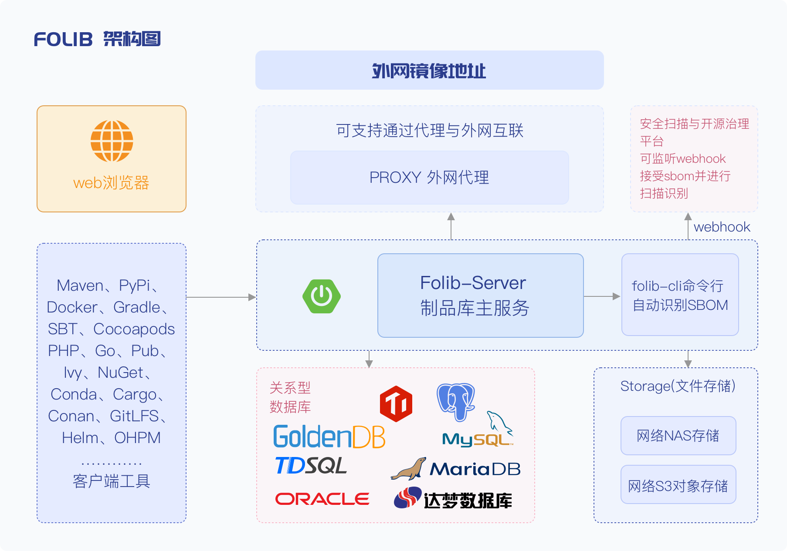

<p align="center"><a href="https://folib.com"></a></p>
<h3 align="center">A Full-Language Software Supply Chain Service Platform Built for AI R&D</h3>
<p align="center">


<br>
</p>
<hr />

[简体中文](./README.md) | English

FOLib is a full-language software supply chain service platform developed specifically for AI research and development.

-   **Language Support Scope**: Over 23 full-language repositories, covering mainstream tools such as npm, Maven, Cangjie (cjpm), Ohpm, PyPi, Docker, Gradle, SBT, Cocoapods, Swift, RPM, Debian, OPKG, PHP, Go, Pub, Ivy, NuGet, Conda, Cargo, Conan, Yarn, GitLFS, and Helm;
-   **AI Model Repository & Ecosystem**: Provides proxy and synchronization capabilities for mainstream AI model repositories including Huggingface, Ollama, and ModelScope. It also supports private upload and hierarchical distribution of tools;
-   **AIAgent & MCP Support**: Enables querying and visualization of multi-dimensional graph data such as metadata requirements, services, artifacts, security vulnerabilities, and dependency certificates. It supports the MCP context protocol, allowing AIAgent to implement intelligent query and recommendation of artifact repositories, intelligent repair of security vulnerabilities, and intelligent hierarchical synchronization;
-   **Containerization & Cloud-Native Support**: Supports Docker V1/V2/OCI image formats, multiple clients including nerdctl, crictl, ctr, and podman. It enables layered transmission and single-layer resumable upload. Additionally, it supports WebDAV to provide cloud-native data mounting capabilities for large files.

## Quick Start

### Our Code Repositories
- Gitcode: https://gitcode.com/folib/folib
- Github:  https://github.com/BoCloud/folib

### Deployment via Docker Image

Tips: MySQL and a docker-ce environment must be prepared in advance.
```
1. Create a directory (taking /data/folib as an example)
mkdir -p /data/folib/folib-data/logs

2. Start the container
docker run -itd -p 38080:38080 -p 7010:7010 -p 7011:7011 -p 7199:7199 -p 49142:49142 -p 8182:8182 \
--name folib-server \
--restart=always --privileged=true \
-e FOLIB_PORT=38080 \
-e FOLIB_JVM_XMX=8192m \
-e FOLIB_JVM_XMS=8192m \
-e FOLIB_JVM_XSS=512k \
-e FOLIB_MYSQL_HOST=127.0.0.1 \
-e FOLIB_MYSQL_PORT=3306 \
-e FOLIB_MYSQL_DB=folib \
-e FOLIB_MYSQL_USER=root \
-e FOLIB_MYSQL_PASSWORD=folib@v587 \
-e FOLIB_ARTIFACT_UPLOAD_RESTRICTIONS=true \
-v /data/folib/folib-conf:/opt/folib/folib-3.0-SNAPSHOT/etc/conf \
-v /data/folib/folib-data:/opt/folib/folib-data \
-v /data/folib/tmp:/opt/folib/folib-3.0-SNAPSHOT/tmp \
public.folib.com/oss/docker/folib-server:latest

3. View logs
docker logs -f --tail 100 folib-server

4. Restart the container
docker restart folib-server

docker logs -f --tail 100 folib-server

# Username: admin
# Password: folib@v587
```

### Deployment on Virtual Machine

Tips: A JAVA environment must be prepared in advance.

1. Extract the file folib-build-3.0-SNAPSHOT.tar.gz or folib-build-3.0-SNAPSHOT.zip from the /target directory under the folib-build module.

2. Copy the folib-3.0-SNAPSHOT and folib-data directories (from the extracted folib-build-3.0-SNAPSHOT folder) to the /opt/folib directory on the deployment machine.

3. Prepare the startup script
```
#!/bin/bash

# Configure environment variables
export FOLIB_PORT=38080                 # Port for external service access
export FOLIB_JVM_XMX=8192m  
export FOLIB_JVM_XMS=8192m
export FOLIB_JVM_XSS=512k
export FOLIB_MYSQL_HOST=127.0.0.1       # Database IP address
export FOLIB_MYSQL_PORT=3306            # Database port
export FOLIB_MYSQL_DB=folib             # Database name
export FOLIB_MYSQL_USER=root            # Database username
export FOLIB_MYSQL_PASSWORD=folib@v587  # Database password
export FOLIB_ARTIFACT_UPLOAD_RESTRICTIONS=true

# Start folib-server
nohup /opt/folib/folib-3.0-SNAPSHOT/bin/folib console > folib-server.log 2>&1 &


4. Save the content from Step 3 into a file named folib-server-start.sh

5. Grant execution permission
chmod u+x folib-server-start.sh

6. Start folib-server
sh folib-server-start.sh

7. View logs
tail -f -n 100 folib-server.log

8. After the initial startup, to restart the service:
/opt/folib/folib-3.0-SNAPSHOT/bin/folib stop

sh folib-server-start.sh

tail -f -n 100 folib-server.log
```
> Username: admin  Password: folib@v587


You can also quickly deploy Folib via [HelmChat](https://artifacthub.io/packages/helm/folib/folib).

For intranet environments, it is recommended to use the [offline installation package](https://folib.com/deployDoc) for deployment.

If you have more questions, you can communicate with us through the forum and technical exchange group.

-   [Product Introduction & Cases](https://folib.com/customers)

-   [Demo Environment](https://demo.folib.com)

### Technical Exchange Group
Welcome to join our technical exchange group, where we also hold regular events.
<p align="left"><a href="https://folib.com"></a></p>


## Version Description

FOLib releases a new version approximately every quarter. For the list of version updates, please refer to the [Change-Log](./changelog.md).
### The latest version currently is V3.10. It supports **cjpm for the Cangjie programming language** (https://gitcode.com/Cangjie/CangjieCommunity). Based on this, we have open-sourced cjpmp; for details about the tool, please visit [folib-cjpmp](https://gitcode.com/folib/cjpmp).


## V3.20 Product Preview

#### The next version will support ModelScope/Swift. In addition, Folib will be available in two editions: Community Edition and Enterprise Edition. For details, please refer to: [Folib Product Edition Comparison](https://folib.com/pricing)

## Technology Stack & Architecture

-   Backend: [Spring Boot3.x](https://spring.io/projects/spring-boot)
-   Frontend: [Vue.js](https://vuejs.org/)
-   Relational Database: Supports most mainstream databases
-   Infrastructure: [Docker](https://www.docker.com/)
-   File Storage: Supports both NFS and S3 protocols
>After the frontend is packaged into static resource files, it is bundled with the backend for packaging.
<p align=""><a href="https://folib.com"></a></p>


## Development & Compilation Instructions
### Environment Preparation
-   Install [OPENJDK 17](https://www.oracle.com/java/technologies/downloads/#java17)
-   Install Maven 3.8.6
-   Install Node 14.21.3
### Compilation & Execution
Locate the folib-package.sh file in the root directory of the code and execute it:
```shell
  sh folib-package.sh
```


## License & Copyright

Folib - [Next-Generation AI Artifact Repository]
Copyright (C) 2025 bocloud.com.cn <folib@beyondcent.com>

This program is free software: you can redistribute it and/or modify
it under the terms of the GNU General Public License as published by
the Free Software Foundation, either version 3 of the License, or
(at your option) any later version.

This program is free software: you may redistribute and modify it in accordance with the terms of the GNU General Public License (GPL-3.0+),
however, **any form of commercial sale is prohibited** (including but not limited to: direct sale, bundled sale, and commercial use in cloud services).

This program is distributed WITHOUT ANY WARRANTY.
Commercial sale of this software is expressly prohibited.

For license details, see: https://www.gnu.org/licenses/gpl-3.0.html
For commercial authorization inquiries, please contact: folib@beyondcent.com
