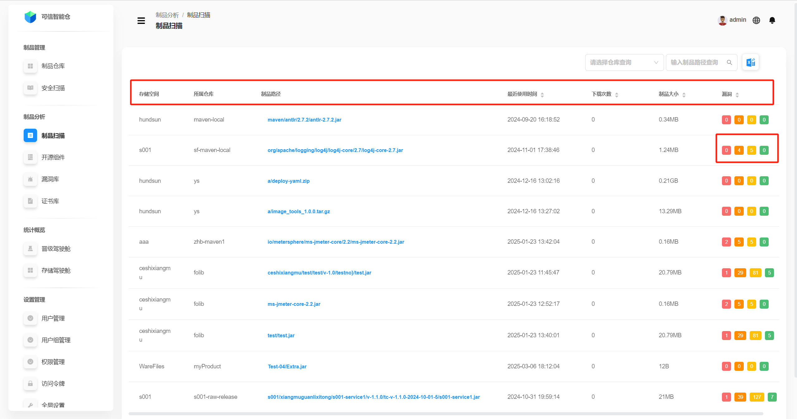
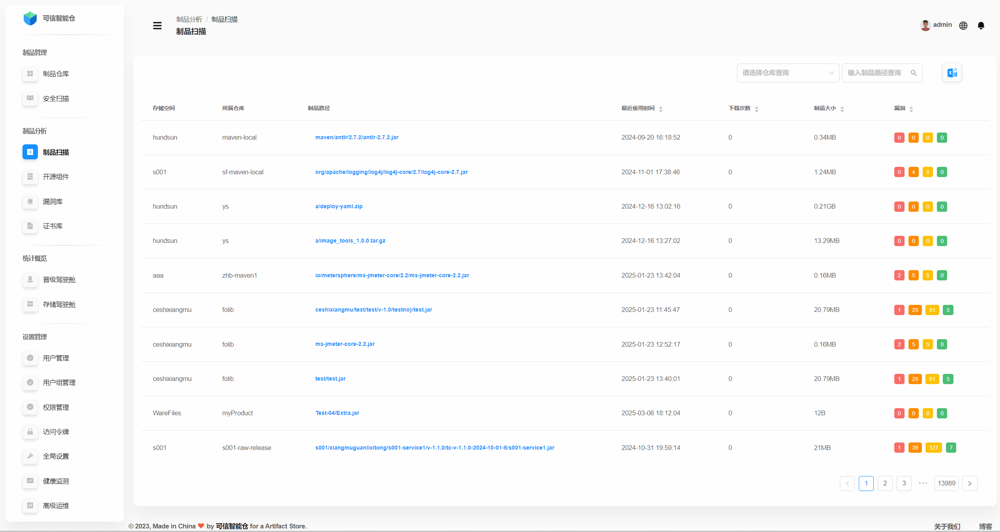
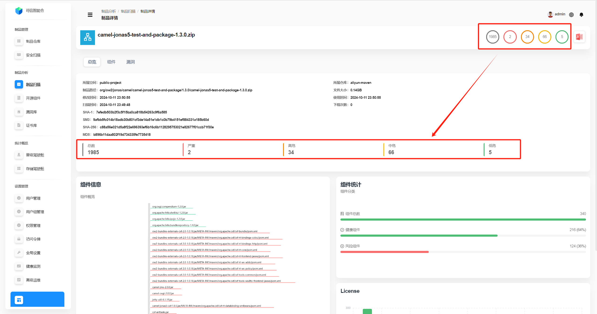
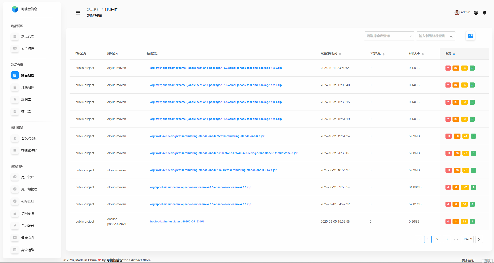
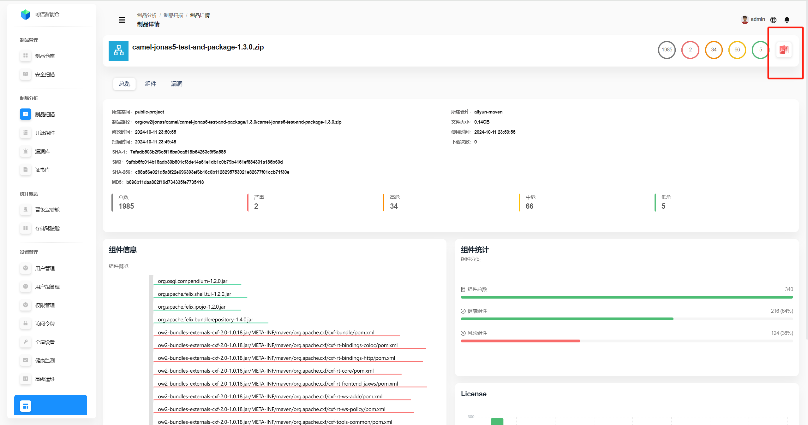
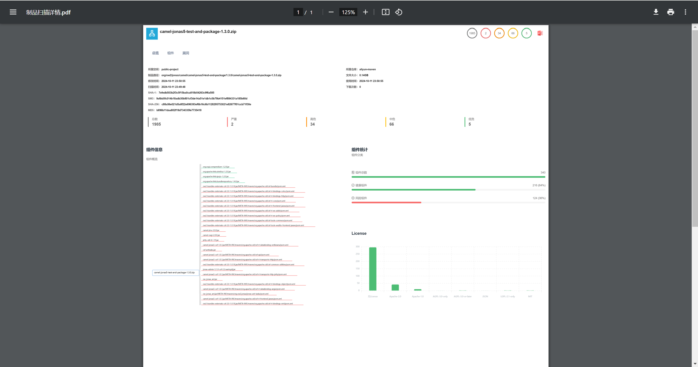
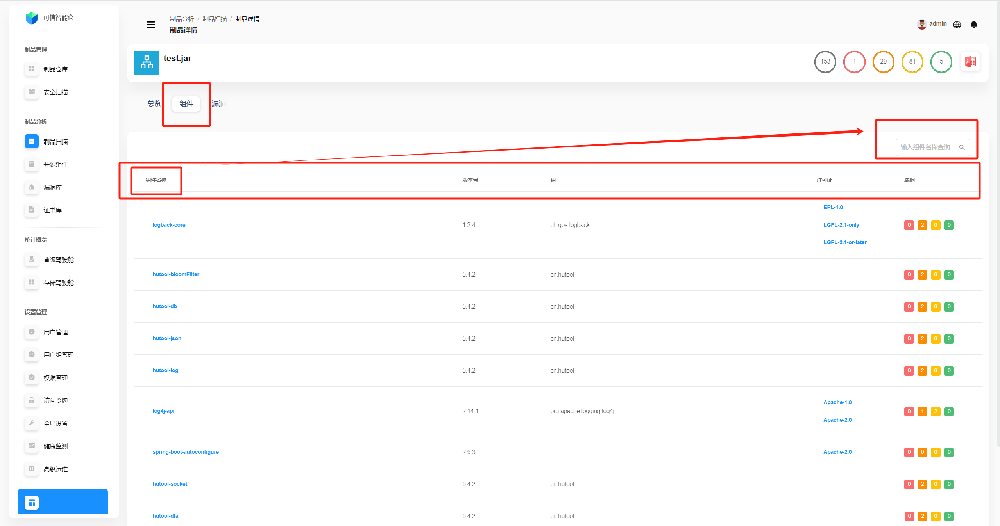
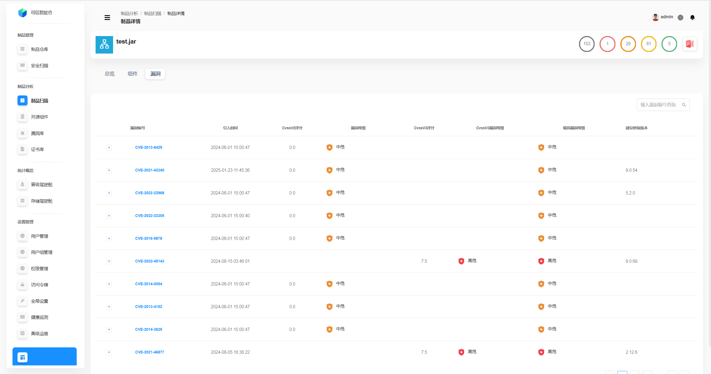

# 制品扫描

## 制品扫描数据列表

制品扫描数据列表展示了平台中所有成功扫描的制品数据。

| 字段名称       | 描述                                                             |
|----------------|----------------------------------------------------------------|
| 存储空间       | 制品所属的存储空间。                                                     |
| 所属仓库       | 制品所属的仓库。                                                       |
| 制品路径       | 制品在仓库目录下的存放位置,**点击可进入制品详情页面**。                                 |
| 最近使用时间   | 制品最近一次被使用的时间。支持按时间最近/最远排序。                                     |
| 下载次数       | 制品被下载的次数。支持按下载次数最多/最少排序。                                       |
| 制品大小       | 制品文件的大小。支持按制品大小最大/最小排序。                                        |
| 漏洞           | 从左往右（从红到绿）依次是 **严重**、**高危**、**中危**、**低危** 的漏洞数量。支持按漏洞总数最多/最少排序。 |

## 制品扫描数据查询

支持通过**仓库**和**制品路径**两个维度进行分别/组合查询。

## 制品详情总览

**点击制品路径**，进入制品详情页面，先默认呈现**制品详情总览**。

| 字段名称   | 描述                                              |
|------------|-------------------------------------------------|
| 所属空间   | 制品所属的存储空间。                                      |
| 所属仓库   | 制品所属的仓库。                                        |
| 制品路径   | 制品在仓库目录下的存放位置。                                  |
| 文件大小   | 制品文件的大小。                                        |
| 修改时间   | 制品最近一次被修改的时间。                                   |
| 使用时间   | 制品最近一次被使用的时间。                                   |
| 扫描时间   | 制品最近一次被扫描的时间。                                   |
| 下载次数   | 制品被下载的次数。                                       |
| SHA-1      | 制品的SHA-1值，用于唯一标识该制品。主要用于低安全需求场景。                |
| SM3        | 制品的SM3值，用于唯一标识该制品。适用于高安全需求场景。主要用于国内标准。          |
| SHA-256    | 制品的SHA-256值，用于唯一标识该制品。适用于高安全需求场景。               |
| MD5        | 制品的MD5值，用于唯一标识该制品。主要用于低安全需求场景。                  |
|统计数据| 从左往右依次是**总数**、**严重**、**高危**、**中危**、**低危**的漏洞数量。 |

可通过鼠标滚轮放大或缩小组件概览图，将光标悬停在对应组件上可查看对应组件的**漏洞总数、严重数量、高危数量、中危数量、低危数量**。

右边的**组件统计**是根据左侧的**组件信息**进行的统计，**只要该组件含漏洞**就是**风险组件**，**0漏洞组件**是**健康组件**。

右下的**license**是制品中所有组件的许可证信息，光标悬停在对应的柱形上可查看该许可证的具体数量。

**统计数据PDF导出**：点击右上角图标，即可自动下载PDF格式的统计数据，如下图所示。

<table>
  <tr>
    <td></td>
    <td></td>
  </tr>
</table>

## 制品组件

点击**组件**，切换展示制品组件。

这里的组件是指制品中所包含的**所有类型**的组件，如开源组件、自研组件等。支持通过**组件名称**查询。

| 字段名称   | 描述                                         |
|------------|--------------------------------------------|
| 组件名称   | 组件的名称。                                     |
| 版本号     | 组件的版本号。                                    |
| 组         | 组件所属的组织或者机构的标识符。                           |
| 许可证     | 组件的许可证。                                    |
| 漏洞       | 从左往右依次是 **严重**、**高危**、**中危**、**低危** 的漏洞数量。 |

## 制品漏洞

点击**漏洞**，切换展示制品漏洞列表。支持通过**漏洞编号**查询。

| 参数名称         | 解释                                 |
|------------------|------------------------------------|
| 漏洞编号         | 漏洞的唯一标识符，通常是一个编号或ID，用于区分不同的漏洞。     |
| 引入时间         | 漏洞被引入的时间。                     |
| CvssV2评分       | 根据CVSS（通用漏洞评分系统）版本2的评分，用于衡量漏洞的严重性。 |
| CvssV2漏洞等级   | 根据CVSS V2评分得出的漏洞等级，通常分为低危、中危、高危等。  |
| CvssV3评分       | 根据CVSS版本3的评分，用于衡量漏洞的严重性。           |
| CvssV3漏洞等级   | 根据CVSS V3评分得出的漏洞等级，通常分为低危、中危、高危等。  |
| 最高漏洞等级     | 在多个漏洞等级中，最高的漏洞等级，用于快速评估风险。         |
| 建议修复版本     | 建议升级到的版本，以修复该漏洞。                   |