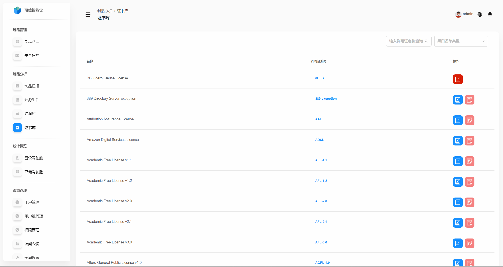
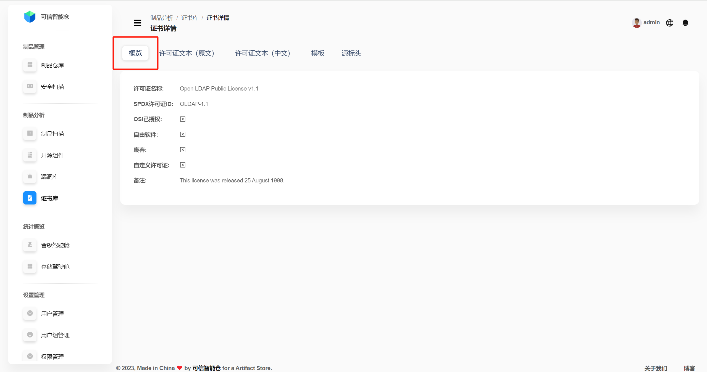
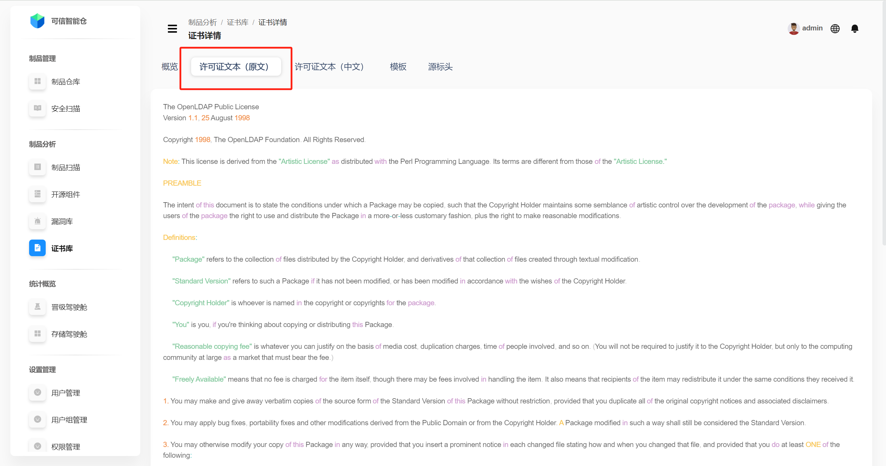
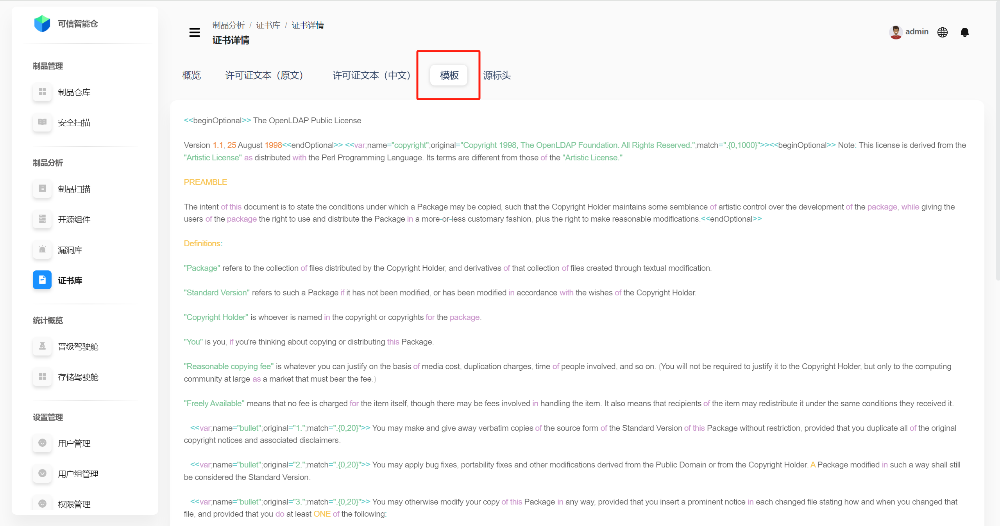
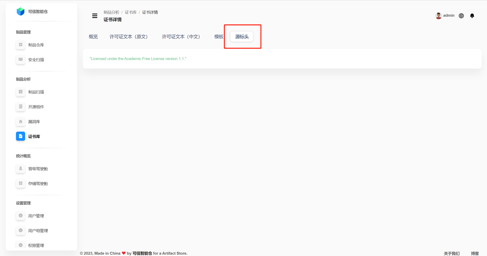

# 证书库

## 证书库列表

证书库展示平台存储的所有许可证列表。支持通过许可证名称、黑白名单类型查询。支持加入/移除黑白名单。

| 名称 | 解释 |
|------|------|
| **许可证名称** | 许可证的名称。 |
| **许可证编号** | 许可证的唯一标识。 |
| **操作** | 支持加入/移除黑白名单。许可证未加入黑白名单时，有蓝红两个标识按钮，点击蓝色按钮加入白名单，点击红色按钮加入黑名单。许可证已加入黑/白名单时，仅有一个标识按钮，点击可将其从黑/白名单移除。 |

## 证书详情

点击对应证书的**许可证编号**，进入**证书详情**页面。默认呈现证书详情**概览**。

+ **概览**

| 术语               | 定义                                           |
|--------------------|----------------------------------------------|
| 许可证名称         | 许可证的名称。                                   |
| SPDX许可证ID       | SPDX（Software Package Data Exchange，软件包数据交换）标准中用于唯一标识许可证的简短标识符。 |
| OSI已授权         | 是否为OSI（Open Source Initiative，开源促进会）已授权的许可证。 |
| 自由软件           | 是否为自由软件许可证。                               |
| 废弃               | 是否为废弃许可证。                                 |
| 自定义许可证       | 是否为自定义许可证。                                |
| 备注               | 许可证的备注信息。                                 |

 

+ **许可证文本**

点击**许可证文本（原文）/许可证文本（中文）**，查看许可证的英文原文/中文翻译。

 

 

+ **模版**

通过使用模板，可以在生成具体的许可证文本时根据需要插入或修改变量，同时保持整体结构和格式的一致性。

 

+ **源标头**

指在软件源代码文件中，通常位于文件顶部的注释部分，用于声明该文件的许可证信息、版权声明以及其他相关信息。

如下图示例，`"Licensed under the Academic Free License version 1.1."`, 表明该代码文件或项目是根据 Academic Free License 版本 1.1 授权的。

