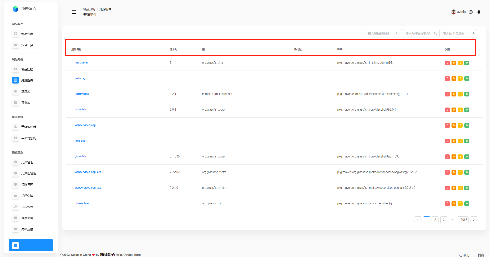
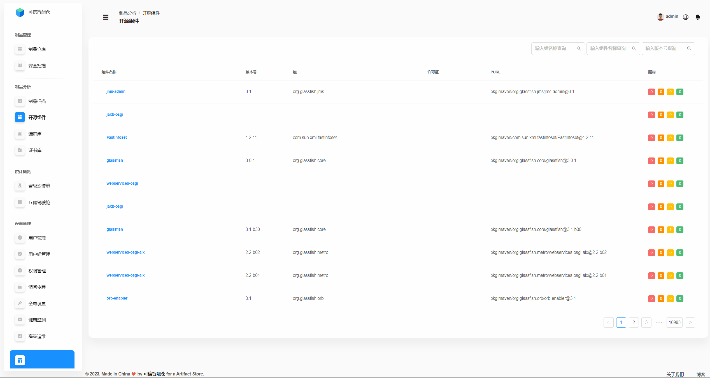
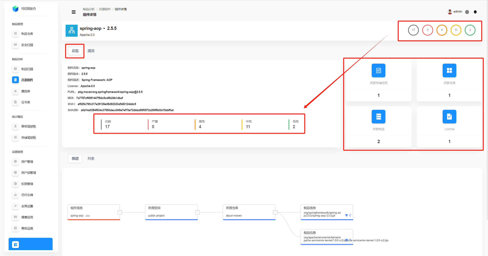
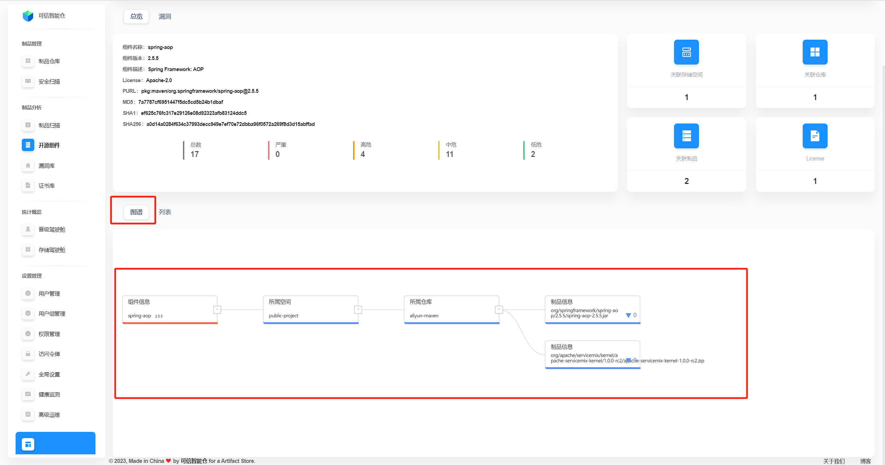
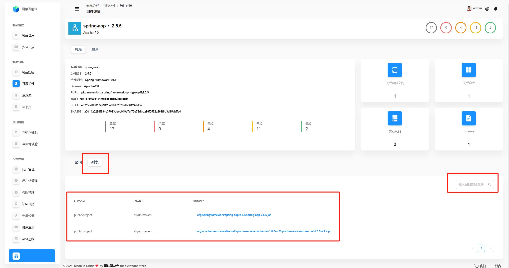
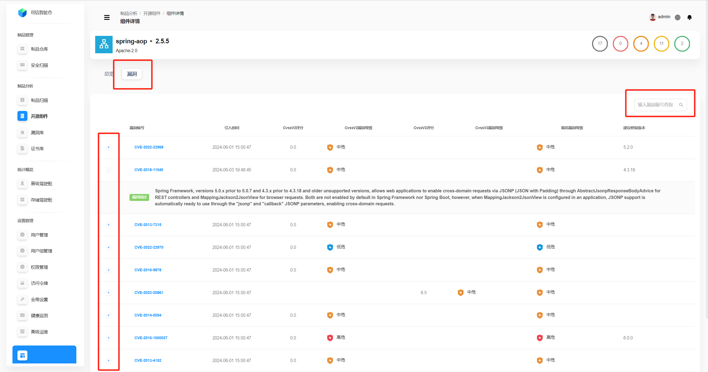

# 开源组件

## 组件列表

这里展示了整个平台的所有开源组件的列表。

| 字段名称   | 描述                                                                                                                                                                                                                                                                                                                                                                                                                                                                                                                                                                                                                                                                                                                                                                                                                                |
|------------|-----------------------------------------------------------------------------------------------------------------------------------------------------------------------------------------------------------------------------------------------------------------------------------------------------------------------------------------------------------------------------------------------------------------------------------------------------------------------------------------------------------------------------------------------------------------------------------------------------------------------------------------------------------------------------------------------------------------------------------------------------------------------------------------------------------------------------------|
| 组件名称   | 组件的名称。                                                                                                                                                                                                                                                                                                                                                                                                                                                                                                                                                                                                                                                                                                                                                                                                                            |
| 版本号     | 组件当前的版本。                                                                                                                                                                                                                                                                                                                                                                                                                                                                                                                                                                                                                                                                                                                                                                                                                          |
| 组         | 组件所属的组织或者机构的标识符。                                                                                                                                                                                                                                                                                                                                                                                                                                                                                                                                                                                                                                                                                                                                                                                                                  |
| 许可证     | 组件的许可证。                                                                                                                                                                                                                                                                                                                                                                                                                                                                                                                                                                                                                                                                                                                                                                                                                           |
| PURL       | PURL（Package URL）是一个用于唯一标识软件包的标准化URL。它的基本格式如下： `pkg:<type>/<namespace>/<name>@<version>?<qualifiers>#<subpath>`  **`pkg`**：固定前缀，表示这是一个软件包的标识符。 **`<type>`**：指定软件包的类型，例如 `maven`、`npm`、`pypi` 等。它表示软件包所属的生态系统或包管理器。 **`<namespace>`**：可选字段，用于指定软件包的命名空间。例如对于 Maven，它是 `groupId`。 **`<name>`**：软件包的名称，例如 Maven 中的 `artifactId`，或 npm 中的包名。 **`@<version>`**：软件包的版本号，用于指定特定版本。 **`?<qualifiers>`**：可选字段，用于提供额外的限定信息，例如操作系统、架构、编译器等。格式为键值对，例如 `arch=x86_64` 或 `os=windows`。 **`#<subpath>`**：可选字段，用于指定软件包内部的子路径。例如，指向某个特定的文件或目录。  **示例**：`pkg:maven/org.glassfish.connectors/connectors-inbound-runtime@3.1` `pkg`：标识这是一个软件包。 `maven`：软件包类型，表示它是一个 Maven 包。 `org.glassfish.connectors`：命名空间（`groupId`）。 `connectors-inbound-runtime`：软件包名称（`artifactId`）。 `@3.1`：版本号。 |
| 漏洞       | 从左往右依次是 **严重**、**高危**、**中危**、**低危** 的漏洞数量。                                                                                                                                                                                                                                                                                                                                                                                                                                                                                                                                                                                                                                                                                                                                                                                        |

## 组件查询

支持通过**组名称、组件名称、版本号**查询组件。

## 组件详情总览

点击**组件名称**，进入**组件详情**，先默认呈现**组件详情总览**。

下方默认是总览页的**图谱**，展示了组件的**影响范围**。例如下图就表示：此组件被`public-project`存储空间下的`aliyun-maven`仓库中的`spring-aop-2.5.5.jar`制品和`apache-servicemix-kernel-1.0.0-rc2.zip`制品使用，也影响它们。

点击**列表**，展示组件的影响的**制品**（包括其**制品名称、所属仓库、存储空间**。

## 组件漏洞

点击**漏洞**，切换展示组件的漏洞信息。支持漏洞编号查询。

点击左侧的“**+**”号，展开漏洞详情。

| 参数名称         | 解释                                 |
|------------------|------------------------------------|
| 漏洞编号         | 漏洞的唯一标识符，通常是一个编号或ID，用于区分不同的漏洞。     |
| 引入时间         | 漏洞被引入的时间。                     |
| CvssV2评分       | 根据CVSS（通用漏洞评分系统）版本2的评分，用于衡量漏洞的严重性。 |
| CvssV2漏洞等级   | 根据CVSS V2评分得出的漏洞等级，通常分为低危、中危、高危等。  |
| CvssV3评分       | 根据CVSS版本3的评分，用于衡量漏洞的严重性。           |
| CvssV3漏洞等级   | 根据CVSS V3评分得出的漏洞等级，通常分为低危、中危、高危等。  |
| 最高漏洞等级     | 在多个漏洞等级中，最高的漏洞等级，用于快速评估风险。         |
| 建议修复版本     | 建议升级到的版本，以修复该漏洞。                   |