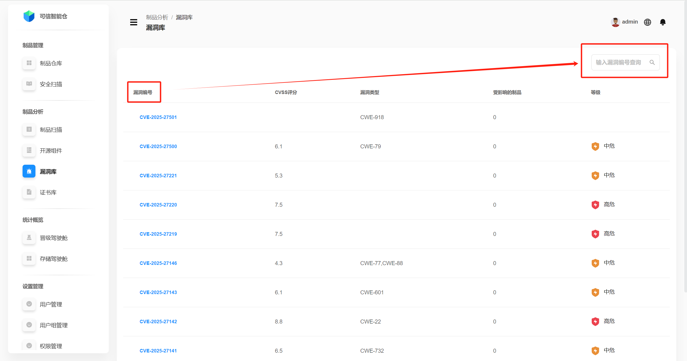
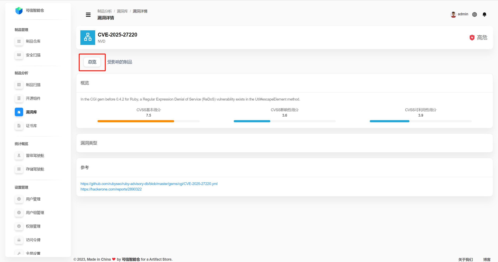
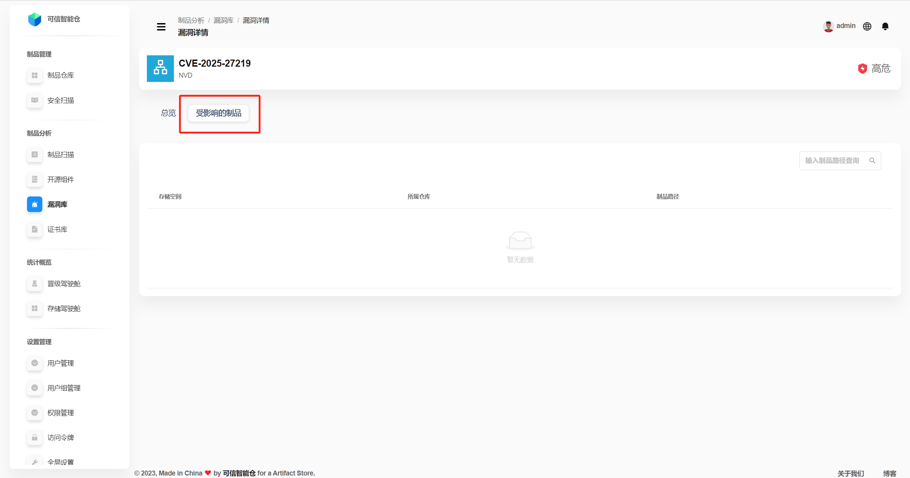

# 漏洞库

漏洞库以全球开源安全开源漏洞库NVD以及国内安全漏洞库CNVD为公共数据基础。

## 漏洞列表

漏洞库展示平台所有已知漏洞的列表。支持漏洞编号搜索。

| 术语               | 定义                                                                 |
|--------------------|----------------------------------------------------------------------|
| 漏洞编号           | 用于唯一标识和管理信息安全漏洞的标准化代码。常见的漏洞编号体系包括 CVE（Common Vulnerabilities and Exposures）编号，其格式通常为 CVE-YYYY-NNNNN，其中：CVE 表示漏洞编号体系；YYYY 表示漏洞被发现或记录的年份；NNNNN 是该年份内漏洞的唯一序列号。 |
| CVSS评分           | CVSS（Common Vulnerability Scoring System）是一种用于评估漏洞严重性的开放式标准，分数越高越严重。 |
| 漏洞类型           | 对漏洞本质特征的分类，用于描述漏洞的成因、表现形式和潜在影响。经常通过 CWE（Common Weakness Enumeration）体系进行标准化。CWE编号是对漏洞类型的唯一标识，其格式为 CWE-NNN，其中 NNN 是漏洞类型的唯一编号。 |
| 受影响的制品       | 特定漏洞影响的制品列表。 |
| 等级               | 根据漏洞的CVSS评分，将漏洞分为严重[9-10)、高危[7-9）、中危[4-7）、低危(0-4)四个等级。 |

## 漏洞详情总览

点击**漏洞编号**，进入**漏洞详情**页面。默认呈现**漏洞详情总览**。

| 术语               | 定义                                                                 |
|--------------------|----------------------------------------------------------------------|
| 概述               | 漏洞描述，通常包括漏洞类型、名称、成因等。  漏洞的CVSS基本得分：可利用性评分 + 影响度评分。是评估漏洞固有严重性的核心指标，它反映了漏洞在不受特定环境或时间因素影响下的固有风险。  漏洞的CVSS可利用性得分：反映了漏洞被攻击者利用的难易程度，主要考虑以下因素：攻击向量（衡量攻击者利用漏洞的途径，如网络（N））、攻击复杂度（衡量攻击者利用漏洞的难度）、身份认证要求（衡量攻击者利用漏洞所需的权限级别）、用户交互要求（衡量是否需要用户参与才能利用漏洞）。  漏洞的CVSS影响性得分：衡量成功利用漏洞后对系统的影响，主要考虑以下三个方面：机密性影响（衡量漏洞被利用后对系统中敏感信息的影响）、完整性影响（衡量漏洞被利用后对系统中数据完整性的影响）、可用性影响（衡量漏洞被利用后对系统可用性的影响）。 |
| CVSS基本得分       | 可利用性评分 + 影响度评分。是评估漏洞固有严重性的核心指标，它反映了漏洞在不受特定环境或时间因素影响下的固有风险。 |
| CVSS可利用性得分   | 反映了漏洞被攻击者利用的难易程度，主要考虑以下因素：攻击向量（衡量攻击者利用漏洞的途径，如网络（N））、攻击复杂度（衡量攻击者利用漏洞的难度）、身份认证要求（衡量攻击者利用漏洞所需的权限级别）、用户交互要求（衡量是否需要用户参与才能利用漏洞）。 |
| CVSS影响性得分     | 衡量成功利用漏洞后对系统的影响，主要考虑以下三个方面：机密性影响（衡量漏洞被利用后对系统中敏感信息的影响）、完整性影响（衡量漏洞被利用后对系统中数据完整性的影响）、可用性影响（衡量漏洞被利用后对系统可用性的影响）。 |
| 漏洞类型           | 对漏洞本质特征的分类，用于描述漏洞的成因、表现形式和潜在影响。经常通过 CWE（Common Weakness Enumeration）体系进行标准化。CWE编号是对漏洞类型的唯一标识，其格式为 CWE-NNN，其中 NNN 是漏洞类型的唯一编号。 |
| 参考               | 漏洞详细信息的链接，点击可查看。 |

## 漏洞影响的制品

