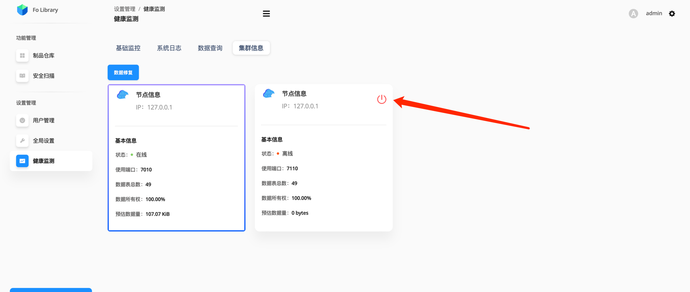

# 集群在线维护

## 在线移除故障节点

当多个节点其中有节点发生故障，或宕机后需要在线修复后方可启动成功。

## 执行修复启动

- 第一步 页面移除故障节点

在页面选择 **健康监测** - **集群信息** 菜单，点击 【移除按钮】



- 第二步 执行修复启动命令

该命令会将当前故障节点修复进行重启。

```shell
$ folib repair_start
```

## 多节点数据修复

多节点下的数据库是列式存储，同一份数据会在多个节点之间进行部分备份，因此，在修复启动之后还需要点击 **数据修复** 按钮，如上图所示。

:::warning 注意事项
数据修复会在后台处理，需要一定的时间，但不影响使用。在没有修复完成之前，请使用正常节点
:::