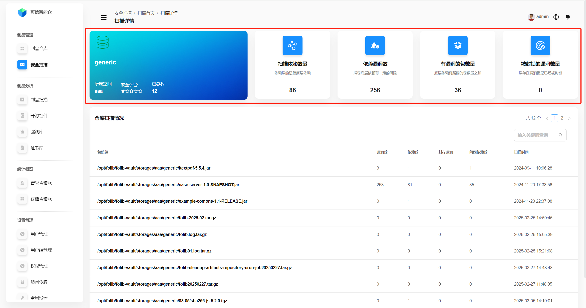
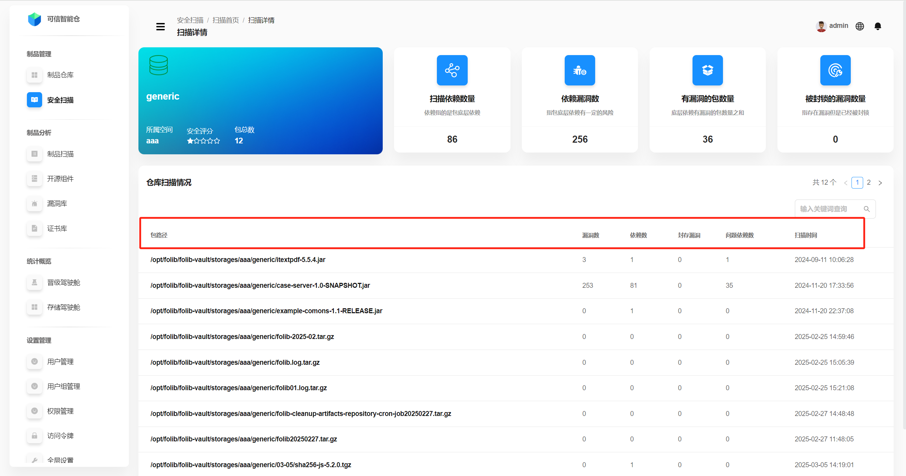
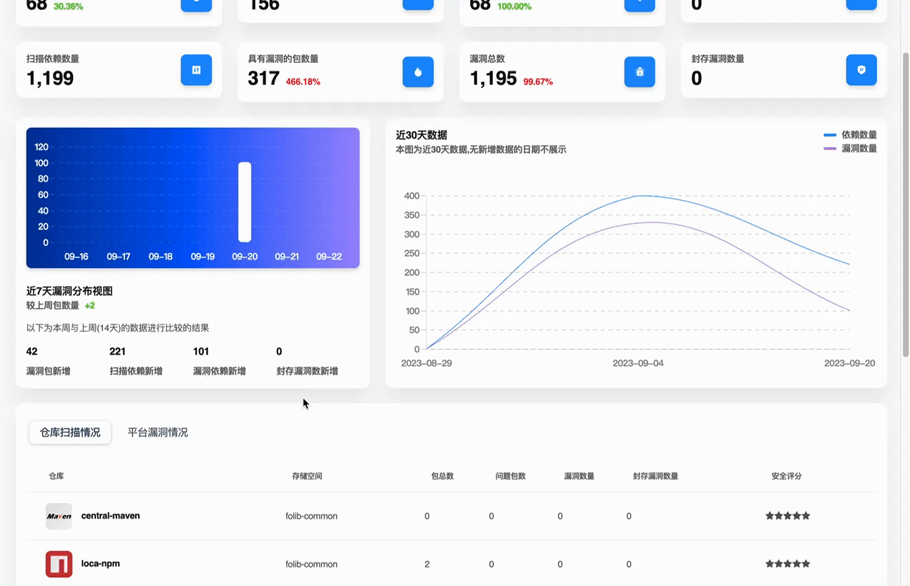
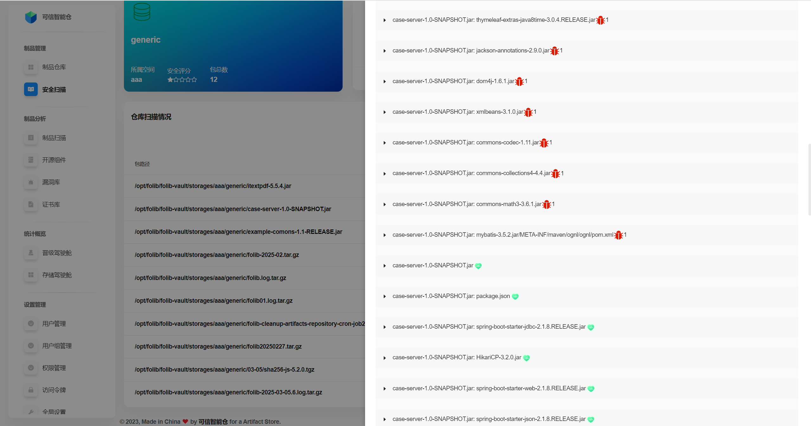
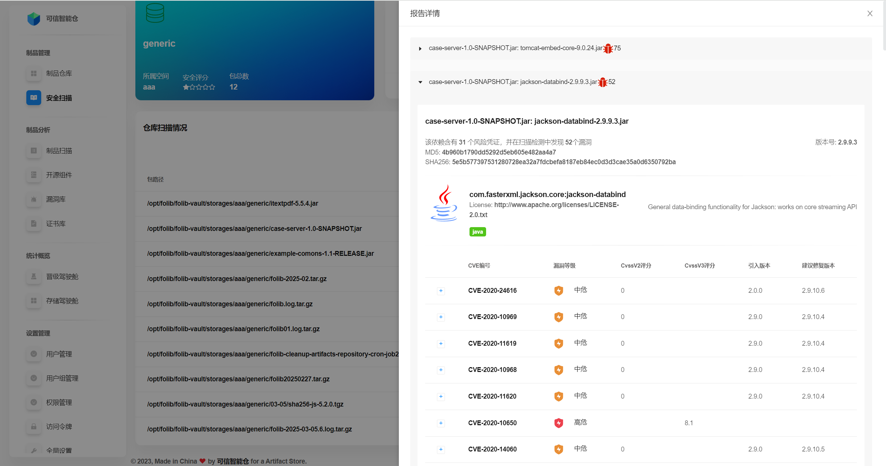
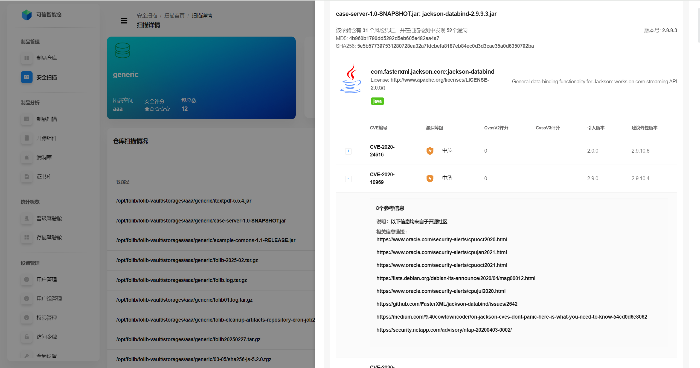

# 仓库扫描详情

此页展示指定**仓库的扫描统计数据**、仓库中每个**包的扫描统计数据**、每个包中的**文件扫描报告详情**。

## 仓库扫描统计数据

该仓库经过安全扫描后的总的统计数据。

| 名词             | 解释                                     |
|------------------|----------------------------------------|
| 所属空间         | 该仓库所属的存储空间。                            |
| 安全评分         | 根据问题包数占包总数的比例计算得出的安全评分。五颗白色星星代表最高安全评分。 |
| 包总数           | 该仓库下的包总数。                              |
| 扫描依赖数量     | 该仓库下的底层包依赖总数。                          |
| 依赖漏洞数       | 底层包依赖中存在漏洞的数量。                         |
| 有漏洞的包数量   | 该仓库下有漏洞的包的数量。                          |
| 被封锁的漏洞数量 | 该仓库中被设置为可忽略的漏洞的数量。                     |

## 包的扫描统计数据

该仓库下每个包的扫描统计数据总览。

| 名词             | 解释            |
|------------------|---------------|
| 包路径           | 包在仓库目录下的存放位置。 |
| 漏洞数           | 该包下的漏洞总数。     |
| 依赖数           | 该包下的依赖总数。     |
| 封存漏洞         | 该包下被设置为可忽略的漏洞的数量。           |
| 问题依赖数       | 该包下有漏洞的依赖总数。  |
| 扫描时间         | 该包最近一次扫描的时间。  |

## 包中文件扫描报告详情

点击目标包所在行，即可查看该包中的**文件扫描报告详情**。以下是从 **扫描首页 -> 扫描详情 -> 包中文件扫描报告详情** 的操作流程。

进入**文件扫描报告详情**，默认展示包中的所有**依赖**的列表。**红色bug图标**表示该依赖存在漏洞，旁边的**数字**表示该依赖的漏洞数，**绿色心形图标**表示该依赖不存在漏洞。

点击目标依赖所在行，即可查看该依赖的**漏洞列表**。

依赖描述的名词解释：

| 名词       | 解释                     |
|------------|------------------------|
| 风险凭证   | 该依赖的许可证的安全合规问题。        |
| 漏洞数     | 该依赖下的漏洞总数。             |
| MD5        | 该依赖的MD5值，用于唯一标识该依赖。    |
| SHA256     | 该依赖的SHA256值，用于唯一标识该依赖。 |
| 版本号     | 该依赖的版本号。               |
| licence    | 该依赖的许可证。               |

依赖漏洞名词解释：

| 名称         | 解释                                 |
|------------|------------------------------------|
| CVE编号      | 漏洞的唯一标识符。                          |
|漏洞等级| 类型分为严重、高危、中危、低危。                   |
| CvssV2评分   | 根据CVSS（通用漏洞评分系统）版本2的评分，用于衡量漏洞的严重性。 |
| CvssV3评分   | 根据CVSS版本3的评分，用于衡量漏洞的严重性。           |
|引入版本| 引进该漏洞时，依赖的版本。                      |
| 建议修复版本     | 建议依赖升级到的版本，以修复该漏洞。                 |

点击左侧“**+**”图标，展示该漏洞的详细描述。

