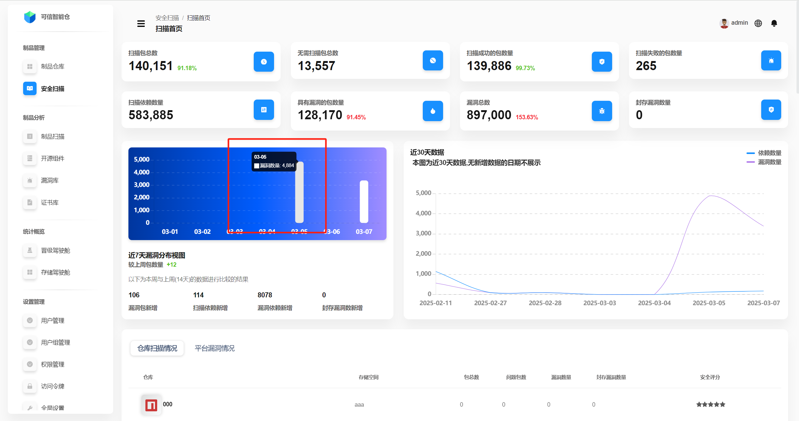
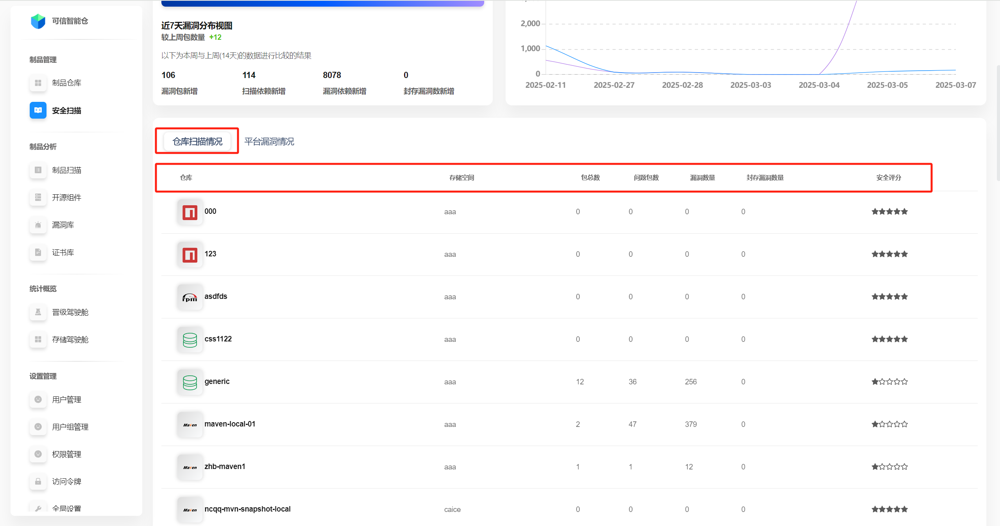
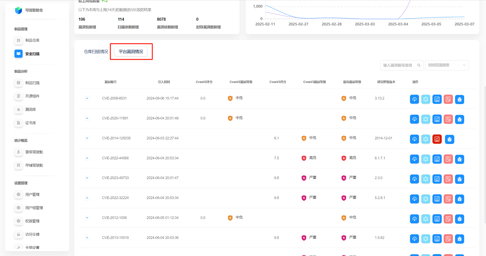

# 扫描概述

Folib的安全扫描功能以全球开源安全开源漏洞库NVD以及国内安全漏洞库CNVD为公共数据基础，通过平台枚举标识来实现每个依赖包的安全识别与CVE分析，并根据图数据库实时进行依赖关系处理、安全范围识别、跟踪与告警。为企业的云原生技术转型与快速迭代提供有利支撑。

## 界面说明

## 扫描数据总览

扫描数据是对整个平台进行的统计。有直接数据展示，也有近7天漏洞分布视图、近30天依赖数量和漏洞数量的变化趋势图。

| 名词                 | 解释                                                                          |
|----------------------|-----------------------------------------------------------------------------|
| 扫描包总数           | 当前平台所有已经开启安全扫描的包总和。旁边的百分数是扫描包总数占所有包总数的百分比。                                  |
| 无需扫描包总数       | 当前平台所有未开启安全扫描的包总和。                                                          |
| 扫描成功的包数量     | 当前平台所有已经开启安全扫描，并且经过安全扫描成功的包总和。旁边的百分数是扫描成功的包占扫描包总数的百分比。                      |
| 扫描失败的包数量     | 当前平台所有已经开启安全扫描，但安全扫描未成功的包总和。                                                |
| 扫描依赖数量         | 当前平台所有经过扫描之后，发现的所有依赖以及底层依赖数量。通常情况下依赖总数大于包总数。                                |
| 具有漏洞的包的数量   | 当前平台所有已经开启安全扫描，并且经过安全扫描发现的所有具有安全漏洞问题的包总和。旁边的百分数是具有漏洞的包占扫描包总数的百分比。           |
| 漏洞总数             | 当前平台所有已经开启安全扫描，并且经过安全扫描发现的漏洞总数量，同类型漏洞存在于不同包或仓库时分别计数。旁边的百分数为漏洞总数占扫描依赖数量的百分比。 |
| 封存漏洞数量         | 当前平台所有可忽略的漏洞的数量。                                                            |

 

**近7天漏洞分布视图**:将光标悬停在柱状图上，可以查看具体的漏洞数量。

## 仓库扫描情况

扫描首页的下部分默认是 **仓库扫描情况**，每一行代表一个仓库的扫描情况。

**点击**目标仓库所在行，即可进入对应仓库的**扫描详情**页，详见使用手册 [安全扫描-仓库扫描详情](./repository_scan_status.md)。

| 名词             | 解释                                     |
|------------------|----------------------------------------|
| 存储空间         | 该仓库所属的存储空间。                            |
| 包总数           | 该仓库下的包总数。                              |
| 问题包数         | 该仓库下有漏洞的包的数量。                          |
| 漏洞数量         | 该仓库下的漏洞总数。同类型漏洞存在于不同包时分别计数。            |
| 封存漏洞数量     | 当前平台所有可忽略的漏洞的数量。                       |
| 安全评分         | 根据问题包数占包总数的比例计算得出的安全评分。五颗黑色星星代表最高安全评分。 |

## 平台漏洞情况

点击 **平台漏洞情况**，切换到对整个平台的所有漏洞的展示。

此页面的元素、操作与使用手册 [制品仓库管理-仓库概述](../warehouse/warehouse-outline.md) 中的第二个标题**仓库统计**类似，可跳转查看详情。

| 参数名称         | 解释                                 |
|------------------|------------------------------------|
| 漏洞编号         | 漏洞的唯一标识符，通常是一个编号或ID，用于区分不同的漏洞。     |
| 引入时间         | 漏洞被引入的时间。                     |
| CvssV2评分       | 根据CVSS（通用漏洞评分系统）版本2的评分，用于衡量漏洞的严重性。 |
| CvssV2漏洞等级   | 根据CVSS V2评分得出的漏洞等级，通常分为低危、中危、高危等。  |
| CvssV3评分       | 根据CVSS版本3的评分，用于衡量漏洞的严重性。           |
| CvssV3漏洞等级   | 根据CVSS V3评分得出的漏洞等级，通常分为低危、中危、高危等。  |
| 最高漏洞等级     | 在多个漏洞等级中，最高的漏洞等级，用于快速评估风险。         |
| 建议修复版本     | 建议升级到的版本，以修复该漏洞。                   |
| 操作             | 对漏洞的处理操作，详见下节“数据操作说明”。             |