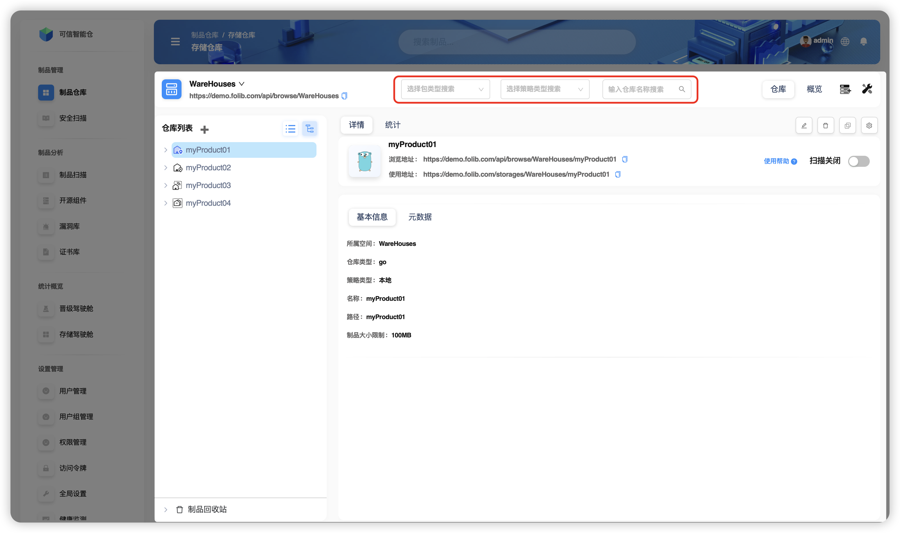
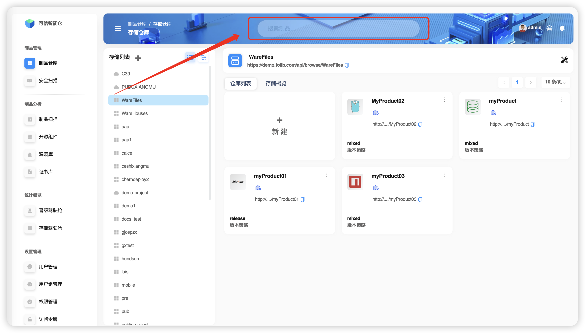

# 搜索概述

`Folib` 支持 **仓库搜索** 以及 **制品搜索** 两种模式，这两种搜索模式搜索的纬度各不相同，搜索入口也不尽相同。

## 仓库搜索

当且仅当在 **树形视图** 下可以对某选中的 **存储空间** 进行 **制品库** 搜索。可以根据 **制品库类型**、**制品库策略** 和 **制品库名称** 三个维度去搜索（可组合搜索）。

## 制品搜索

在界面上方的搜索栏中输入搜索信息。可以根据 **普通** 、 **元数据** 、 **校验码** 三个维度搜索。

| 术语名 | 术语阐释 | 全局搜索模式支持 | 局部搜索模式支持 |
| :------: | :------: | :------: | :------: |
|    普通    |     制品文件名称搜索     | ✅ | ✅ |
|元数据	|制品文件描述性信息（元数据是对数据的“数据”，它帮助人们更好地理解、管理和使用数据）搜索	| ✅ | ✅ |
|校验码	|制品文件校验码（用于验证数据完整性和一致性的技术手段。通过特定的算法对数据进行处理，生成一个固定长度的字符串）搜索| ✅ | ✅ |