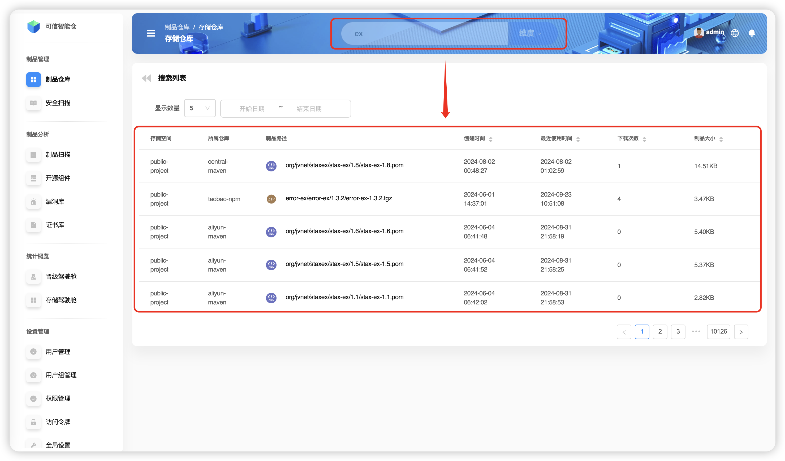
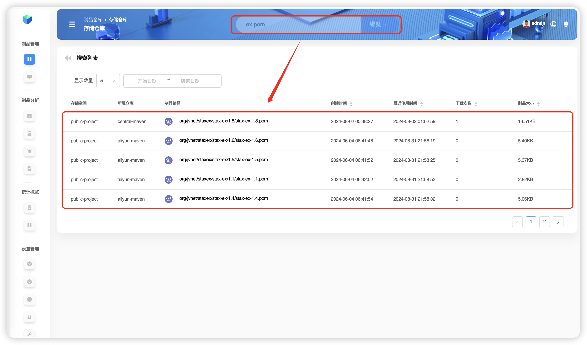
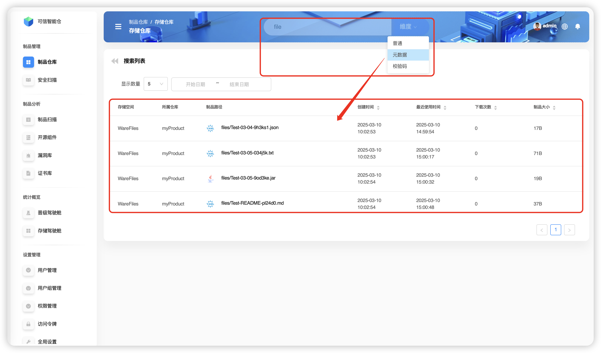
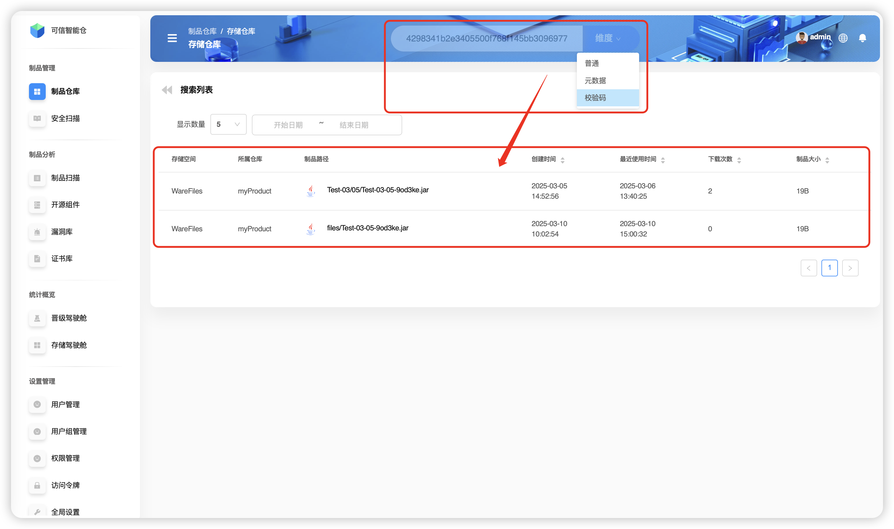
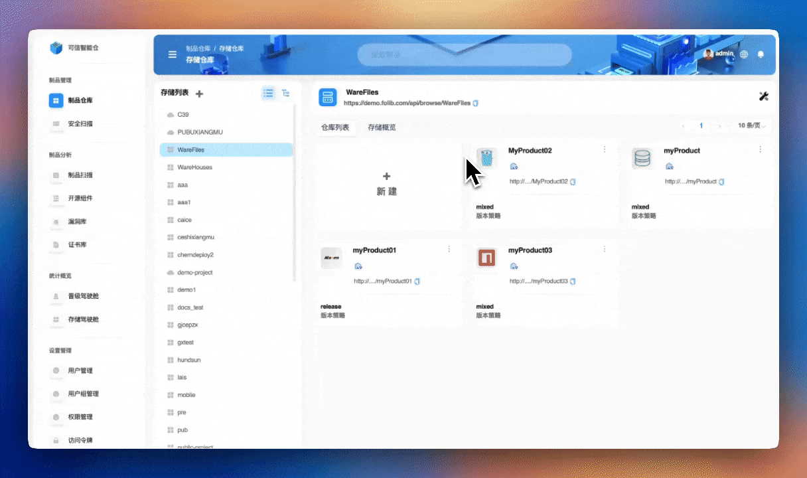
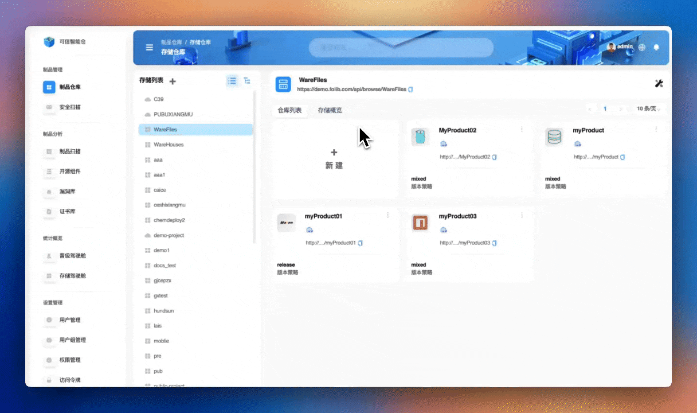
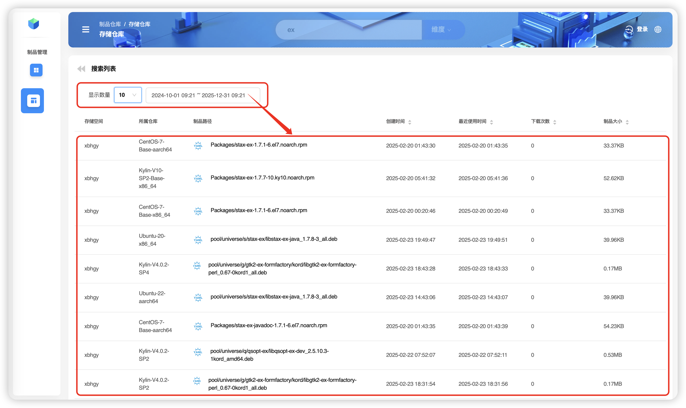

# 制品文件搜索

搜索制品文件通常有两个角度，在 **全局** 上（未选中特定的制品库）搜索和在 **局部** 上（选定特定的制品库）搜索。

:::tip
⏳ 若不选中某个制品库，将在全局范围内搜索，消耗大量时间

💡 若选中某个制品库，将只在该范围内搜索，时间消耗较少

🎯 输入后直接回车默认 **普通** 纬度搜索
:::

## 全局搜索

+ **普通** 纬度搜索 🔍 （支持 **模糊搜索** 、 **区分大小写** ）

**普通** 搜索是根据 **制品文件路径名称** 进行的搜索。以单个词条 `ex` 搜索为例。

**普通** 搜索支持多个词条组合搜索，其中词条以空格隔开。以两个词条 `ex` 、 `pom` 搜索为例。搜索结果都是路径名称中包含 `ex` 的 `pom` 制品文件。

+ **元数据** 纬度搜索 🔍 （支持 **模糊搜索** 、 **区分大小写** ）

**元数据** 搜索是根据制品文件所拥有的元数据进行搜索。以 `file` 搜索为例。

+ **校验码** 纬度搜索 🔍

**校验码** 搜索是根据制品文件的校验码进行搜索。以 `sha1: 4298341b2e3405500f768f145bb309697788f508` 搜索 `Test-03-05-9od3ke.jar`为例。

## 局部搜索

以在 `myProduct` 中搜索制品文件为例。在存储空间 `warefiles` 中选中制品仓库 `myProduct` ，在页面上方输入搜索信息。

:::tip
本例中，在制品库 `myProduct` 中存在 `Test-03/04` 和 `Test-03/05` 两个路径

`Test-03/04` 中存在制品 `Extra.jar`

`Test-03/05` 中存在制品 `Test-03-05-9od3ke.jar` 和 `Test-03-05-034j5k.txt`
:::

+ **普通** 纬度搜索 🔍 （支持 **模糊搜索** 、 **区分大小写** ）

以 `Ex` 模糊搜索 `Extra.jar` 为例。

> ❗️ **区分大小写：** 当按 `ex` 模糊搜索时，无法搜索到 `Extra.jar`

+ **元数据** 纬度搜索 🔍 （支持 **模糊搜索** 、 **区分大小写** ）

以 `file` 模糊搜索 `Extra.jar` 为例。

> ❗️ **区分大小写：** 当按 `file` 模糊搜索时，无法搜索到 `Extra.jar`

+ **校验码** 纬度搜索 🔍

`Folib` 支持四种校验码，分别是 `SHA-1` , `SM3` , `SHA-256` 和 `MD5` 。以 `sha1: 4298341b2e3405500f768f145bb309697788f508` 搜索 `Test-03-05-9od3ke.jar` 为例。

:::tip
💡 在搜索时会另外支持 **显示数量** 和 **开始/结束日期** 筛选搜索结果
:::

