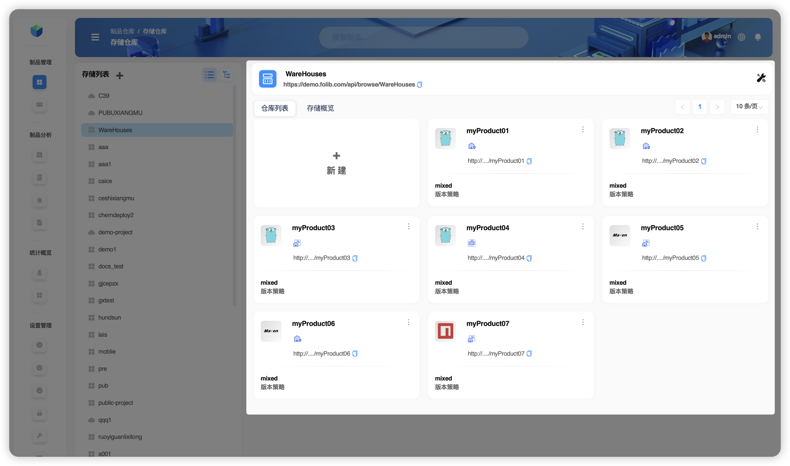
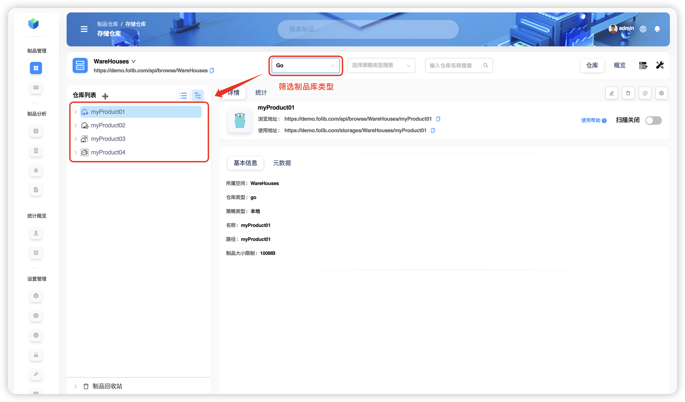
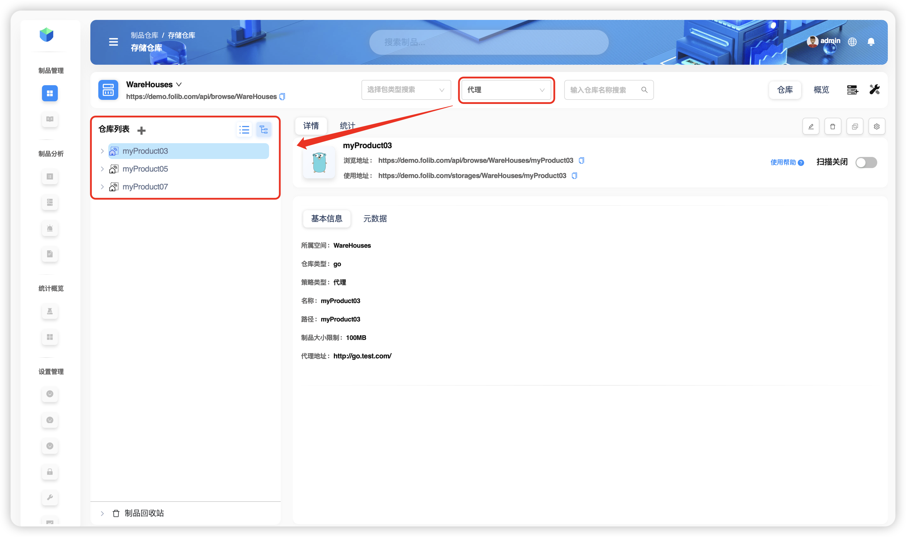
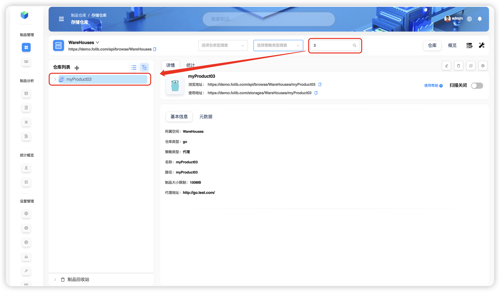
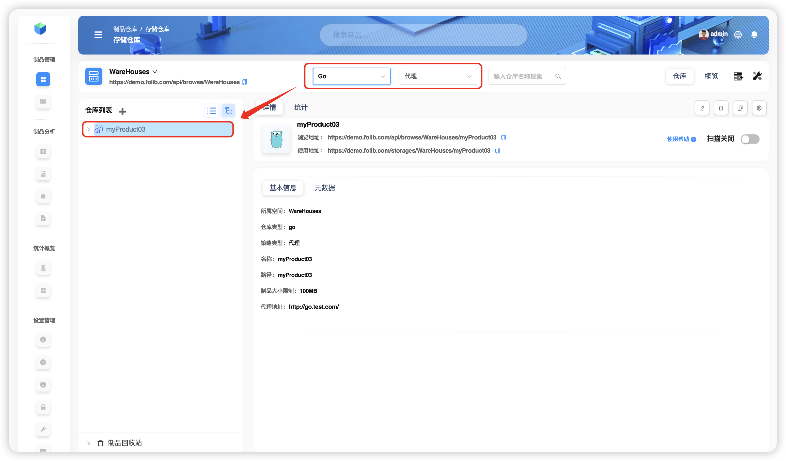

# 仓库搜索

以在存储空间 `WareHouse` 中搜索制品库 `myProduct01` 为例。其中制品库 `myProduct03` 类型为 `Go` ，策略为 **本地策略** 。

:::tip
存储空间 `WareHouse`  包含:

4个 `Go` 类型制品（ `myProduct01` 本地、 `myProduct02` 本地、 `myProduct03` 代理、 `myProduct04` 组合）

2个 `Maven` 类型制品（  `myProduct05` 代理、 `myProduct06` 本地）

1个 `Npm` 类型制品（`myProduct07` 代理）
:::

## 单纬度简单搜索

+ 仅选择 **类型** 纬度 `Go`

+ 仅选择 **策略** 纬度 **代理**

+ 仅选择 **名称** 纬度（支持模糊搜索）

## 多维度组合搜索

同时选择 **类型** 纬度 `Go` 与 **策略** 纬度 **代理**

