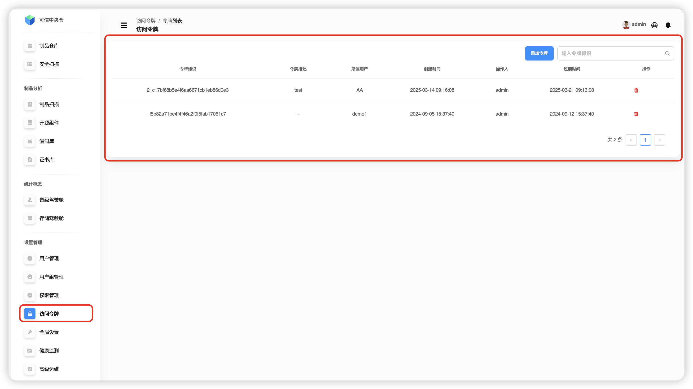
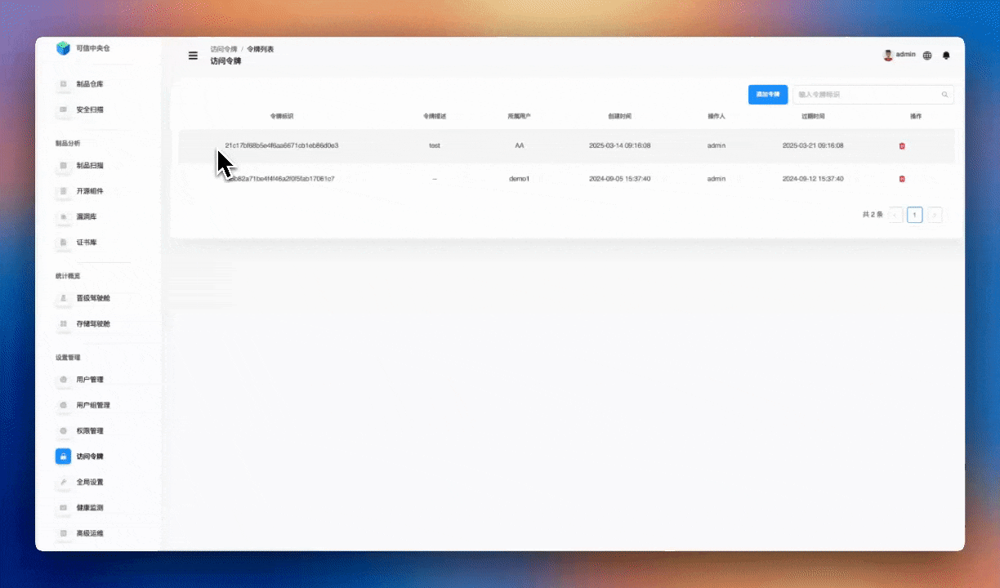
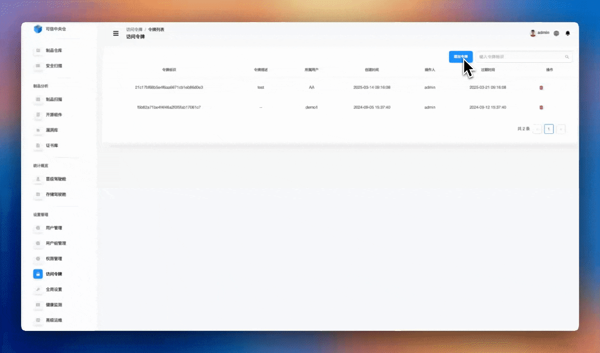
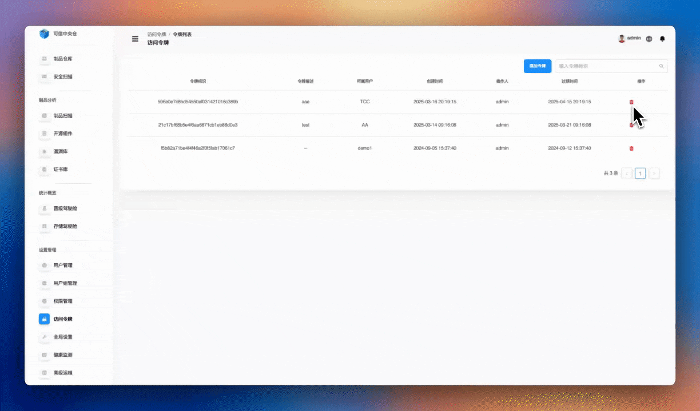

# 访问令牌管理

点击左侧导航栏 **【设置管理】->【访问令牌管理】** ，访问令牌模块提供了一种安全的身份验证机制，允许用户在不使用用户名和密码的情况下访问系统资源。通过生成和管理访问令牌，可以实现更安全、灵活的系统访问控制。主要功能包括：

1. 令牌基础操作
	+ 查看现有令牌列表
	+ 生成新的访问令牌
	+ 删除令牌
2. 令牌属性设置
	+ 设置令牌名称
	+ 配置令牌有效期
	+ 设置令牌使用者
	+ 定义令牌用途说明
3. 令牌使用场景
	+ CI/CD流程集成
	+ 第三方系统对接
	+ 自动化脚本访问

特点
+ 安全的身份验证机制
+ 灵活的有效期管理
+ 便捷的系统集成方式
+ 可追踪的访问记录

# 访问令牌查询

可以通过输入访问令牌标识进行精准查询。（不支持模糊搜索）

# 添加访问令牌

点击 **【添加令牌】** 按钮,输入令牌描述，在所属用户选项里选择用户，在设置过期时间选项里选择过期时间，点击右下角确定按钮完成访问令牌的添加。

# 删除访问令牌

选择要删除的令牌信息，在右侧操作那一列下点击删除图标，可以删除产品下的一个访问令牌信息。

