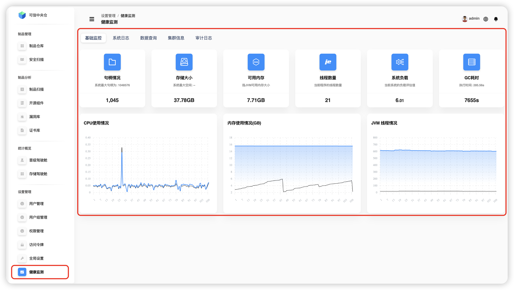
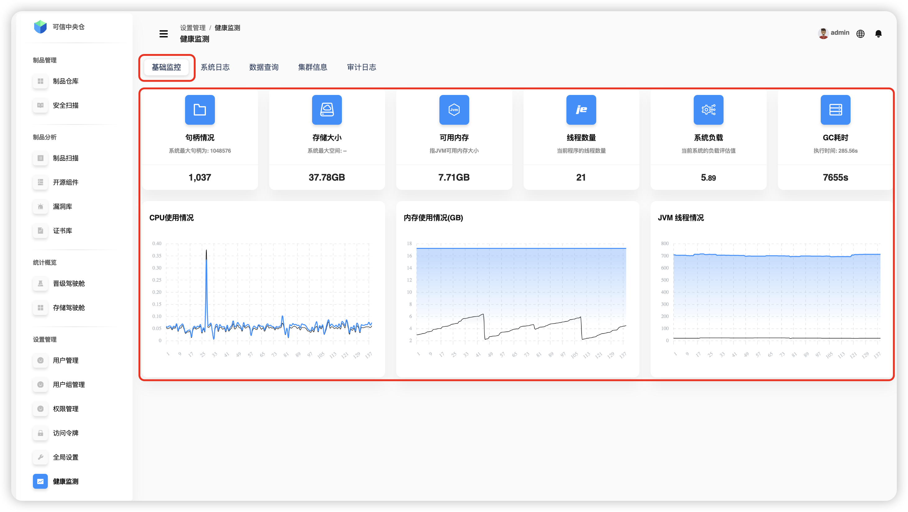
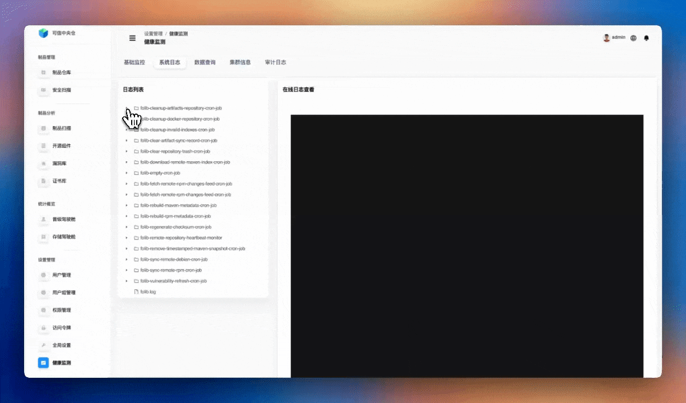
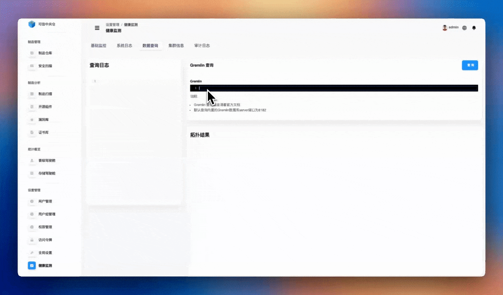
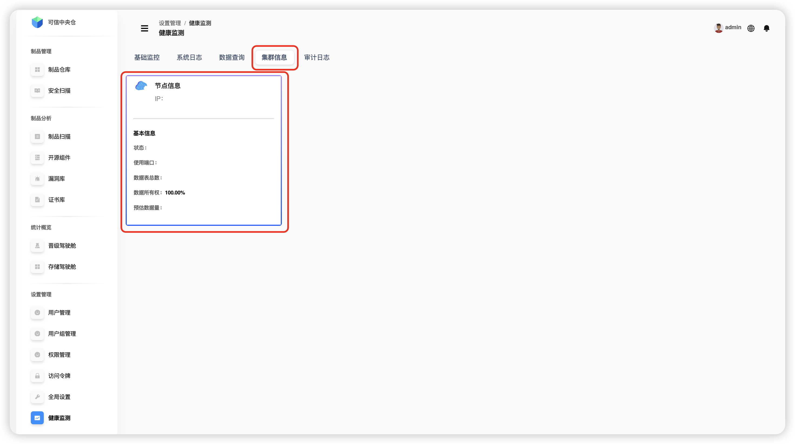
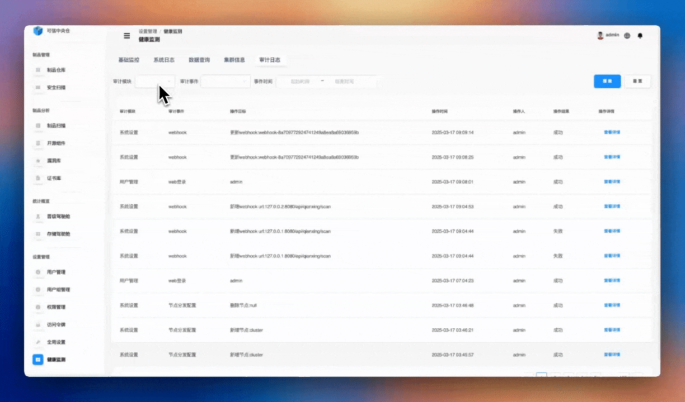

# 健康监测

健康监测提供了各种工具去查看产品的信息和日志，帮助使用者更好地掌握产品的动态变化，确保产品的健康。

## 基础监控

监控对象为运行该产品的服务器的数据信息，通过实时详细的数据和直观的图表方便开发人员监控系统的运行情况。其中 **CPU使用情况** 、 **内存使用情况** 、 **JVM线程情况** 以图表的形式实时展示。

| 术语 | 术语阐释 |
| :----: | :----: |
| 句柄情况 | 句柄是服务器中使用一个文件的中间媒介，代指系统中可运行文件的剩余情况 |
| 存储大小 | 服务器剩余存储空间的大小 |
| 可用内存 | 指JVM可用内存大小 |
| 线程数量 | 当前程序的线程数量 |
| 系统负载 | 当前系统的负载评估值 |
| GC耗时 | 内存垃圾清理一次的耗时 |

## 系统日志

通过可视化展示该产品运行系统日志目录，便于开发人员查看系统运行状况。可对文件选择同步操作，会将文件的最新日志到本界面。

## 数据查询

通过 `Gremlin` 查询语句查看图数据和拓扑结果。

:::tip
💡 默认查询内置的Gremlin数据库server端口为8182
:::

## 集群信息

展示集群各个节点的 IP、状态、端口、数据表、数据所有权占比、预估数据量大小等数据。

## 审计日志

通过筛选，查看特定审计模块下的审计事件的日志，同时可以筛选时间间隔。

