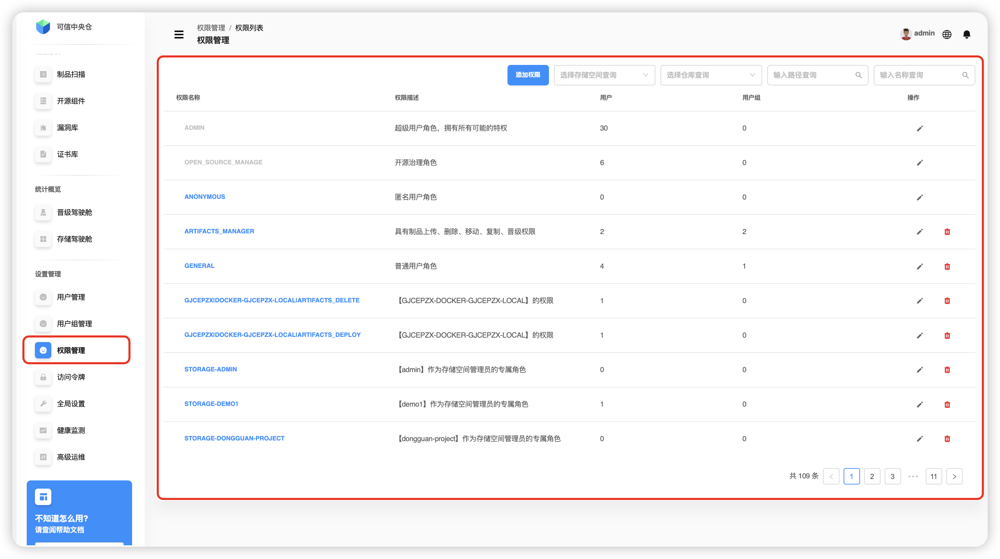
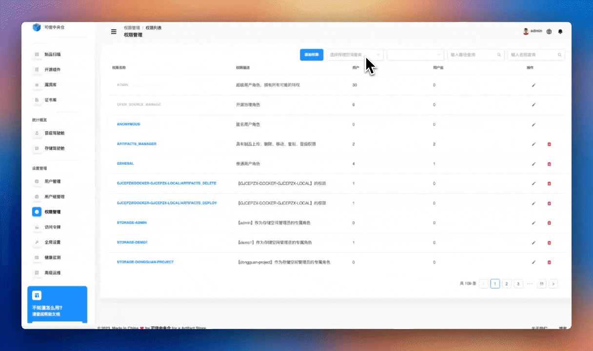
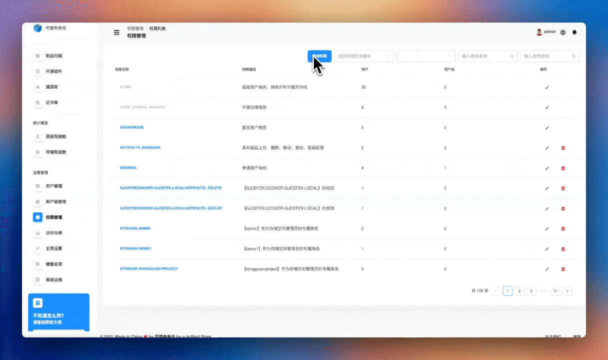
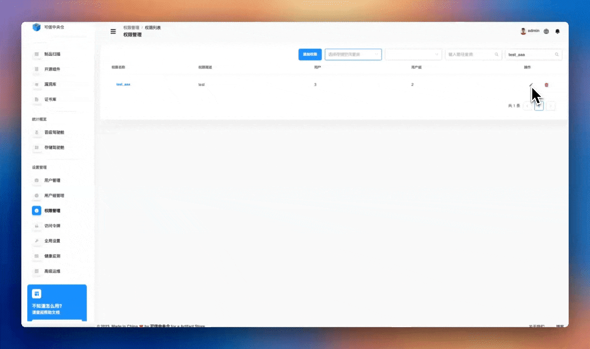

# 权限管理

权点击左侧导航栏【设置管理】->【权限管理】，权限管理模块提供了对制品库访问权限的精细化控制。通过设置权限，可以为用户和用户组分配对特定存储空间和仓库的访问权限。主要功能包括：

1. 权限基础操作
	+ 创建新的权限规则
	+ 查询现有权限设置
	+ 修改权限配置
	+ 删除权限规则
2. 资源权限控制
	+ 选择存储空间和仓库
	+ 设置具体的访问路径
	+ 配置资源访问范围
3. 权限级别设置
	+ 查看/下载权限
	+ 元数据操作权限
	+ 部署缓存权限
	+ 删除/覆盖权限
    + 仓库管理权限
4. 权限分配对象
	+ 为用户分配权限
	+ 为用户组分配权限
	+ 灵活调整权限范围

特点
+ 精细化的权限控制
+ 灵活的资源访问管理
+ 多级别的权限设置
+ 支持用户和用户组权限分配

## 权限查询

可以通过选择或搜索存储空间名称、仓库名称、路径以及权限名称进行精准查询。

## 添加权限

添加权限步骤如下：

1. **添加权限名称和描述：** 点击"添加权限"按钮，输入您要添加的唯一权限名称及其描述。
2. **选择资源：** 在资源模块中，点击"选择资源"按钮。系统会首先展示存储空间列表。您可以通过点击存储空间名称左侧的"+"按钮或直接点击存储空间名称来查看该存储空间内的仓库列表。
3. **搜索仓库：** 点击仓库旁边的搜索按钮，输入仓库名称以进行搜索。您还可以填写指定仓库权限包含的路径，并根据需要勾选相应的存储空间或仓库。
4. **选择用户：** 接下来，点击用户模块。在可选择用户列表中，选择用户或通过查询用户名称来查找用户。选择用户后，点击中间的转移按钮，将选择的用户转移到已选择用户列表中。
5. **分配用户权限：** 为选择的用户分配权限，包括查看/下载、元数据、部署缓存、删除/覆盖和仓库管理五种权限。
6. **选择用户组：** 然后，点击用户组模块。在可选择用户组列表中，选择用户组或通过查询用户组名称来查找用户组。选择用户组后，点击中间的转移按钮，将选择的用户组转移到已选择用户组列表中。
7. **分配用户组权限：** 为选择的用户组分配权限，同样包括查看/下载、元数据、部署缓存、删除/覆盖和仓库管理五种权限。
8. **确认设置：** 选择好权限后，点击右下角的确认按钮，完成用户组模块的设置。

## 修改权限

修改权限步骤如下：

1.  **选择修改权限：** 在权限名称右侧的操作列表中，点击修改图标。
2.  **修改资源模块：** 按照添加资源模块的步骤进行操作。这包括选择存储空间、搜索仓库以及勾选所需的存储空间或仓库。
3.  **调整用户模块：** 在用户模块中，根据需要将可用用户列表中的用户转移到已选择用户列表中。然后，为这些用户选择相应的权限。
4.  **调整用户组模块：** 在用户组模块中，根据需要将可用用户组列表中的用户组转移到已选择用户组列表中。选择好权限后，点击右下角的"确认"按钮，完成用户组模块的修改。

## 删除权限

在要删除的权限信息右侧，点击删除图标，二次确认后删除一个权限信息。

