# 高级运维

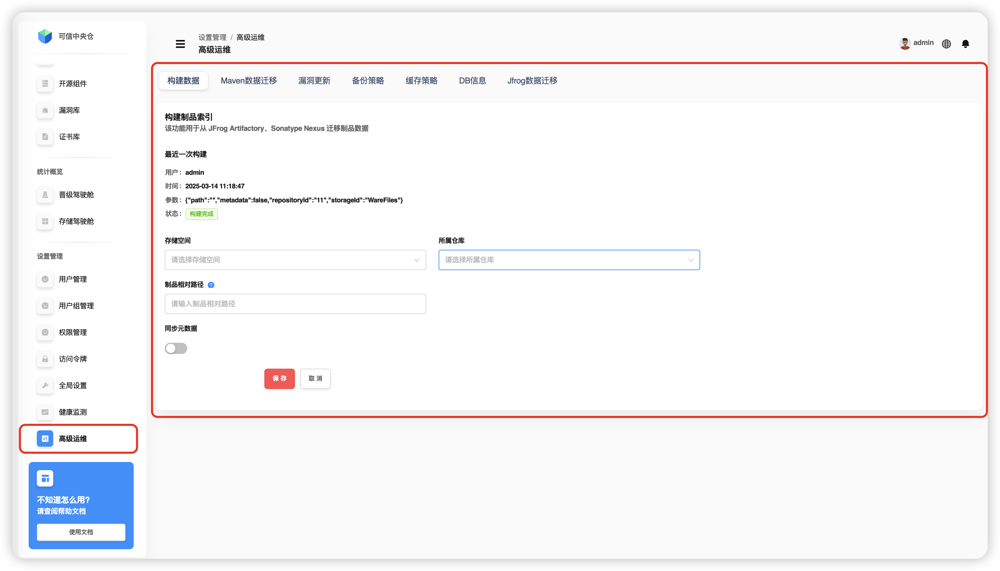

## 构建数据

该功能为方便已使用 `JFrog Artifactory` 和 `Sonatype Nexus` 制品库的用户，可以快速将原有制品库中的存量数据快速迁移至 `Folib` 制品库中，助力用户轻松完成系统切换。具体操作如下：

1. 从左侧导航栏选择 **【设置管理】->【高级运维】** 。
2. 在 **【高级运维】** 页面，点击 **【构建数据】** 。
3. **选择存储空间和所属仓库：** 用户首先需要选择用于迁移数据的存储空间和所属仓库。
4. **输入索引制品的具体路径：** 用户需要输入要迁移的制品的具体路径，以确保迁移过程中的数据准确性。
5. **点击【保存】：** 用户输入完路径后，点击保存按钮以确认迁移设置。
6. **二次确认弹窗：** 系统会弹出一个二次确认窗口，用户需要确认迁移操作的正确性。
7. **数据构建：** 确认后，系统开始构建数据，将选定的制品从源制品库迁移到目标制品库。
8. **状态与最近一次构建信息展示：** 数据构建完成后，系统会在上方展示构建的状态和最近一次构建的信息，以便用户跟踪迁移进度和结果。

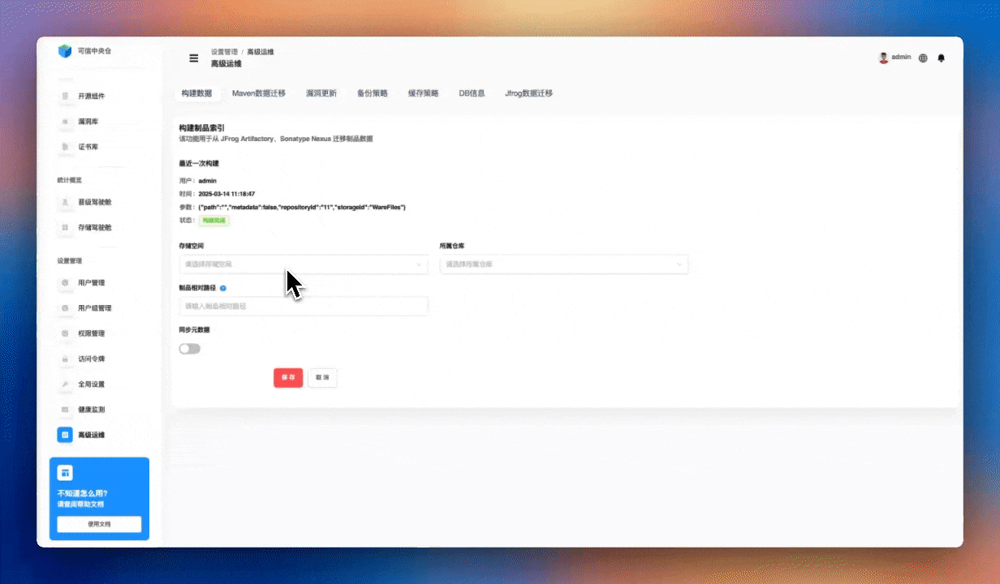

最近一次构建中展示了构建的用户（如 `admin` ），具体时间，参数以及构建状态（如构建完成）。其中参数代表着构建索引时使用的配置，这些参数定义了索引的特定属性和构建条件。以下是对每个参数的解释：

| 参数 | 参数阐释 |
| :----: | :----: |
| **path** | "com.jfrog" 表示索引构建的目标相对路径。这指定了制品库路径，用于确定该路径下的数据需要被索引 |
| **metadata** | "true" 表示在构建索引时包括元数据。这意味着索引不仅包含制品的基本信息，还包含其元数据，如版本、依赖关系等 |
| **repositoryId** | "m1" 指定了用于构建索引的仓库的名称。这有助于确定从哪个仓库中提取数据 |
| **storageId** | "demo-storages" 指定了存储空间的名称，用于确定数据存储的位置 |

这个操作的主要目的是确保数据从一个制品库迁移到另一个制品库时的完整性和准确性，同时提供用户界面友好的操作流程和状态反馈。

:::tip
💡 构建为异步执行，点击状态可手动结束构建。制品相对路径可指定目录进行构建数据，若不填写则为仓库的根目录, 目录为仓库下的相对路径。
:::

## Maven数据迁移

该功能为方便已使用 `JFrog Artifactory` 和 `Sonatype Nexus` 制品库的用户，可以快速将原有制品库中的存量数据使用 `MavenIndxer` 方式快速迁移至 `Folib` 制品库中，并设置批处理数量。选择的目标仓库为代理仓库，这些代理仓库已经设置好了 `JFrog Artifactory` 、`Sonatype Nexus` 制品库的远程访问地址,代理仓库的用户名、密码等信息。具体操作步骤如下：

1.  从左侧导航栏选择 **【设置管理】->【高级运维】** 。
2.  在【高级运维】页面，点击 **【Maven数据迁移】** 。
3. **选择存储空间和所属仓库：** 用户首先需要选择用于迁移数据的存储空间和所属仓库。
4. **输入索引制品的具体路径：** 用户需要输入要迁移的制品的具体路径，以确保迁移过程中的数据准确性。
5. **设置批处理数量：** 用户需要设置批处理数量，以确保迁移过程中的数据准确性。
6. **点击【保存】：** 用户输入完路径后，点击保存按钮以确认迁移设置。
7. **二次确认弹窗：** 系统会弹出一个二次确认窗口，用户需要确认迁移操作的正确性。

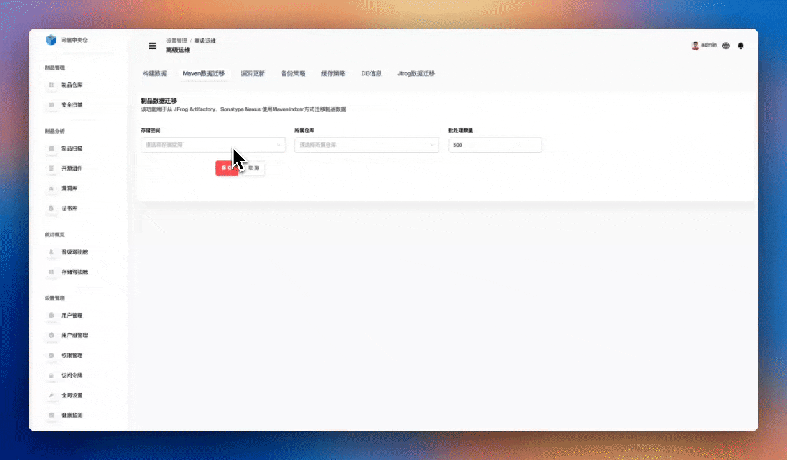

:::tip
**异步执行：** 数据迁移过程为异步执行，不会阻塞其他操作。
**数据来源：** 迁移的数据基于之前构建的索引数据。
**批处理说明：** 批处理数量用于控制每次迁移操作中处理的制品数量，合理的批处理数量可以：
:::

特点
+ 避免系统资源过度占用
+ 减少迁移失败的风险
+ 便于问题定位和恢复

注意事项
+ 迁移前建议先进行数据备份
+ 确保网络连接稳定
+ 检查存储空间是否充足
+ 建议在系统负载较低时进行大规模数据迁移

## 漏洞更新

该功能用于更新漏洞数据至本地漏洞库以及对已开启扫描的仓库进行全量制品扫描，更新的漏洞信息以及扫描信息会展示在左侧导航栏 **【制品管理】->【安全扫描】->【仓库扫描情况】/【平台漏洞情况】** 。具体操作步骤如下：

1. 从左侧导航栏选择 **【设置管理】->【高级运维】** 。
2. 在 **【高级运维】** 页面，点击 **【漏洞更新】** 。
3. 点击 **【手动更新】** 进行手动更新漏洞数据。
4. 点击最近一次更新中的状态 **【更新中】** 里面的锁图标，可以手动结束更新。（可选操作）
5. 输入定时规则（如0 0 12 \* \* ?），点击 **【定时更新】** 进行定时更新漏洞数据。
6. 点击 **【删除任务】** ，二次确认弹窗，选择是否删除定时更新漏洞任务。
7. 点击右侧 **【立即扫描】** ，二次确认弹窗，确定现在执行全量扫描制品。 **【定时扫描】** 以及 **【删除任务】** 和更新漏洞操作一致。

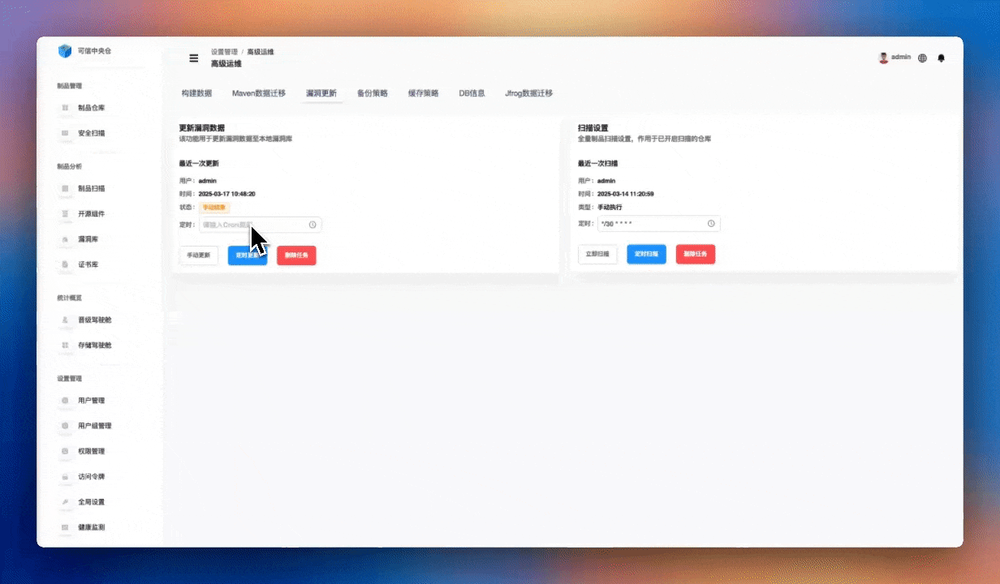

定时规则为 `cron` 表达式，例如 `0 0 12 \* \* ?` 表示每天中午12点更新。 每个 `Cron` 表达式字段解释如下：
1. 秒（0）：每分钟的第0秒执行任务。
2. 分（0）：每小时的第0分钟执行任务。
3. 时（12）：每天的中午12点执行任务。
4. 日（\*）：表示每天。
5. 月（\*）：表示每个月。
6. 周（?）：表示不指定星期几（因为已经指定了日期，所以这里用问号表示不关心星期几）。

## 备份策略

制品库在现代软件开发环境中扮演着至关重要的角色，存储了开发团队构建和部署软件所需的各种制品。如果制品库数据丢失或损坏，将导致项目延期、生产故障甚至损失客户信任。因此，合适的备份策略是保障数据安全和业务连续性的必要措施。 该功能用于设置备份策略备份指定仓库目录的制品数据。具体操作如下：

1. 从左侧导航栏选择 **【设置管理】->【高级运维】** 。
2. 在 **【高级运维】** 页面，点击 **【备份策略】**。
3. 选择要备份的目标仓库和仓库目录，即选择要备份的制品数据路径，可选择多个仓库但目录只能选一个。
4. 点击左侧 **【保存】** ，二次确认开始备份制品数据。
5. 可以在右侧搜索框中输入存储空间或所属仓库名称进行模糊查询，以获取备份信息。系统将显示备份的制品数据路径（存储空间+所属仓库+备份目录）。
6. 选择输入存储空间名称进行模糊搜索。
7. 选择输入所属仓库名称进行模糊搜索。

## 缓存策略

该功能专门设计用于配置和优化制品的 `SSD` 缓存加速策略。通过这一策略，可以显著提升数据的读写速度和系统的整体响应能力。我们强烈推荐使用高性能的 `SSD` 磁盘作为存储卷，因为 `SSD` 磁盘相较于传统硬盘具有更快的数据处理速度和更低的延迟。具体操作步骤如下：

1. 从左侧导航栏选择 **【设置管理】->【高级运维】** 。
2. 在 **【高级运维】** 页面，点击 **【缓存策略】** 。
3. 选择是否开启缓存，点击开启缓存按钮后，填写缓存策略并保存，缓存策略即生效。不开启保存则只作为一种策略，不生效。
4. 选择缓存目录，填写缓存容量、单文件最小缓存值、单文件最大缓存值、清理条件（百分比）、清理比例（百分比）。
5. 点击 **【保存】** ，设置缓存策略。
6. 点击 **【取消】** ，清空当前填写的缓存策略信息。
7. 点击 **【清空】** ，二次确认后清空选择的缓存目录。

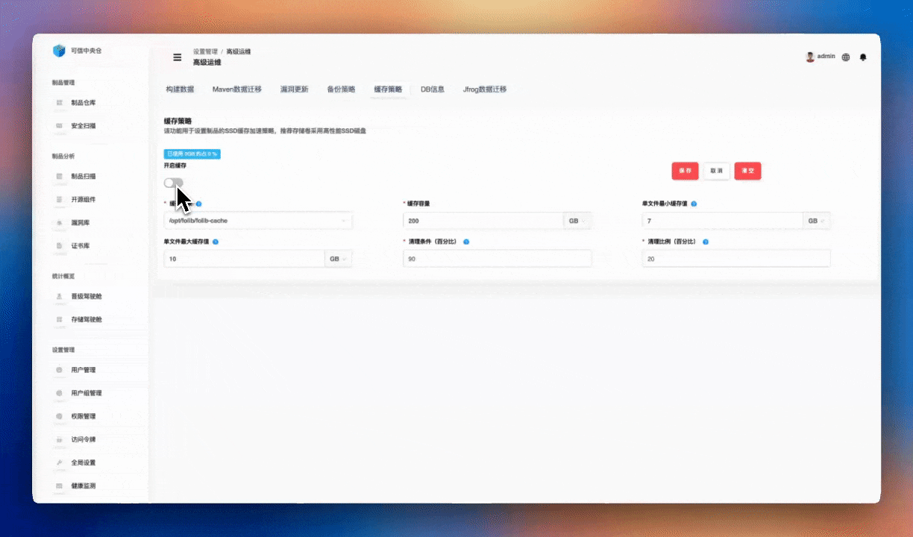

:::tip
**缓存目录：** 如果是容器化部署，目录则为容器内目录，需要在容器启动时将缓存目录挂载到容器内容的对应目录。
**缓存容量：** 缓存容量为缓存目录的容量，单位可选择MB、GB、TB 。
**单文件最小缓存值：** 大于等于单文件最小缓存值的制品才会被放入缓存中。可选择文件单位可选择KB、MB、GB 。
**单文件最大缓存值：** 小于等于单文件最大缓存值的制品才会被放入缓存中。可选择文件单位可选择KB、MB、GB 。
**清理条件（百分比）：** 输入1-100的值，例如输入90，表示大于等于缓存容量的90%时开始清理。
**清理比例（百分比）：** 输入1-100的值，例如输入10，表示达到清理条件时，至少清理缓存容量的10%，也可能大于10%。
:::

## DB信息

+ Schema信息

`Schema` 信息展示了系统的图数据库结构，查看方式如下：

1.  从左侧导航栏选择 **【设置管理】->【高级运维】** 。
2.  在 **【高级运维】** 页面，点击 **【DB信息】** ，在 **【DB信息】** 页面，点击 **【Schema】** 。

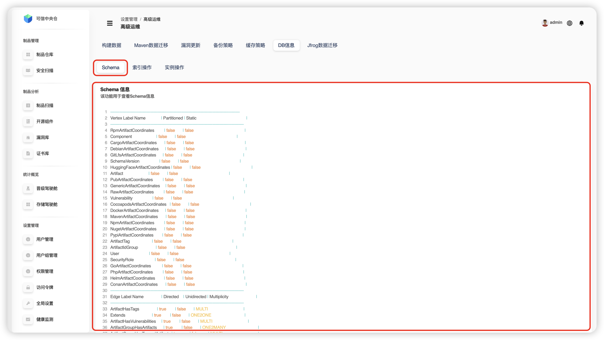

`Schema` 信息展示了系统的图数据库结构，主要包含以下几个部分：

1. *Vertex Label*（节点标签）
	+ 各类制品坐标（如Maven、Docker、NPM等）
	+ 组件（Component）
	+ 制品（Artifact）
	+ 漏洞（Vulnerability）
	+ 用户（User）
	+ 安全角色（SecurityRole）

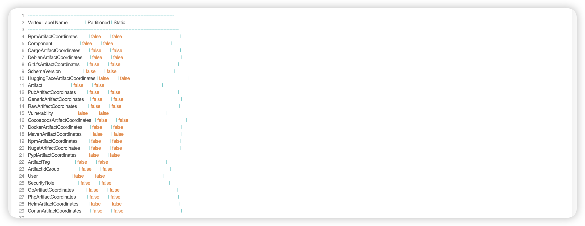

2. *Edge Label*（边标签）
	+ ArtifactHasTags：制品与标签的关系
	+ ArtifactHasVulnerabilities：制品与漏洞的关系
	+ UserHasSecurityRoles：用户与安全角色的关系
	+ ComponentHasVulnerabilities：组件与漏洞的关系

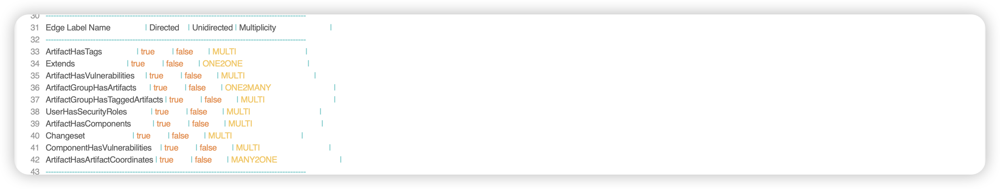

3. *Property Keys*（属性键）
	+ 基本信息：name、description、version等
	+ 安全相关：vulnerabilityID、safeLevel等
	+ 时间信息：created、lastUpdated等
	+ 文件信息：sizeInBytes、checksums等
	+ 用户信息：username、password等

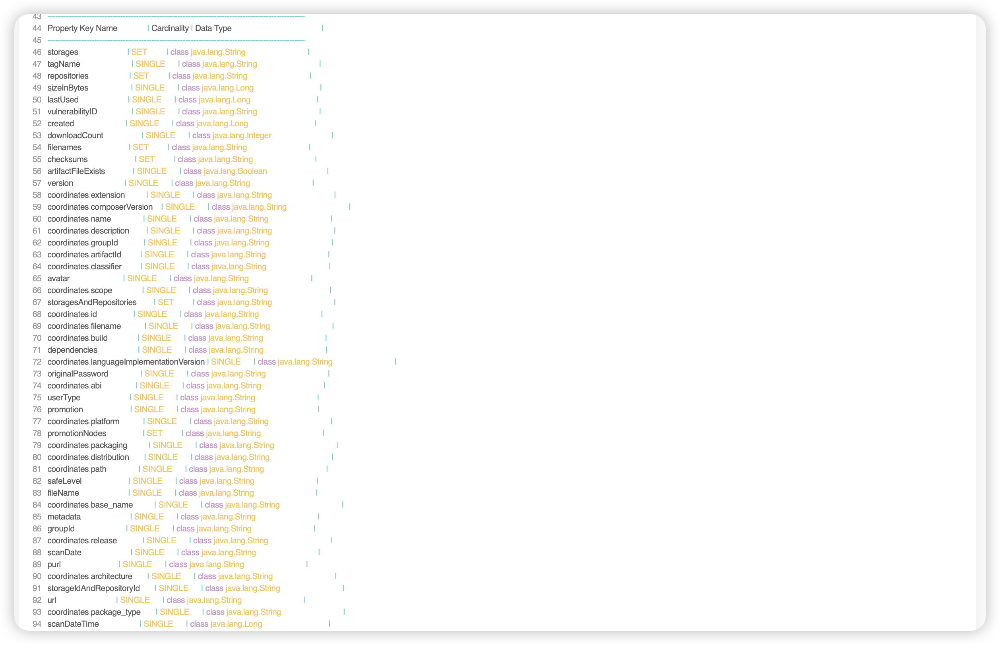

4. *Graph Index*（图索引）
	+ 按UUID的索引
	+ 按存储空间的索引
	+ 按用户类型的索引
	+ 按邮箱的索引

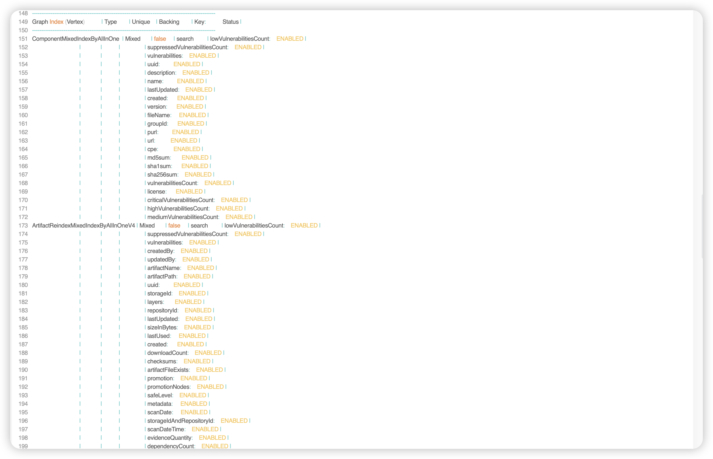

  这个 `Schema` 定义了整个系统的数据结构，包括：
  + 如何存储不同类型的制品
  + 如何管理用户和权限
  + 如何跟踪漏洞信息
  + 如何建立各种关联关系

  这些信息对于理解系统的数据模型和进行数据库维护非常重要。

+ 索引操作

索引操作功能是数据库管理系统中的一个重要组成部分，它允许用户对数据库中的索引进行管理和优化，主要操作如下：

1. 从左侧导航栏选择 **【设置管理】->【高级运维】** 。
2. 在 **【高级运维】** 页面，点击 **【DB信息】** ，在 **【DB信息】** 页面，点击 **【索引操作】** 。
3. 输入索引名称，点击 **【重建索引】** ，二次确认进行索引重建。重建索引用处如下：
  	+ 重新创建数据库表的索引，提高查询性能
  	+ 消除索引碎片，优化索引结构
  	+ 建议在系统负载较低时段进行
  	+ 可改善查询响应时间，特别适用于大数据量且频繁更新的表
4. 输入索引名称，点击 **【注册索引】** ，二次确认进行索引注册。注册索引需要考虑以下几点：
  	+ 创建新索引的过程，包括选择索引键和定义索引类型
  	+ 需考虑数据分布、查询模式和维护成本
  	+ 系统自动维护索引，确保数据变更同步

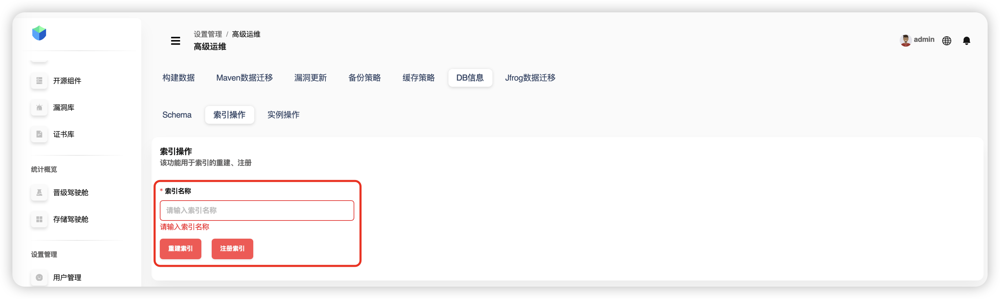

  索引的使用场景：
  + 加速数据检索操作，特别是在大型数据集上
  + 实现快速查找、排序和分组操作
  + 需要平衡查询性能和维护成本
  + 根据实际查询模式和数据更新频率进行优化

+ 实例操作

实例操作功能用于对数据库实例进行操作，主要操作如下：

1.  从左侧导航栏选择 **【设置管理】->【高级运维】** 。
2.  在 **【高级运维】** 页面，点击 **【DB信息】** ，在 **【DB信息】** 页面，点击 **【实例操作】** 。

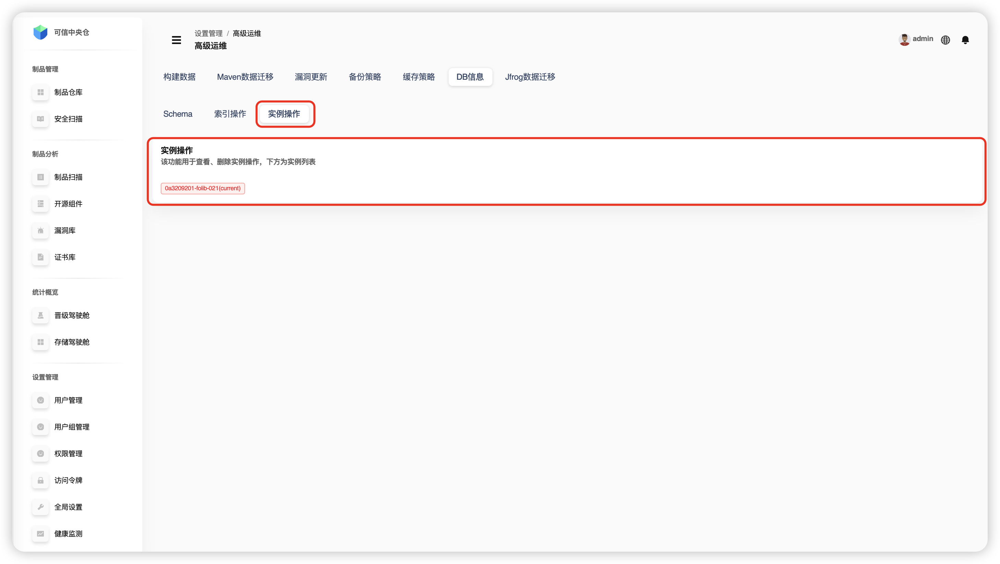

:::tip
💡 当只有一个的时候为当前使用实例，不允许删除。
:::

## Jfrog配置数据迁移

该功能支持已使用 `jforg` 制品系统的用户，通过填写Jfrog地址、用户名、密码后选择迁移内容和存储空间，进行相关数据的直接迁移至本平台。

1. 从左侧导航栏选择 **【设置管理】->【高级运维】** 。
2. 在 **【高级运维】** 页面，点击 **【Jfrog数据迁移】** 。
3. 输入JFrog平台的地址（IP地址和端口号），以及具备管理员权限的JFrog账户凭证；
4. 选定目标存储空间以保存制品；
5. 选择迁移方式：1-基于JFrog备份；2-基于API调用（这里选择API调用）；
6. 选择需要迁移具体内容。 
7. 点击 **【保存】** ，进行数据迁移。
   :::tip
   💡 该功能在于实现对Jfrog制品库中特定仓库信息、用户信息、用户组以及权限等数据的有选择性同步。特别指出，由于原始用户密码信息无法被检索，因此将为所有用户统一配置初始密码。
   :::

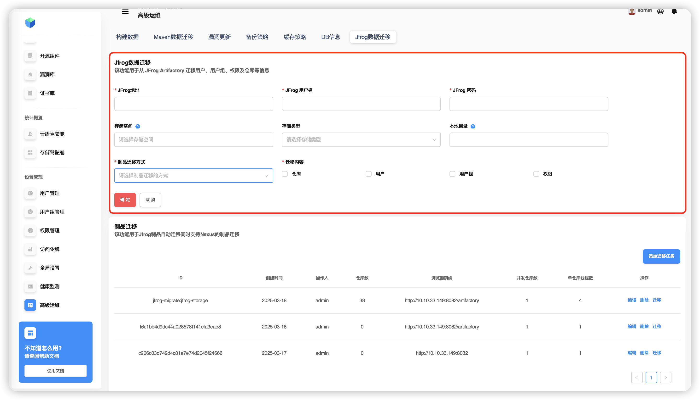

:::tip
💡 存储空间指 *Jfrog* 同步仓库所属存储空间,可以是一个已经存在的存储空间,也可以新建一个新的存储空间，若不填默认创建一个本地目录的新存储空间。
:::

## Jfrog制品数据迁移
当使用高级运维-jfrog配置数据迁移结束后，会在下方的制品迁移多出一条迁移任务

操作步骤如下：
1. 点击 ***迁移*** 按钮后，将进入待迁移列表，所有jfrog同步中的本地库将被视为本次迁移的待迁移仓库；
2. 在列表中选择需要迁移的仓库后，即可开始迁移。迁移过程中，仓库会进入“迁移中”状态；
3. 当仓库内容迁移完成后，选择“完成迁移”，该仓库将从代理库恢复为本地库，标志着迁移的正式完成。

  <!-- 右侧上下两张图片 -->
  

    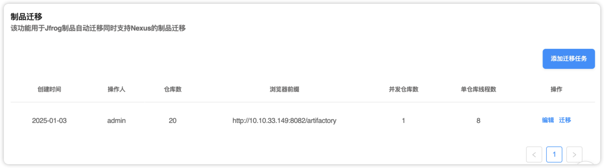
    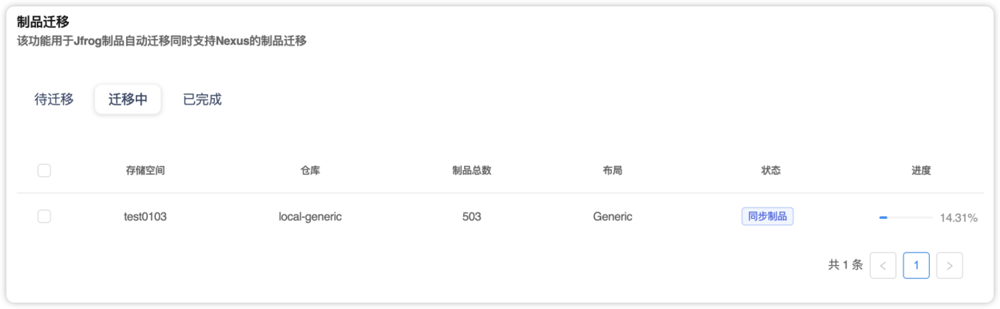
  

  <!-- 左侧单张图片 -->
  

    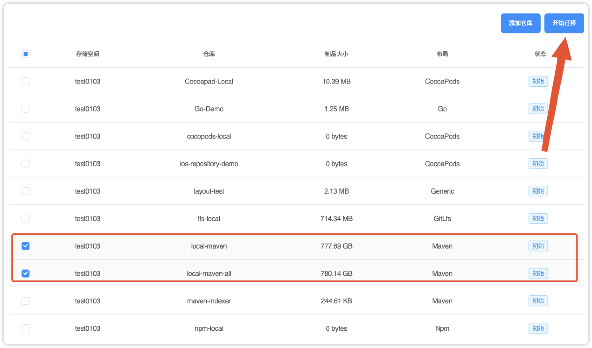
  

## Jfrog制品增量迁移
当制品数据迁移完成后，为防止JFrog制品库数据还有新增或修改删除等情况，增量同步目前可以通过jfrog的webhook功能实现，确保你的 JFrog 实例版本支持 Webhook（Artifactory 7.x 及以上版本）。
操作步骤如下：
1. 在JFrog 管理控制台为要同步的仓库配置webhook
2. URL中输入folib的webhook监听api http://IP:端口/artifactory/webhook
3. 选择需同步的仓库及事件
4. 添加自定义header
- X-jfrog-event-auth: 访问令牌可在folib访问令牌-添加令牌处添加
- X-storage: 被同步至folib的存储空间格式和 “存储空间” 例 public-project
  - X-repository: 被同步至folib的仓库格式和 “存储空间:仓库名称” 例 public-project:maven-local
注意，webhook除了上述手动添加的方式以外，您还可通过添加迁移任务是进行自动添加。

  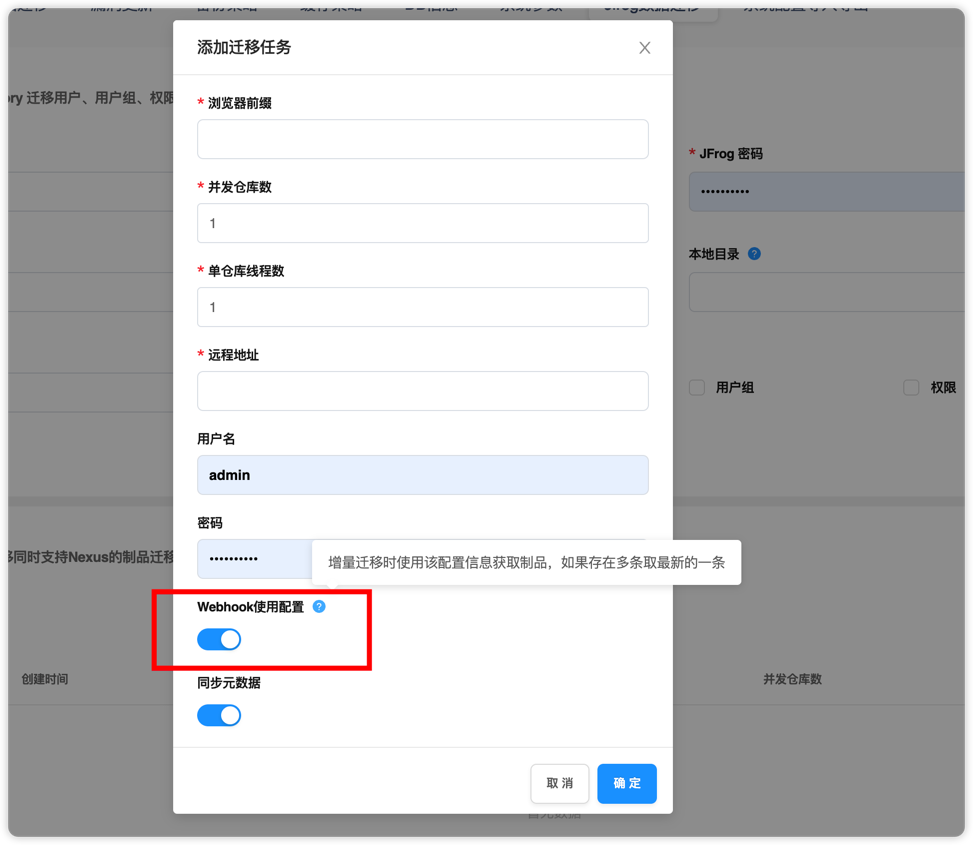
  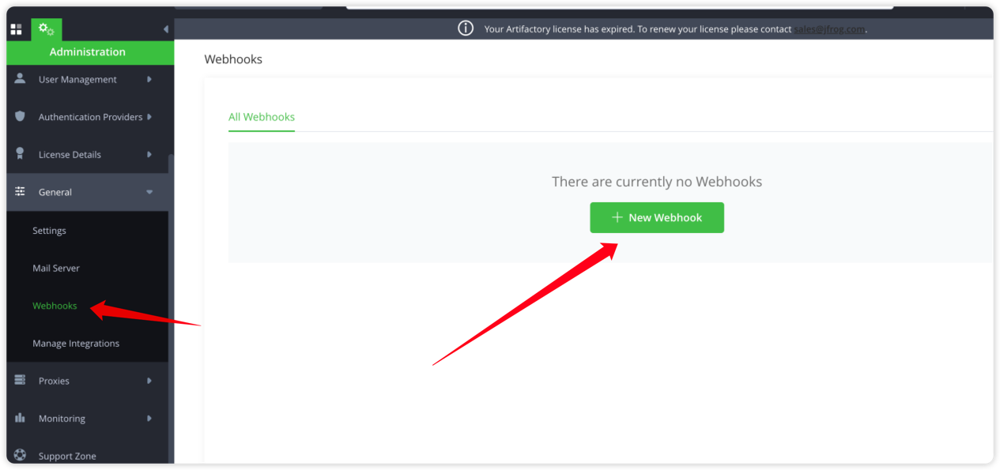

:::tip
当使用手动添加迁移任务是，为避免影响源仓库的数据，可以通过配置同步线程数来控制迁移任务的执行效率，包括单一实例允许同时同步的最大仓库数和每个仓库的线程数（即单实例总同步线程数 = 并发仓库数 × 单仓库线程数）。
:::
