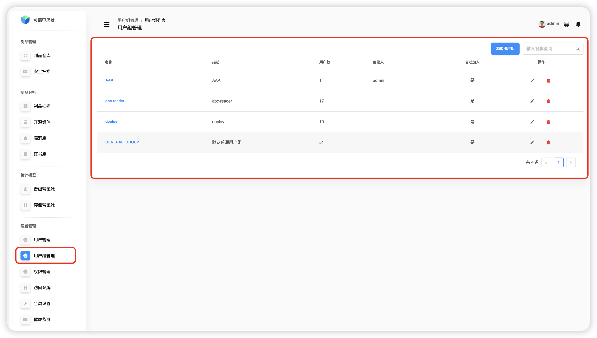
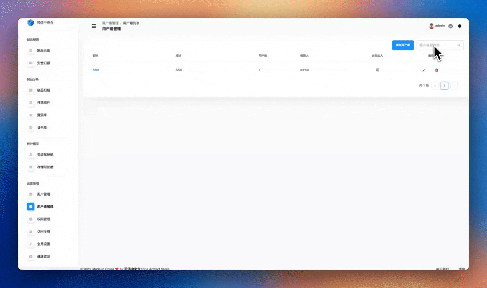
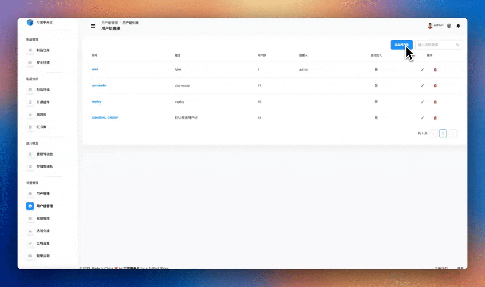
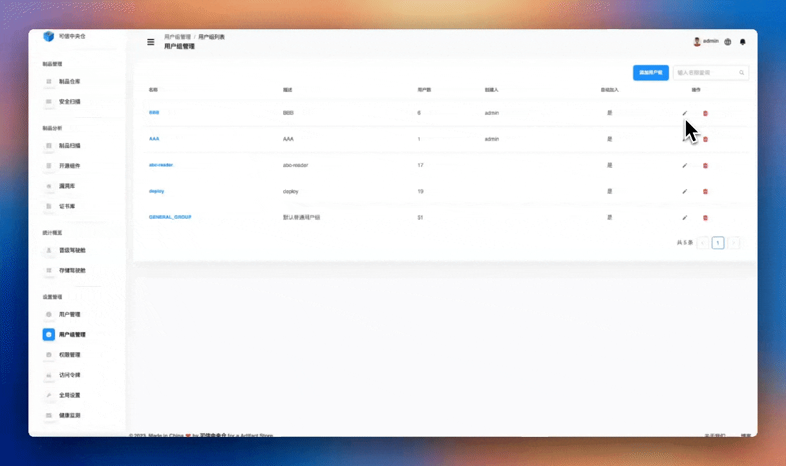

# 用户组管理

点击左侧导航栏【设置管理】->【用户组管理】，用户组管理模块提供了对用户组的创建、查询、修改和删除等基础操作功能。通过用户组管理，可以批量管理用户，并为新用户设置自动加入的用户组。主要功能包括：
1. 用户组基础操作
	+ 创建新的用户组
	+ 查询现有用户组
	+ 修改用户组信息
	+ 删除用户组
2. 用户组成员管理
    + 添加用户到用户组
    + 从用户组移除用户
    + 批量调整用户组成员
3. 自动加入设置
    + 配置新用户自动加入的用户组
    + 简化用户管理流程

特点
+ 便捷的用户组管理
+ 灵活的成员调整
+ 自动化的用户分组

## 用户组查询

可以通过在搜索框中输入用户组名称进行精准查询，查询结果为用户组名称、用户组描述、用户组内用户数量、创建人、是否将新创建的用户自动加入该用户组。

:::tip
💡 支持模糊搜索、不区分大小写
:::

## 用户组添加

**【系统管理员】** 可以在该产品中添加一个用户组，填写用户组的名称、描述，选择是否自动将新用户加入此用户组、选择好成员后点击【>】或【<】按钮进行转移，点击右下角确认按钮完成添加。

+ 用户组编辑说明
	+ **用户组名称：** 为用户组设置一个唯一的标识名称，便于识别和管理。
	+ **描述信息：** 添加对该用户组用途或特点的说明，帮助其他管理员理解该组的作用。
	+ **自动加入：** 设置新创建的用户是否自动加入该用户组，便于批量用户管理。
	+ **成员选择：** 从现有用户中选择需要加入该组的成员，支持搜索和批量操作。
	+ **成员转移：** 在可选择用户列表与已选择用户列表之间通过【>】或【<】按钮进行转移，用于将用户添加或移出该用户组。

## 用户组修改

**【系统管理员】** 可以在需要修改的用户组那一行信息的最右侧【操作】那一列中点击修改图标，修改用户组名称、描述，选择是否自动将新用户加入此用户组、转移用户组成员。

## 用户组删除

**【系统管理员】** 可以在需要删除的用户组那一行信息的最右侧【操作】那一列中点击删除图标,二次确认后删除一个用户组信息

