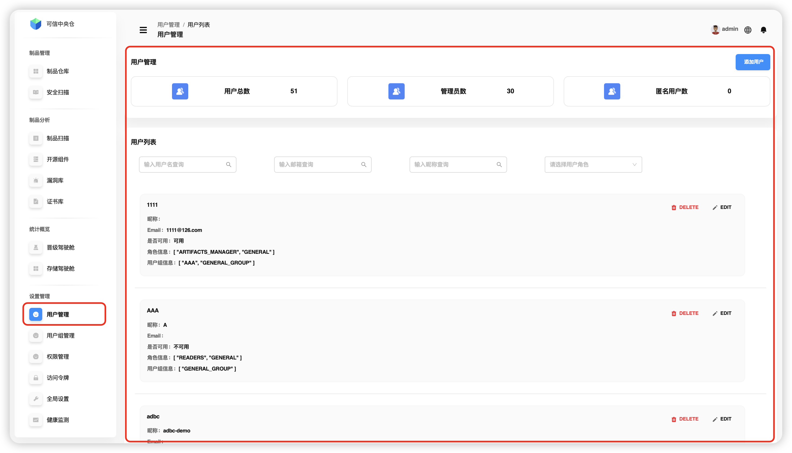
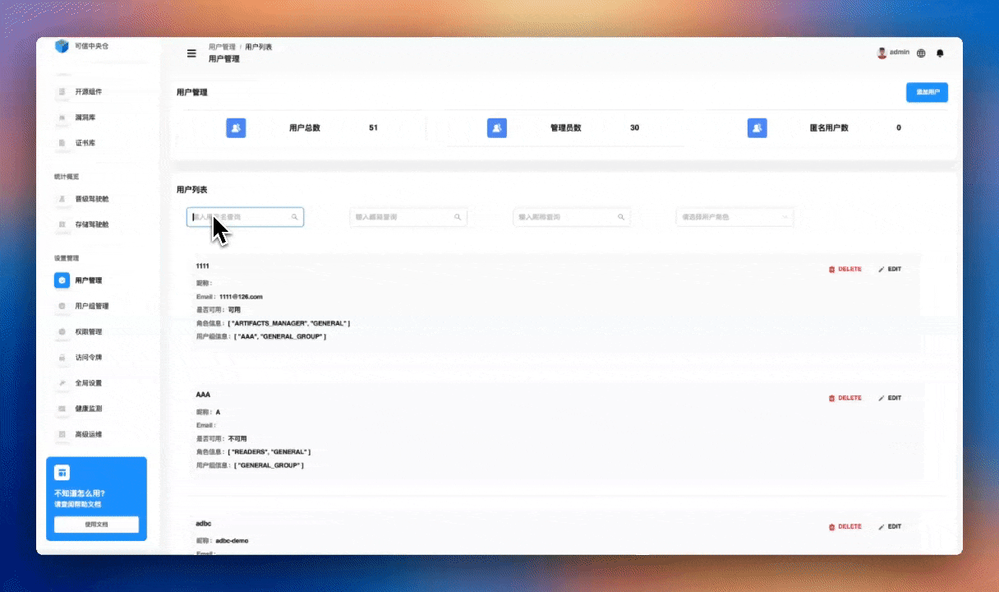
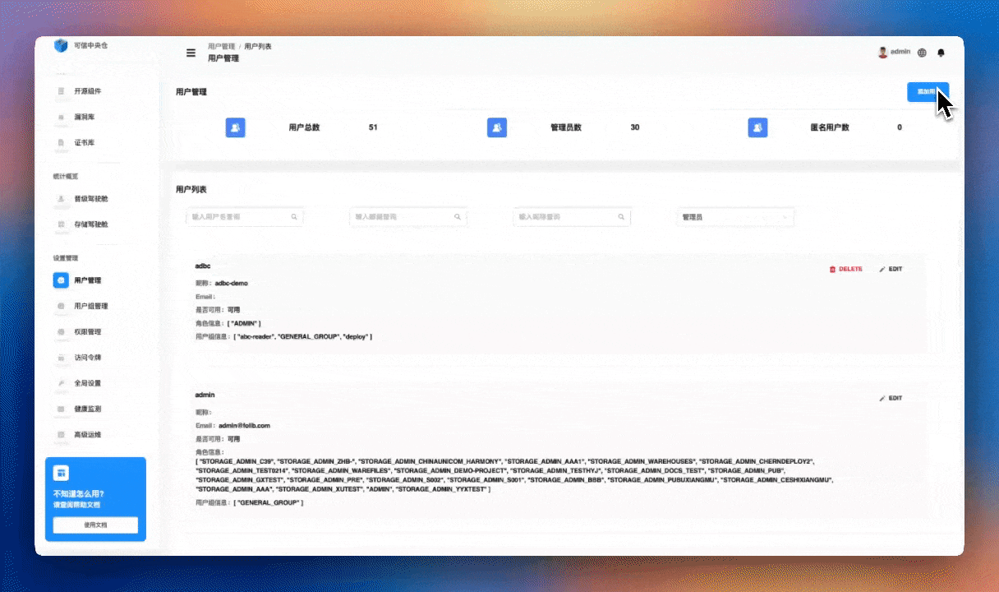
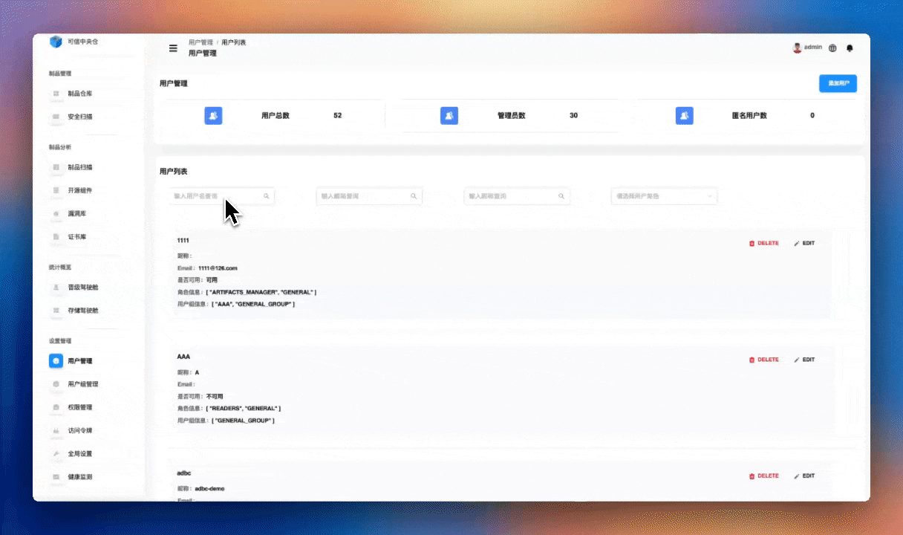
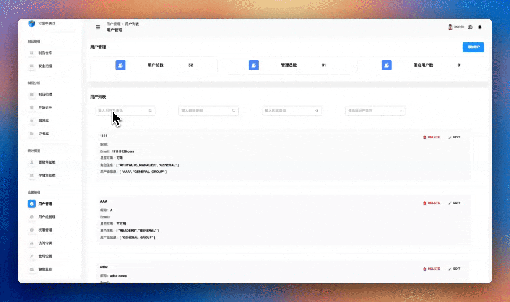

# 用户管理

点击左侧导航栏【设置管理】->【用户管理】,用户管理模块提供了基础的用户操作功能，包括用户的创建、查询、修改和删除等基础操作。同时，通过内置角色分配和用户组编辑权限设置，确保系统使用的规范性。主要功能包括：
1. 用户基础操作
	+ 创建新用户账号
    + 查询和筛选用户信息
    + 修改用户基本信息
    +  停用或删除用户账号
3. 角色管理
    + 分配内置角色（如管理员、全局只读等）
    + 灵活调整用户角色
4. 用户组权限
    + 设置用户组编辑权限
    + 控制用户信息的访问与修改

用户管理模块页面在进行基础用户操作后会动态展示用户总数、管理员数以及匿名用户数。

特点:
+ 完整的用户基础操作
+ 内置角色快速分配
+ 用户组编辑权限管理

## 用户查询

系统提供灵活的用户查询功能，支持以下查询方式：
+ **用户名称查询：** 通过输入用户名进行精确匹配
+ **邮箱查询：** 根据用户邮箱地址进行精确定位
+ **角色查询：** 根据用户角色进行精确定位

:::tip
💡 均不支持模糊搜索
:::

查询结果为用户名称、是否可用、 *Email* 邮箱地址、角色信息、所在用户组，查询结果会实时显示，帮助管理员快速定位和管理特定用户。

## 用户添加

**【系统管理员】** 可以点击右上角【添加用户】按钮为该产品中添加一位用户。

+ **用户编辑说明**
	+ **用户名：** 用户名在系统中必须是唯一的，以确保每个用户都有一个独特的标识。
	+ **密码：** 密码应为字母，数字，特殊符号(~!@#$%^&\*()\_.)，三种及以上组合， *12-30* 位字符串，如： *example666@abc*
	+ **Email：** 电子邮件地址也必须是唯一的，以确保通信和通知的准确性。电子邮件地址有标准的格式要求（如 *username@example.com* ）。
	+ **是否激活：** 通过开启激活按钮，该用户信息才可以被应用到其他模块中，【用户列表】中第二行信息是否可用即代表该用户是否激活。
+ **角色编辑说明**
	+ **ADMIN：** 超级用户角色，拥有所有可能的特权。
	+ **ARTIFACTS\_MANAGER：** 具有制品上传、删除、移动、复制、晋级权限。
	+ **GENERAL：** 普通用户角色，具有基础的制品下载和查看权限，可以访问系统的基本功能，但不具备高级管理权限。
	+ **OPEN\_SOURCE\_MANAGE：** 开源治理角色，负责开源合规管理，可以进行开源许可证审查、漏洞扫描结果查看等开源相关的管理工作。
+ **用户组编辑说明**
	+ 首先展示了所有的用户组，有用户组名称和用户组描述，默认为开启状态，即该用户创建后，该用户组能够对用户进行编辑，如添加该用户到用户组。

## 用户修改

**【系统管理员】** 可以在用户列表中找到需要修改用户信息的用户，点击该用户信息右上角的 *【EDIT】* 按钮，即可进行用户编辑、角色编辑、用户组编辑。

## 用户删除

**【系统管理员】** 可以在用户列表中找到需要修改用户信息的用户，点击该用户信息右上角的 *【DELETE】* 按钮，二次确认删除该角色后即可删除该用户。

