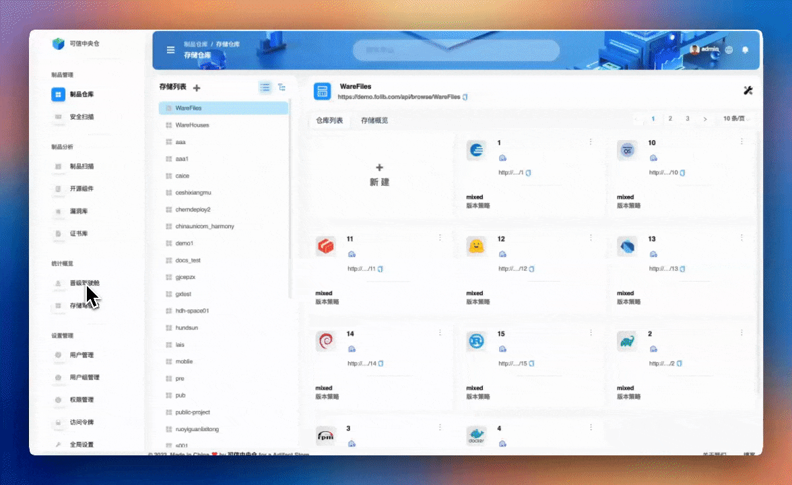
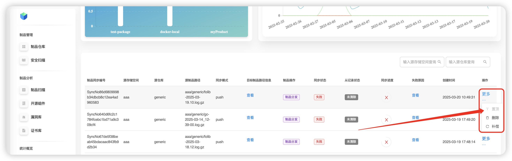
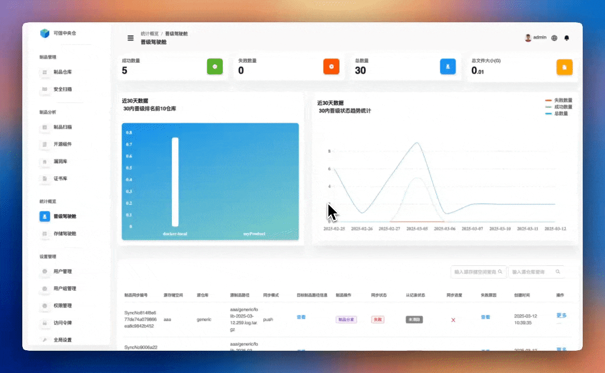

# 晋级驾驶舱

用于查看全平台所有正在晋级的制品状态，支持补偿同步失败、查看失败原因，并可置顶优先级高的制品库或执行删除操作。

## 补偿操作

选择失败需要重新晋级的制品，点击 **更多** —— **补偿** ，对该任务进行重新晋级。

## 删除操作

选择失败需要删除的制品，点击 **更多** —— **删除** ，完成该晋级任务的删除。

## 置顶操作

选择需要优先晋级的任务，点击**更多** —— **置顶** ，完成该任务优先处理操作。

## 失败原因

选择对应的失败任务，点击 **查看** ，展示具体的失败原因。

