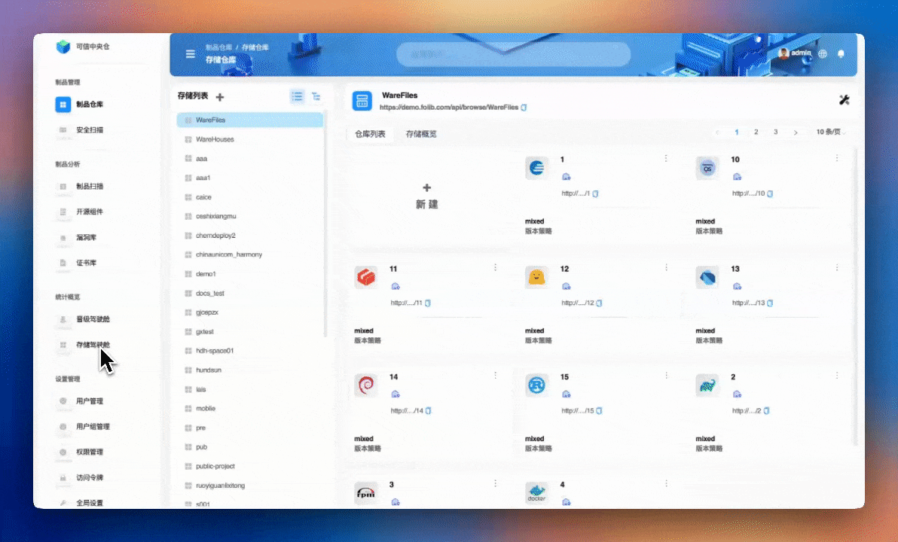
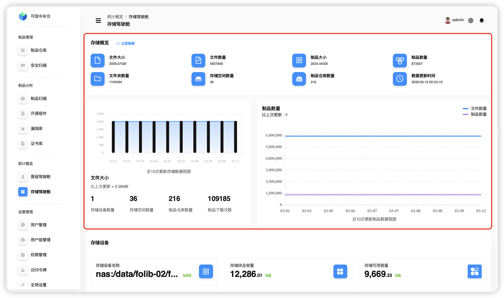
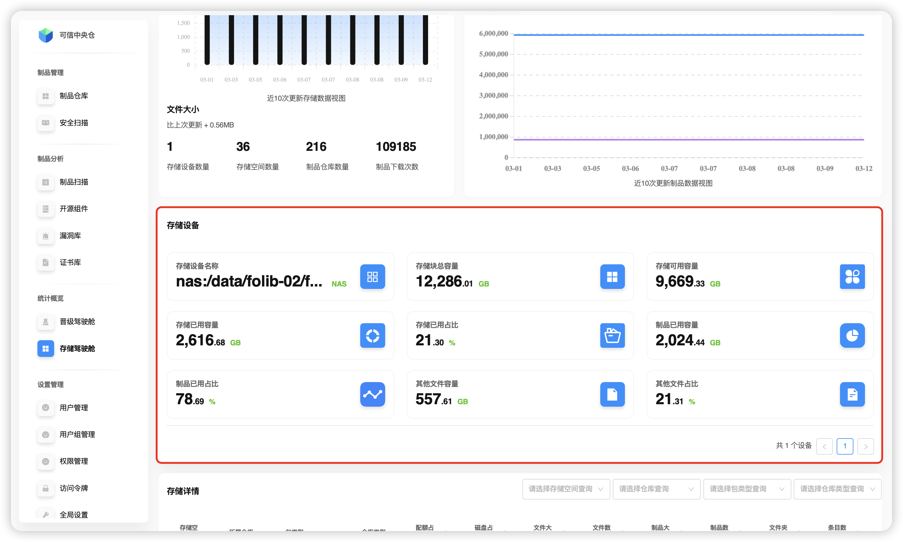
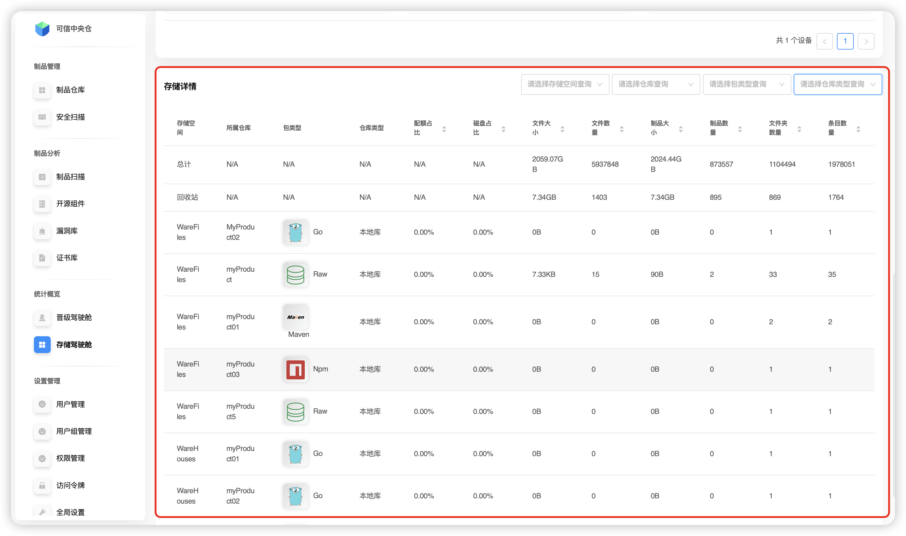
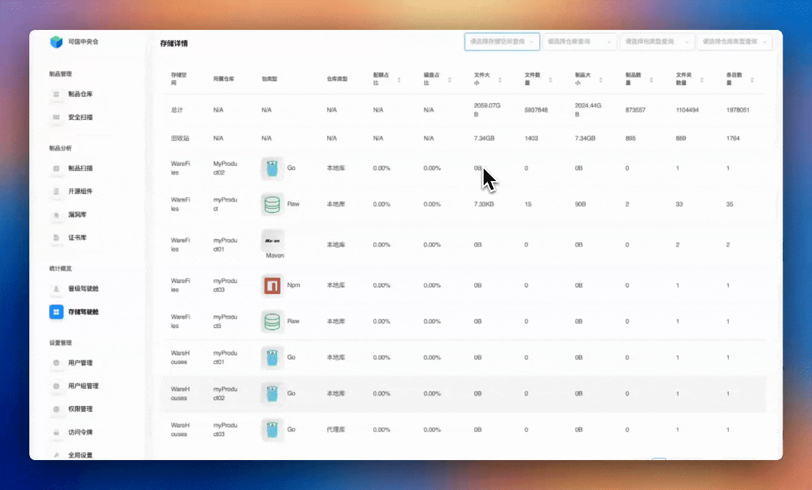

# 存储驾驶舱

用于查看平台下存储的情况，支持查看全局和对应存储空间。

## 存储概览

在存储概览中，平台展示了 **文件大小** 、 **文件数量** 、 **制品大小** 、 **制品数量** 、 **文件夹数量** 、 **存储空间数量** 、 **制品仓库数量** 以及 **数据更新时间** 的信息，还提供了 **近10次更新存储数据视图** 和 **近10次更新制品数据视图** 两种视图。

## 存储设备

平台还提供了一些存储设备的信息和数据， 如 **存储设备名称** 、 **存储块总容量** 、 **存储可用容量** 、 **存储已用容量** 、 **存储已用占比** 、 **制品已用容量** 、 **制品已用占比** 、 **其他文件容量** 以及 **其他文件占比** 。

## 存储详情

存储详情提供了 **制品仓库** 、 **回收站** 以及 **总存储** 的情况展示。

支持通过 **存储空间** 、 具体 **仓库** 、 **包类型** 、 **仓库类型** 进行筛选。

:::tip
💡 只有当选定 **存储空间** ，才能选择某个具体 **仓库**

📚 **包类型** 包括平台现在支持的所有的类型

🔍 **仓库类型** 有 *本地库* 和 *代理库* 两种
:::

