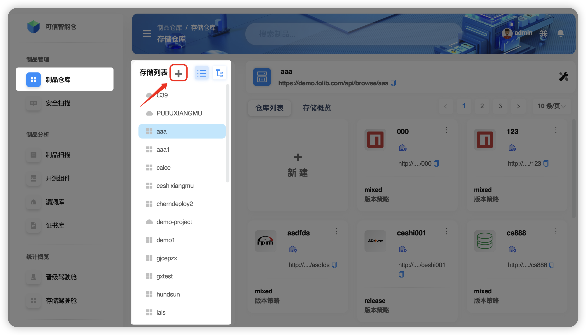
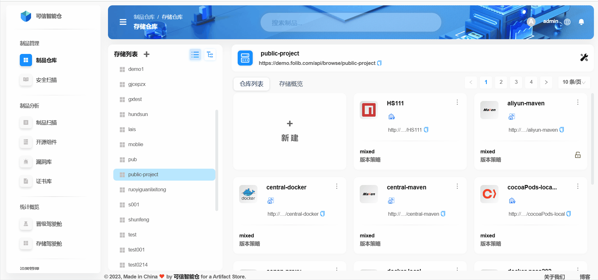
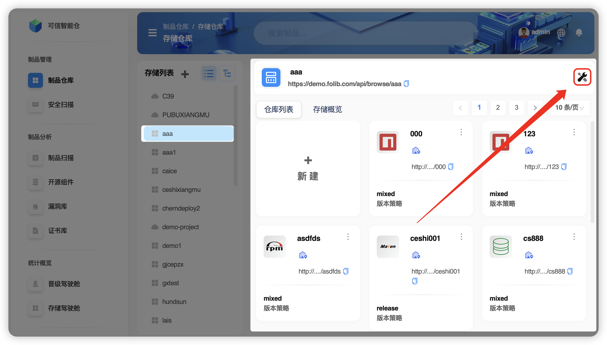
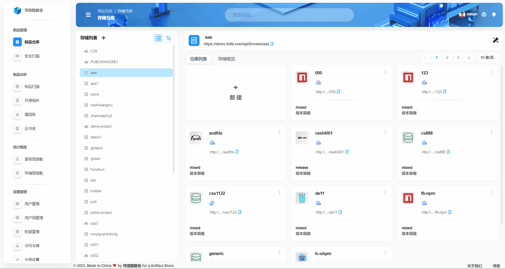
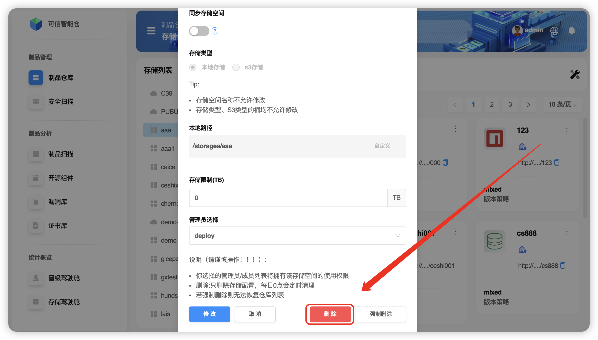
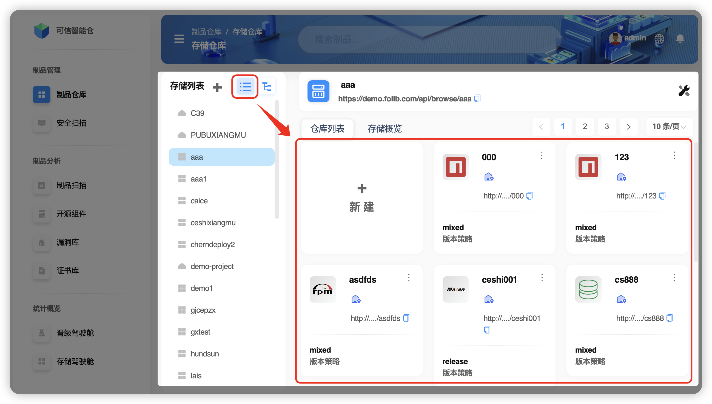
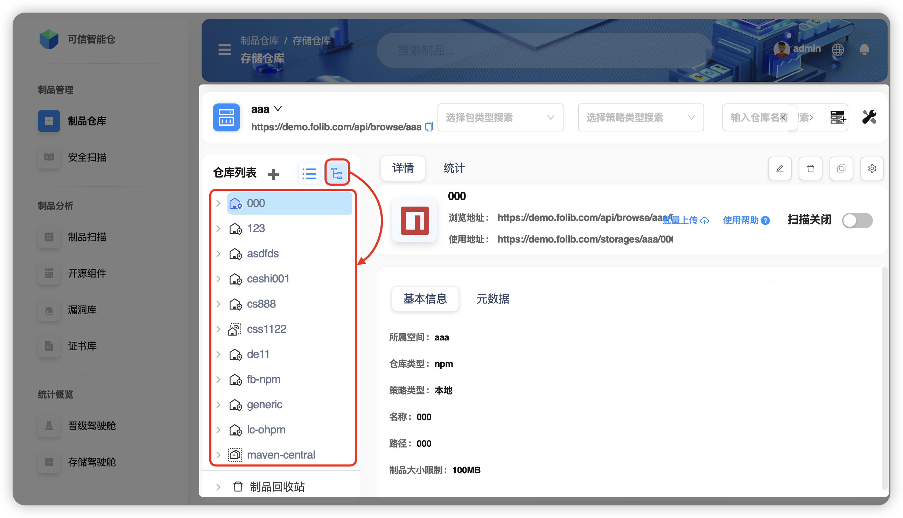
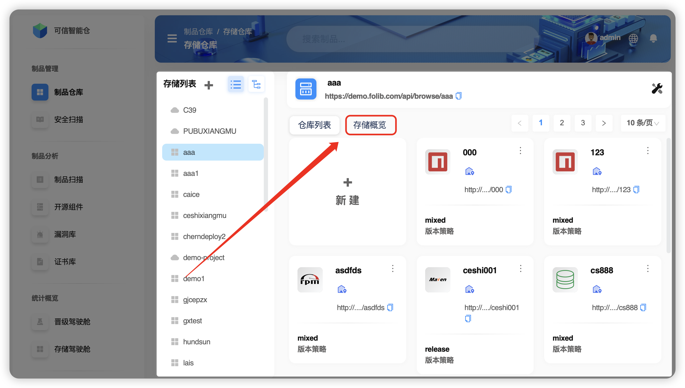
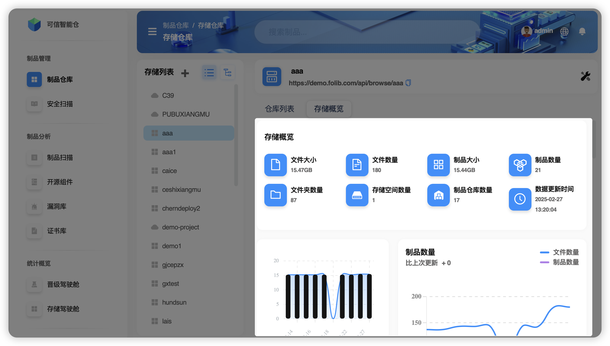

# 基本操作

**存储空间** 可由 **平台管理员** 创建并分配 **空间管理员** 进行管理，同时可以进行 **修改与删除**。通过 **存储空间列表** 可以直观看到本账号所拥有的存储空间，在这里对 **存储空间** 进行操作。

+   操作涉及的术语表

|      术语名      |                               术语阐释                                |
| :--------------: |:-----------------------------------------------------------------:|
| **存储空间名称** |                            存储空间的唯一标识名称                            |
| **同步存储空间** | 开启/关闭同步，则此存储空间下所有仓库的同步将开启/关闭。但存储空间下的每个仓库又可单独设置同步选项，且不影响这个整体的同步选择。 |
|   **存储类型**   |                   提供两种类型：本地存储（NFS目录）和S3存储（云存储桶）                   |
|   **本地路径**   |                         本地存储的物理路径，支持自定义设置                         |
|   **存储限制**   |                             存储空间的最大容量                             |
|  **管理员选择**  |                    由平台管理员在创建仓库时设置，可修改、删除此存储空间                     |

:::tip

  图标表示 NFS 存储

  图标表示 S3 存储

:::

## 新建存储空间

+   **步骤1:** 在 **存储空间外部视角** 下，点击 **+** 图标

+   **步骤2:** 配置 **存储空间** 参数，点击 **“确定”** 即可完成新增操作

:::tip
[📄 存储空间的命名规范文档](#)
:::

## 修改存储空间

以存储空间 `aaa` 为例

+   **步骤1:** 在 **存储空间内部视角** 下，点击右上角 **“修改”** 图标

+   **步骤2:** 配置 **存储空间** 选项，点击 **“修改”** 按钮即可完成新增操作，点击 **“取消”** 按钮即可取消操作

:::tip
💡 仅支持修改 **同步存储空间**、**存储限制**、**管理员限制** 选项
:::

## 删除存储空间

以存储空间 `aaa` 为例

+   **步骤1:** 在 **存储空间内部视角** 下，点击右上角 **“修改”** 图标

+   **步骤2:** 点击 **“删除”** 按钮（*推荐*）

**存储空间** 存在两种删除方式：**删除** 和 **强制删除**。

| 方式 | 对比 |
| :--------: | :-------------------------------: |
|  删除 👍🏻  | 只删除存储配置，每日0点会定时清理 |
| 强制删除 ⚠️ |         完全删除且无法恢复仓库列表         |

## 仓库视角切换

仓库列表是本账号有权限的存储空间的集合展示。系统默认展示 **平面模式**，支持通过开关切换到 **树形模式**。

+   **平面视角**

+   **树形视角**

## 空间存储概览

在存储概览中可看到存储空间的文件大小、数量，制品大小、数量等信息。

+   在平面模式下，选择 **存储概览**。

