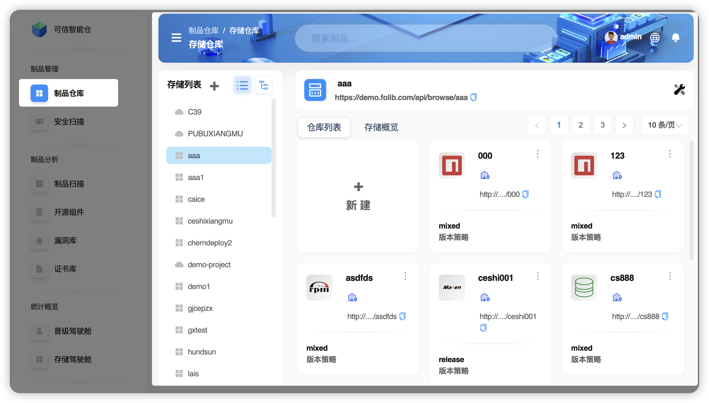
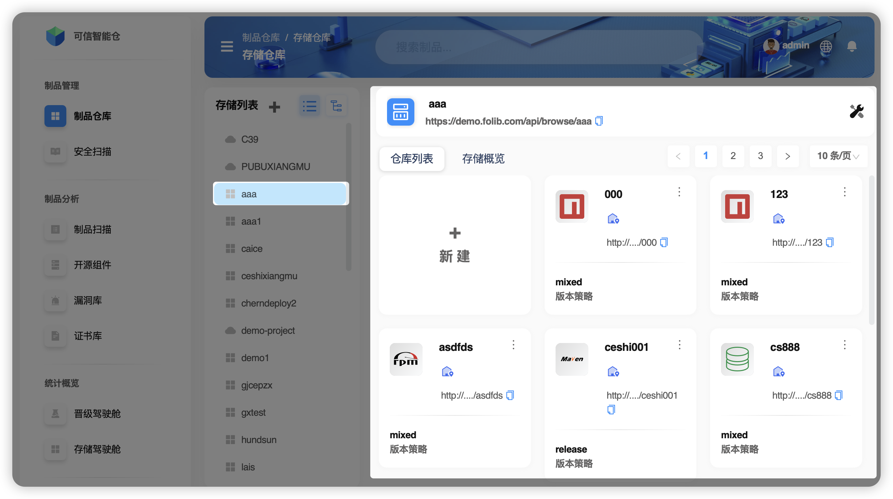

# 空间概述

**存储空间** 是用于隔离不同业务单元（如部门、子公司）的独立资源池，支持本地存储（NFS目录）和S3云存储两种模式。在该空间下，您可以创建和管理您想要使用的仓库。它保障了部门间资源的独立性、安全性、可扩展性。

+ 两种存储模式

| 术语名        | 术语阐释 |
|:-----------|:---------|
| **NFS存储**  | **定义**：基于 NFS（Network File System）协议实现的网络共享存储解决方案，允许客户端通过网络访问服务器上的文件，如同访问本地文件系统。 **协议**：基于 TCP/IP 或 UDP 协议。 **挂载方式**：需要将远程文件系统挂载到本地路径，挂载后可通过本地路径访问。 **读写操作**：支持本地磁盘的读写操作，性能接近本地文件系统。 **扩容方式**：通过增加服务器存储容量或网络带宽实现，需手动配置。 **灵活性**：扩容和配置较复杂，可能影响业务连续性。 **适用场景**：适合本地网络中对性能要求高、数据量适中的业务。 |
| **S3存储**   | **定义**：基于云的对象存储服务，支持大规模数据存储和高可用性，通过 HTTP/HTTPS 协议和 RESTful API 进行数据操作。 **协议**：基于 HTTP/HTTPS 协议。 **挂载方式**：不支持传统文件系统挂载，需通过 SDK 或命令行工具操作。 **读写操作**：基于网络协议，性能依赖于网络带宽和延迟。 **扩容方式**：自动扩展，无需预配存储容量，支持按需付费。 **灵活性**：扩容灵活，无需手动干预，适合动态调整。 **适用场景**：适合大规模数据存储、云原生应用，以及对成本和可用性要求高的业务。 |

## 界面说明

1.   **存储空间外部视角**

空间外部视角下，可以看到本账户拥有的存储空间及选中空间下的制品库。

2.   **存储空间内部视角**

空间内部视角下，只关注选中空间内的情况。

