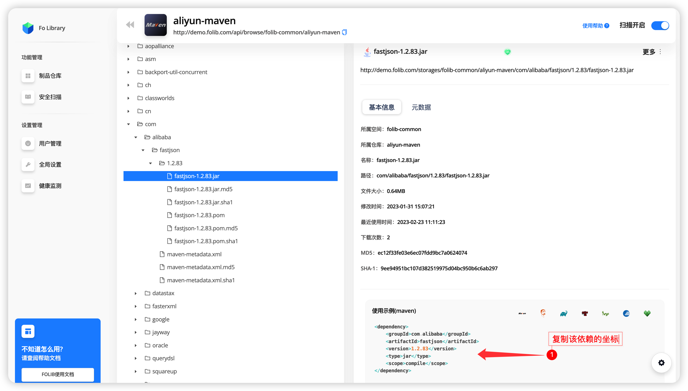
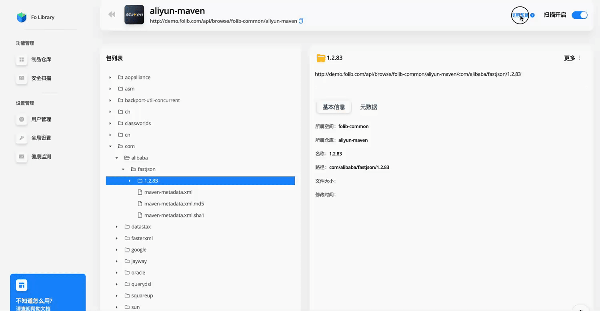

## Maven工具示例

可以通过 `folib-examples/hello-folib-maven` 工程或者你的随便一个 `maven` 工程进行测试与验证，目的是用来体验如何通过 `maven` 相关命令工具与制品库进行交互。

## 前置条件

* Java 开发工具包 (JDK) 版本 1.8.x或更高版本
* Maven 3.x 或更高版本

## 基础用法

<div class="custom-divider">
    <span class="divider-inner">了解POM中坐标</span>
</div> 

`pom.xml` 文件用于定义项目的依赖项、用于解析和部署制品以及插件等。

每个项目的 `pom.xml` 中需要包含以下属性：

```shell
    groupId                                       - 其他类似项目所在的逻辑前缀。其他类似项目所在的逻辑前缀其他类似项目所在的逻辑前缀其他类似项目所在的逻辑前缀其他类似项目所在的逻辑前缀
    artifactId                                    - 制品的名称。
    version                                       - 制品的版本。
    packaging（可选，jar如果未指定，则默认为 ）        - 包装类型（jar、war 等...）
    <repositories/>section                        - 定义从哪个仓库拉取依赖。
    <distributionManagement/>section              - 定义将此构建生成的工件部署到哪个仓库。
```

<div class="custom-divider">
    <span class="divider-inner">如何快速的使用</span>
</div> 

这里将演示从 `Folib` 中获取一个 `maven` 依赖并在 `pom.xml` 中进行使用



将坐标文件复制到`pom.xml`中进行使用，其中`type`和`scope`两个参数可以不用。

```xml
<dependency>
    <groupId>com.alibaba</groupId>
    <artifactId>fastjson</artifactId>
    <version>1.2.83</version>
</dependency>
```

<div class="custom-divider">
    <span class="divider-inner">如何设置mirror和repository</span>
</div> 

如何需要将依赖传入制品仓库，你需要设置你将要上传的 `repository` 地址在 `pom.xml` 中。拉取包可以在 `settings.xml` 中进行配置 `mirror` 。



如何使用命令与注意事项

```shell
mvn clean deploy       #上传包到制品库
mvn clean install      #可以用来打包下载依赖
```

1. settings.xml是 Maven 的配置文件，用于定义全局设置，例如远程仓库、首选镜像、代理设置、仓库凭据等。它通常位于.m2您的主目录下的文件夹中 ~/.m2/settings.xml 或 C:\Users\youruser\.m2\settings.xml 您还可以使用 -s /path/to/settings.xml 来定义自定义位置（即您可能需要有多个settings.xml文件）

2. pom.xml文件中的 repositories 和 distributionManagement 具有id， 这 id 需要与 settings.xml 文件中的 id 所对应中的 server 能够对应上。