# 操作指南

在仓库页面可以对制品和元数据进行列表浏览、搜索制品、预览、上传、删除、复制、移动、晋级与分发等操作。

以存储空间 `WareFiles` 下的制品库 `myProduct` 为例 （操作指南的操作都以在存储空间 `WareFiles` 下进行为例）

+ 在 **平面视图** 下，点击所选的制品库 *myProduct*

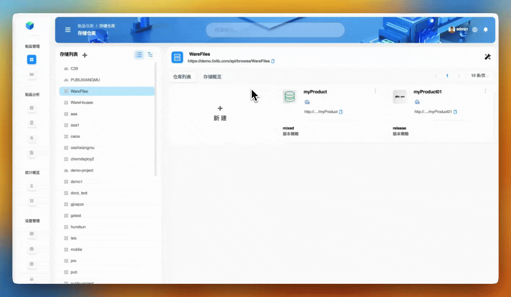

+ 在 **树形视图** 下，点击所选的制品库 *myProduct*

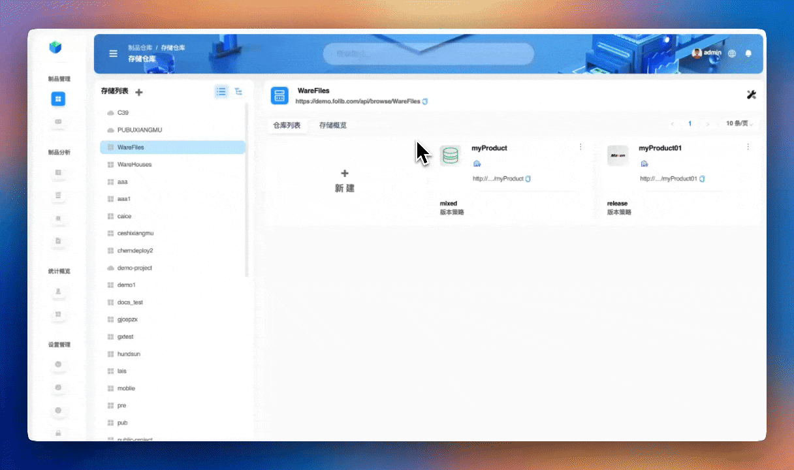

## 制品上传

:::tip
⚠️ **代理** 和 **组合** 策略不支持上传
:::

+ **制品上传**

:::tip
👨🏻‍💻 目前 *Maven* , *Gradle* , *SBT* , *lvy* , *Rpm* 和 *docker* 类型的制品库支持上传 (详情查看 [🔍 上传类型支持文档](../../docs/supplement-explanation/supplement-explanation-type-support.md) )
:::

以 `Maven` 类型制品库为例，选中需要上传的 `Maven` 类型制品库，点击右上角的 **上传** 按钮。如果上传的是非标准制品库，需要填写 `GroupID` , `ArtifactID` 和 `Version` 。

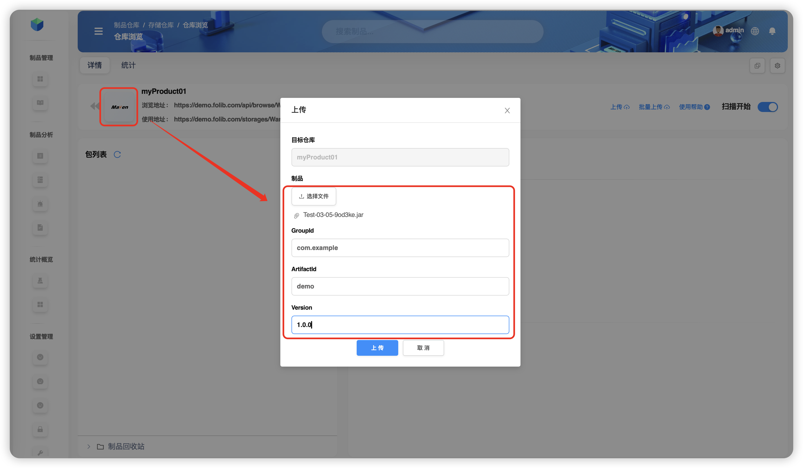

+ **批量制品上传**

:::tip
👨🏻‍💻 目前 *Gradle*, *SBT*, *Maven*, *lvy*, *yarn*, *npm*, *raw*, *php*, *pub*, *debian* 和 *cargo* 类型的制品库支持批量上传 (详情查看 [🔍 批量上传类型支持文档](../../docs/supplement-explanation/supplement-explanation-type-support.md) )

💡 按住 *command* 键（ *mac* 用户） 或 *ctrl* 键（ *win* 用户） 来多选文件
:::

以 `raw` 类型制品库为例，选中需要上传的 `raw` 类型制品库，点击右上角的 **批量上传** 按钮。

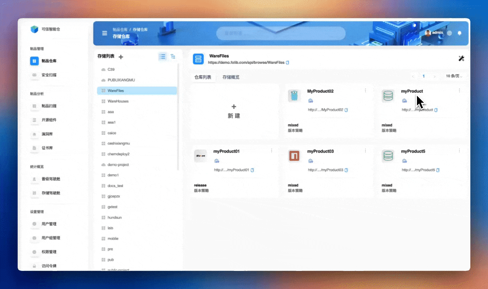

+ **制品压缩包上传**

:::tip
💡 上传成功后会把压缩文件解压到目标目录下
:::

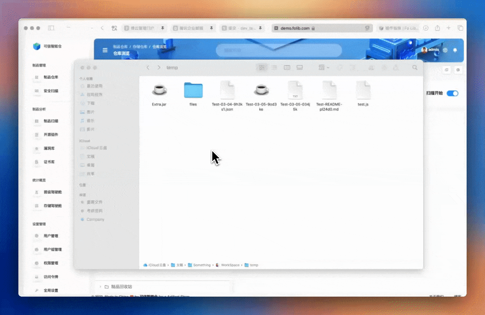

## 制品搜索

具体查看 [🔍 制品文件搜索文档](../../docs/search-summary/search-summary-warefile.md)

## 制品预览

通过制品预览可以预览 **制品文件** 内的内容。 选中包列表中的 `04/Extra.jar` ，点击右侧界面右上角 **更多** 图标，选中 **下拉菜单** 中的 **预览** 。

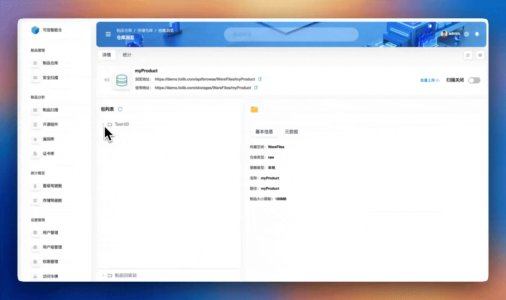

:::tip
包文件只能预览目录，文件才可以预览内容。*jar* 文件只能预览目录，*pom* 文件和 *xml* 文件可以预览到内容。(详情查看 [🔍 支持预览的制品类型汇总文档](../../docs/supplement-explanation/supplement-explanation-type-support.md))
:::

## 制品复制

可以以 **文件夹** 为单位复制，也可以以 **文件** 为单位进行复制。

:::tip
❗️仅可复制到 **本制品库** 内或 **同类型的制品库** 内。
:::

+ 选中包列表中的 *04* 文件夹，点击右侧界面右上角 **更多** 图标，选中 **下拉菜单** 中的 **复制** ，选择 *WareFiles* 中的 *myProduct* 制品库并选择 *Test-03/03/04* 路径。

+ 选中包列表中的 *04/Extra.jar* ，点击右侧界面右上角 **更多** 图标，选中 **下拉菜单** 中的 **复制** ，选择 *WareFiles* 中的 *myProduct* 制品库并选择 *Test-03/03* 路径。

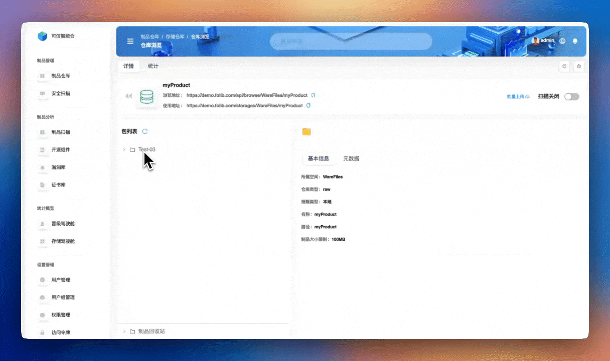

## 制品移动

可以以 **文件夹** 为单位移动，也可以以 **文件** 为单位进行移动。

:::tip
❗️仅可移动到 **本制品库** 内或 **同类型的制品库** 内
:::

+ 选中包列表中的 *03* 文件夹，点击右侧界面右上角 **更多** 图标，选中 **下拉菜单** 中的 **移动** ，选择 *WareFiles* 中的 *myProduct* 制品库并选择 *Test-03/05/03* 路径。

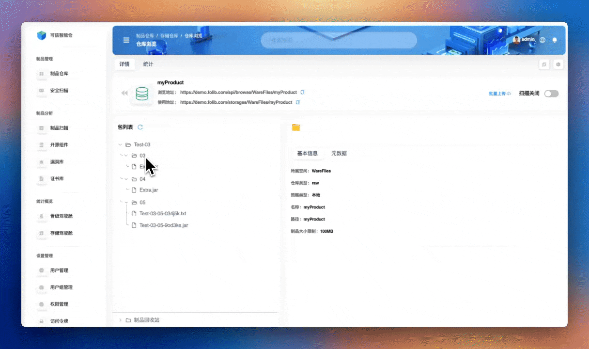

+ 选中包列表中的 *03/Extra.jar* ，点击右侧界面右上角 **更多** 图标，选中 **下拉菜单** 中的 **移动** ，选择 *WareFiles* 中的 *myProduct* 制品库并选择 *Test-03/05* 路径。

## 制品删除

可以以 **文件夹** 为单位删除，也可以以 **文件** 为单位进行删除。

+ 以 **文件夹** 为单位删除

+ 以 **文件** 为单位删除

## 制品分发

**制品分发** 是指在软件开发和交付过程中，将生成的制品文件快速、准确且可靠地分发到目标环境或用户手中的过程。分发记录可以通过查看 **事件记录** 中的 **分发/晋级记录** 情况。

+ 以 **文件夹** 为单位分发

	+ **内部节点** 分发

	选中 `myProduct` 库中 `Test-03` 下的 `05` 文件夹，点击右侧界面右上角 **更多** 图标，选中 **下拉菜单** 中的 **分发** 。分发至 `aaa` 存储空间中的 `generic` 库。

	

	+ **外部节点** 分发

	**外部节点** 指 **JFrog** 等网站的节点，通过在 **全局设置** 的 **节点分发配置** 中新建 **外部节点** ，才能在分发时选择对应的 **外部节点** 。

	选择外部节点分发，再选择新建的外部节点，进行分发。

	

+ 以 **文件** 为单位分发

	+ **内部节点** 分发

	选中 `myProduct` 库中 `Test-03/05` 下的 `Test-03-05-9od3ke.jar` 文件，点击右侧界面右上角 **更多** 图标，选中 **下拉菜单** 中的 **分发** 。分发至 `aaa` 存储空间中的 `generic` 库。

	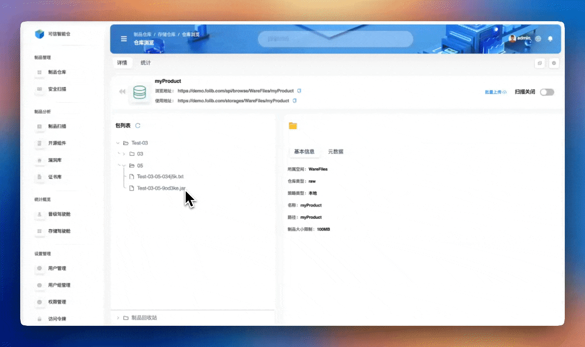

	+ **外部节点** 分发

	

## 制品下载

+ 以 **文件夹** 为单位下载

选中 `myProduct` 库中 `Test-03` 下的 `05` 文件夹，点击右侧界面右上角 **更多** 图标，选中 **下拉菜单** 中的 **下载** 。该操作会将整个文件夹下载到浏览器默认的下载位置。

+ 以 **文件** 为单位下载

选中 `myProduct` 库中 `Test-03/05` 下的 `Test-03-05-9od3ke.jar` 文件，点击右侧界面右上角 **更多** 图标，选中 **下拉菜单** 中的 **下载** 。该操作会将该文件下载到浏览器默认的下载位置。

## 元数据操作说明

+ **添加** 元数据

:::tip
💡 可自定义 **元数据** `KEY`

🔑 `KEY` 有五种类型，分别是 *字符串* ， *数字* ， *文本* ，`Markdown` 以及 `JSON`
:::

选中 `Test-03/05/` 路径下的 `Test-03-05-9od3ke.jar` 文件，点击制品库信息面板的 **元数据** 按钮，再点击下方的 `+` 按钮。

当设置 **文件夹** 的 **元数据** 时，可以选择 **递归** ，这样该文件夹下的所有文件都会有这项元数据。

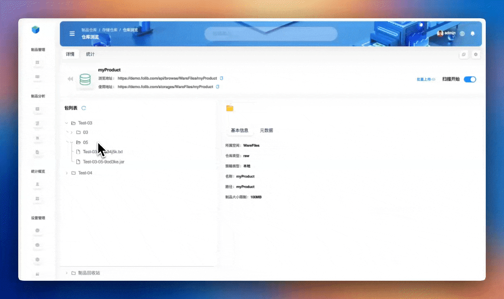

+ **编辑** 元数据

:::tip
⚠️ 修改不可以切换自定义

💡 只有自定义 `KEY` 的元数据才可以切换类型
:::

选中 `Test-03/05/` 路径下的 `Test-03-05-9od3ke.jar` 文件，点击制品库信息面板的 **元数据** 按钮，选中需要编辑的元数据，再点击 **编辑** 按钮。

+ **删除** 元数据

选中 `Test-03/05/` 路径下的 `Test-03-05-9od3ke.jar` 文件，点击制品库信息面板的 **元数据** 按钮，选中需要编辑的元数据，再点击 **删除** 按钮。

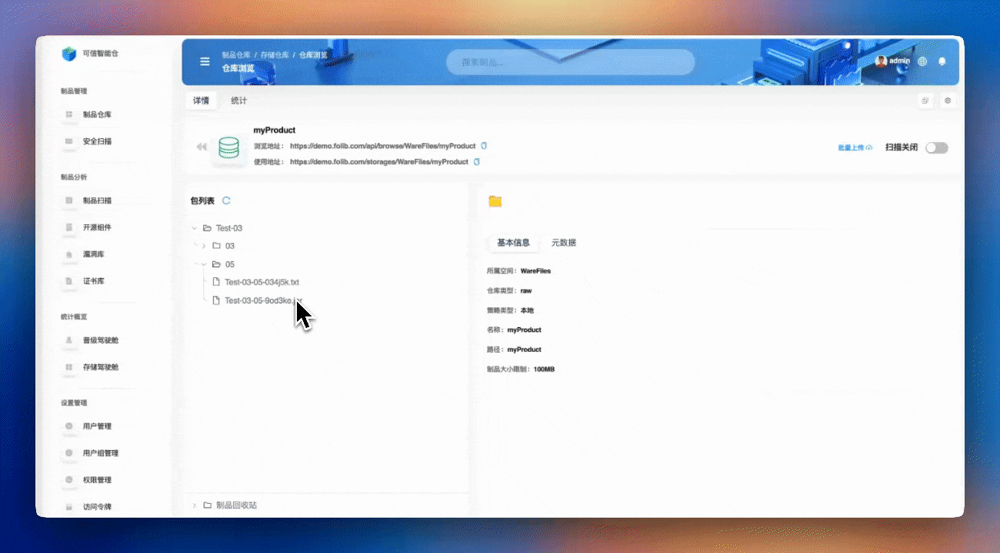

当删除**文件夹** 的 **元数据** 时，可以选择 **递归删除** ，这样该文件夹下的所有文件都删除这项元数据。

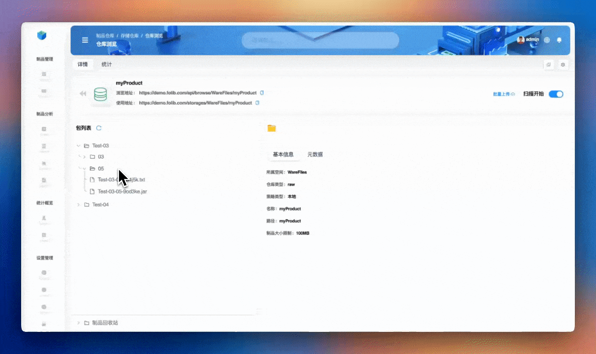