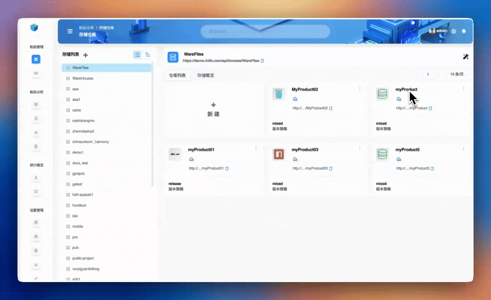
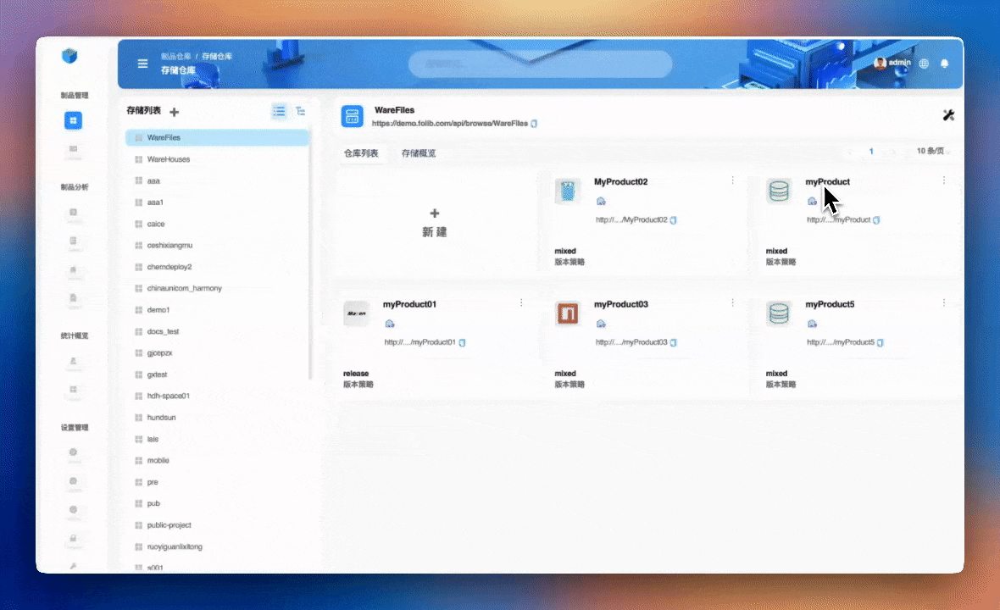
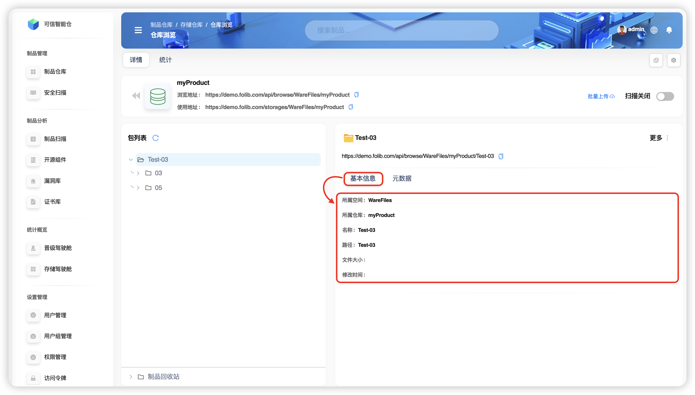
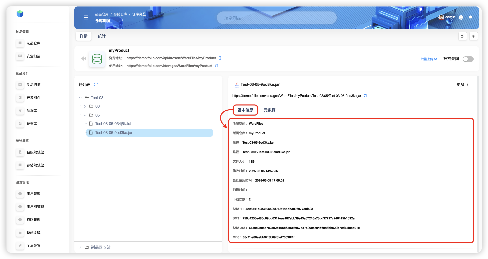
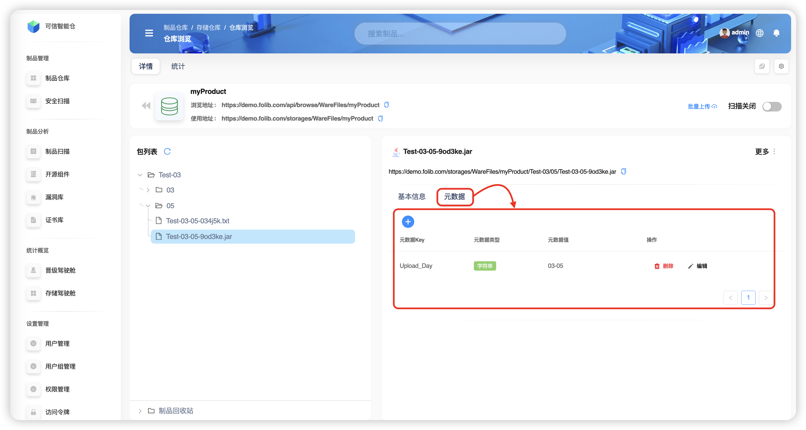
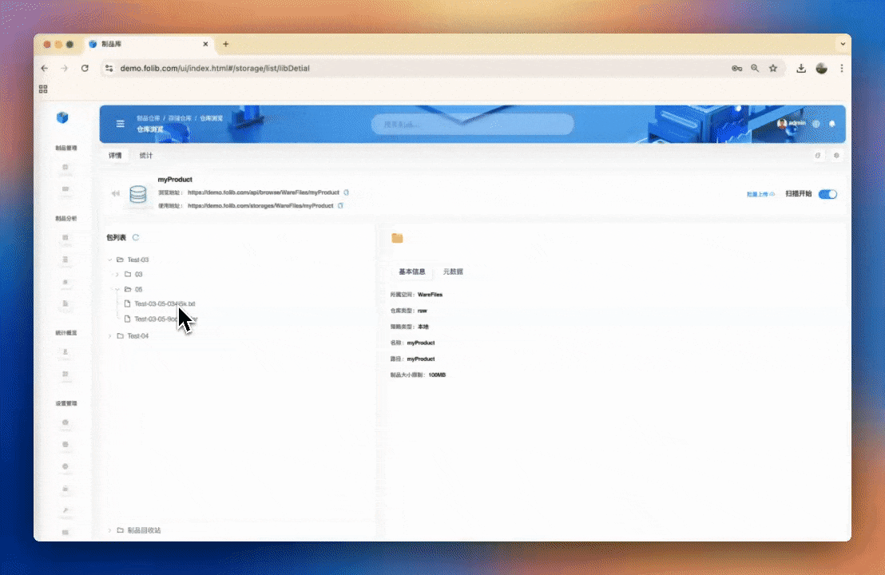
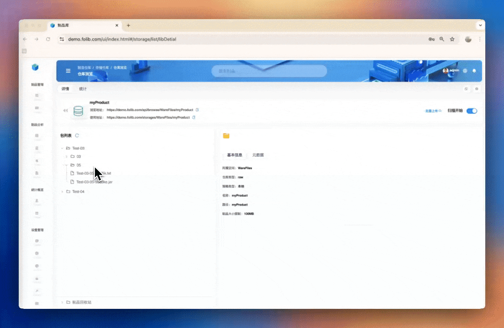

# 制品概述

**制品** 是构建过程的产物，可以是代码编译后的二进制文件、库、容器镜像、配置文件、文档等。**制品** 是软件交付的一部分，在不同的开发阶段（开发、测试、部署）中被使用。

## 界面说明

以存储空间 `WareFiles` 内的仓库 `myProduct` 为例

+ 面板 **左侧** 的 **包列表** 是仓库内的制品文件结构，点击文件或文件夹会在面板 **右侧** 显示具体信息。

**包列表** 下的 **制品回收站** 里是被 **删除** 的制品文件或制品文件夹

+ 面板 **右侧** 是制品文件夹或制品文件的两个信息—— **基本信息** 和 **元数据** 。
	+ **基本信息**

	文件夹的基本信息如下表所示
	| 术语名 | 术语阐释 |
  |:--------:|:-----------:|
  | 所属空间 | 所在的存储空间名称 |
  | 所属仓库 | 所在的制品仓库名称 |
  | 名称 | 制品文件名称 |
  | 路径 | 包列表中所在的路径 |
  | 文件大小 | 制品文件的大小 |
  | 修改时间 | 最近一次的修改时间 |

	

	文件的基本信息如下表所示（已省略与文件夹相同的术语）
	| 术语名 | 术语阐释 |
  |:----:|:----:|
  | 最近使用时间 | 最近一次复制、移动、下载或分发的时间 |
  | 扫描时间 | 最近一次对该文件进行扫描的时间 |
  | 下载次数 | 从制品库里下载的次数 |
  | SHA-1 | 一种加密哈希算法，用于生成数据的唯一摘要（ *digest* ） |
  | SM3 | 密码散列函数标准，属于哈希算法 |
  | SHA-256 | 是SHA-2（安全哈希算法2）家族中的一种加密哈希函数，用于生成数据的唯一摘要 |
  | MD5 | 是一种广泛使用的哈希函数 |

	

   + **元数据**

	

  | 术语名 | 术语阐释 |
  | :----: | :----: |
  | 元数据KEY | 元数据关键词 |
  | 元数据类型 |  元数据关键词所对应的类型，有五种类型  |
  |  元数据值  | 元数据关键词对应的值，受元数据类型限制 |
  | 操作 | 支持删除或编辑 |

+ 在浏览器中浏览文件

以制品库 `myProduct` 为例，在 **制品库** 页面，点击 **浏览地址** 或复制该地址到浏览器中，就进入到 **文件浏览页面**

若选中某个文件，在 **右侧面板** 中点击文件对应地址，会触发下载

若选中某个文件夹，在 **右侧面板** 中点击文件夹对应地址，进入到这个文件夹的 **文件浏览页面**

