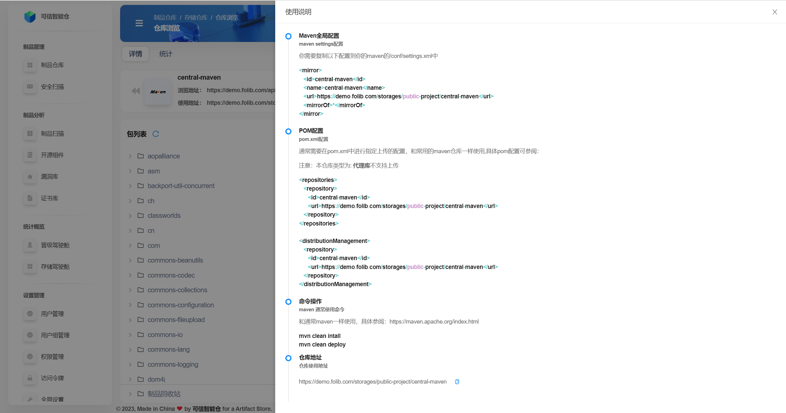

# 仓库信息

制品仓库的信息主要在**仓库详情页**和**仓库统计页**中。

## 仓库详情页

## 1.地址介绍

 

### 1.1 浏览地址

 

### 1.2 使用地址
它是仓库在使用中的地址。使用的具体方式点击右侧“**使用说明**”，“**使用说明**”根据仓库的类型不同而不同，如Maven类型的仓库的使用说明与Gradle类型的仓库不同。

示例 —— Maven类型仓库的“**使用说明**”：

## 2.包列表介绍

## 3.基本信息

 

仓库基本信息、文件夹基本信息、文件基本信息格式有所不同，分类介绍如下：

 

### 3.1 仓库基本信息

从仓库外部视图点进仓库时，默认显示该仓库的基本信息。不同类型的仓库所显示的基本信息不同，名词解释如下：

* **三类仓库**均含的基本信息：

| 名词             | 解释                           |
|------------------|------------------------------|
| 所属空间         | 仓库所属的存储空间，用于组织和隔离不同项目或团队的资源。 |
| 仓库类型         | 仓库的类型，例如 Maven、Docker、npm 等。 |
| 策略类型         | 仓库的策略类型，含本地、代理、组合三种。         |
| 名称             | 仓库的名称，用于标识和引用。               |
| 路径             | 路径指其在包列表中的位置，仓库路径就是仓库名称。     |
| 制品大小限制     | 仓库允许存储的最大文件大小限制。             |

* 仅**代理仓库**含的基本信息：

| 名词            | 解释                                                                 |
|---------------|----------------------------------------------------------------------|
| 代理地址          | 代理仓库的上游地址，用于转发请求并获取资源。在内网环境中，当当前制品库无法直接访问外部资源时，可以通过配置代理服务器（proxy）来间接访问代理地址。                           |

* 仅**组合仓库**含的基本信息：

| 名词             | 解释                                                                 |
|------------------|----------------------------------------------------------------------|
| 组合仓库列表     | 组合仓库中包含的子仓库列表，这些子仓库可以是本地仓库、代理仓库或其他组合仓库。 |

 

### 3.2 文件夹基本信息

| 名词         | 解释                               |
|--------------|----------------------------------|
| 所属空间     | 文件夹所处的存储空间，用于组织和隔离不同项目或团队的资源。    |
| 所属仓库     | 文件夹所处的制品仓库。                      |
| 名称         | 文件夹的名称。                          |
| 路径         | 文件夹在仓库中的存储路径，也是在包列表中的位置，用于定位和访问。 |

 

### 3.3 文件基本信息

* 情况一：该文件为**制品文件**，如jar包、war包等。基本信息中的名词解释如下：

| 名词         | 解释                                    |
|--------------|---------------------------------------|
| 所属空间     | 文件所处的存储空间，用于组织和隔离不同项目或团队的资源。          |
| 所属仓库     | 文件所处的制品仓库。                            |
| 名称         | 文件的名称，通常包含文件的标识和版本信息。                 |
| 路径         | 文件在仓库中的存储路径，也是在包列表中的位置，用于定位和访问。       |
| 文件大小     | 文件的大小，通常以字节（KB、MB等）为单位，表示文件的存储占用空间。   |
| 修改时间     | 文件最后一次被修改的时间。                         |
| 最近使用时间 | 文件最近一次被使用的时间。                         |
| 扫描时间     | 文件最后一次被扫描的时间，通常用于安全检查或依赖分析。           |
| 下载次数     | 文件被下载的次数，可用于衡量文件的使用频率。                |
| SHA-1        | 文件内容的SHA-1哈希值，可用于验证文件的完整性和一致性。        |
| SM3          | 文件内容的SM3哈希值，一种国产密码算法，可用于验证文件的完整性。     |
| SHA-256      | 文件内容的SHA-256哈希值，一种更安全的哈希算法，可用于验证文件的完整性。 |
| MD5          | 文件内容的MD5哈希值，可用于验证文件的完整性，但安全性较低。       |

 

* 情况二：该文件为**非制品文件**，如xml文件等。基本信息中的名词解释如下：

| 名词         | 解释                                      |
|--------------|-----------------------------------------|
| 所属空间     | 文件所处的存储空间，用于组织和隔离不同项目或团队的资源。            |
| 所属仓库     | 文件所处的制品仓库。                              |
| 名称         | 文件的名称，通常包含文件的标识和版本信息。                   |
| 路径         | 文件在仓库中的存储路径，也是在包列表中的位置，用于定位和访问文件。       |
| 文件大小     | 文件的大小，通常以字节（KB、MB等）为单位，表示文件的存储占用空间。     |
| 修改时间     | 文件最后一次被修改的时间。                           |

## 4.元数据

**仓库**、**非制品文件**（如xml文件等）没有元数据，**文件夹**和**制品文件**（如jar包、war包等）有元数据。

元数据名词解释如下：

| 名词 | 解释 |
|:----:|:----:|
| 元数据Key      | 元数据的键（Key），用于唯一标识一个元数据项。在默认情况下，它是默认提供的键值`ISSUE_ID`，在自定义情况下，用户需要输入一个唯一的Key名称。                              |
| 元数据类型     | 元数据的类型，决定了元数据值的格式。可选类型包括数字类型、字符串类型、文本类型、Markdown类型和JSON类型。在默认情况下，类型为字符串类型且不可修改，在自定义情况下，用户可以从下拉菜单中选择所需的类型。 |
| 元数据值       | 元数据的具体值，根据所选的元数据类型输入对应格式的内容。例如，如果类型为数字类型，则只能输入数字；如果类型为字符串类型，则可以输入文本内容。                                    |

## 5.制品回收站

## 6.仓库扫描快捷键

## 仓库统计页

## 1.统计数据说明

## 2.漏洞数据说明

## 3.数据操作说明

### 3.1

### 3.2

### 3.3

### 3.4

