# 操作指南

+ 操作涉及的部分术语表

|      术语名      | 术语阐释                                                                                                                                                                                                                                                                           |
| :--------------: |:-------------------------------------------------------------------------------------------------------------------------------------------------------------------------------------------------------------------------------------------------------------------------------|
|       策略       | 三种策略——本地、代理和组合                                                                                                                                                                                                                                                                 |
|     版本策略     | 版本策略是用来做制品包版本限制使用的，一般在本地仓库中进行使用，如果是 *release* 库则只能存储 *release* 而不能存储 *snapshot* 。                                                                                                                                                                                              |
| 仓库存储限制(*GB*) | 仓库可存储的制品的大小的上限配置。                                                                                                                                                                                                                                                              |
| 制品大小限制(*MB*) | 制品大小限制，默认是 *100M*，可以按照需求调整，该功能是为了限制单个制品包大小使用的，防止会不规范的用户将超大文件上传等。                                                                                                                                                                                                               |
|     服务状态     | 仓库的可用状态，分为“开放”、“关闭”两种。                                                                                                                                                                                                                                                         |
|     存储阈值     | 仓库可存储的制品的大小的上限配置，类似“仓库存储限制(*GB*)”，一旦达到则会发送警报且无法再上传。                                                                                                                                                                                                                            |
|  启用自定义布局  | 用户可选择制品库存储结构，支持不同格式和版本管理需求。提供Simple Layout（简单布局）、Maven 2 Layout（Maven 2 布局）两种方式。 简单布局（Simple Layout）: 一种基础的文件存储结构，适用于通用文件管理，支持简单的版本区分，但不涉及复杂格式识别或高级版本管理。 Maven 2 布局（Maven 2 Layout）: 专为 Maven 项目设计的存储结构，按 groupId、artifactId 和 version 分层，支持复杂的格式识别和高级版本管理（如快照版本、元数据管理）。 |

:::tip

📝 补充说明：

+ **版本策略：** 如果是代理库，组合库，通常选择 *mixed* 混合模式。在没有版本管理的情况下，本地库也可以采用 *mixed* ，如果细分严格化管理可设定 *snapshot* 和 *release*
+ **制品大小限制：** 一般情况下，只有 *raw* 仓库(成品库)需要设置的更大一些，可能一些安装包比较大。

:::

+ 三种策略解释

1.   **本地策略：** 本地表示本地私有化，通常情况下本地仓库主要用于一方、二方包的存放；
2.   **代理策略：** 代理仓库主要代理第三方依赖进行使用的，比如代理 *aliyun* ， *qinghua* 等外网源。当然，也可以代理公司内部的其他网络区域的制品仓库；
3.   **组合策略：** 组合仓库是一个虚拟的仓库，可以将同语言类型的不同仓库，进行排序组合，以组合仓库统一对外开放使用。

|      术语名      | 术语阐释                                                     |
| :--------------: | :----------------------------------------------------------- |
| 一方包（一方库） | 同系统下的各模块的相互依赖包                                 |
| 二方包（二方库） | 公司内部的依赖库，一般指公司内部的其他项目发布的jar包，通常情况下是跨团队的或者跨子公司的制品包 |
| 三方包（三方库） | 公司之外的开源库， 比如apache、ibm、google等发布的依赖       |

## 新建制品库

+ **步骤1：**

    以“在储存空间 `WareHouses` 中新建制品库“为例

    + 在平面视图下，在存储列表中选中 *WareHouses* ，点击右侧的 **新建 +**

    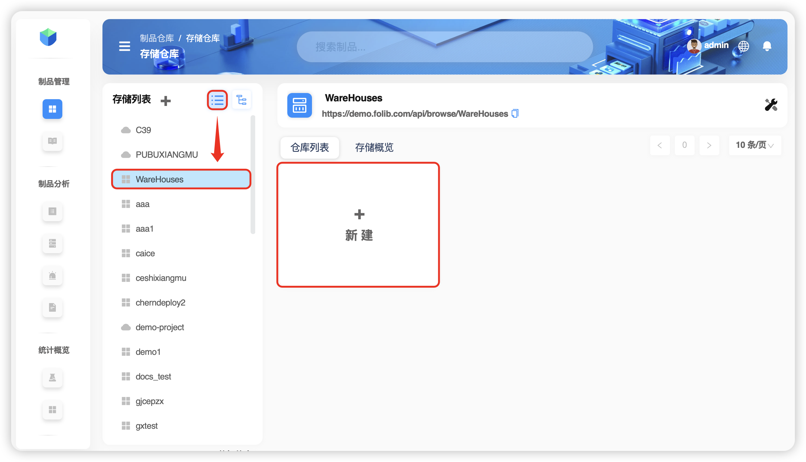

    + 在树形视图下，需先选中 *WareHouses* ，再选择树形视图，点击 **+** 按钮

    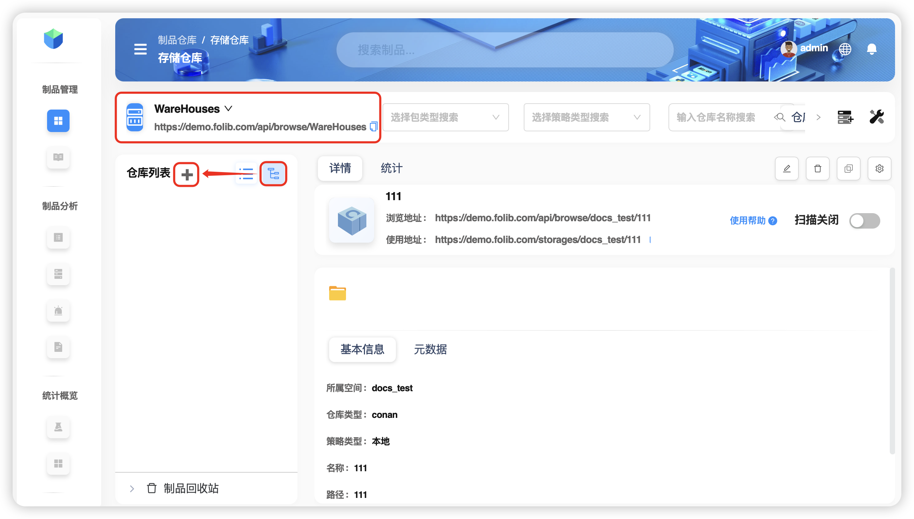

  

+ **步骤2：** 根据流程新建制品库

:::tip
📋 流程按钮说明

**回退：** 返回更改上一流程的配置

**下一步：** 进行下一步流程

**保存：** （配置基础信息时）之后的流程中使用默认配置，直接创建
:::

  

+ **流程1：** 选择 **仓库类型** 并点击下一步

🔎 **仓库类型** 支持详情查看 [🔍 仓库类型支持文档](../../docs/supplement-explanation/supplement-explanation-type-support.md)

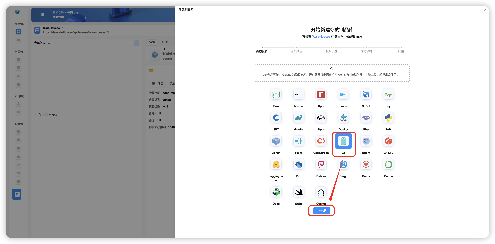

  

+ **流程2：** 基础信息配置（根据 **策略类型** 分为 **本地** 、**代理** 和 **组合**  ）

    + **本地策略**

    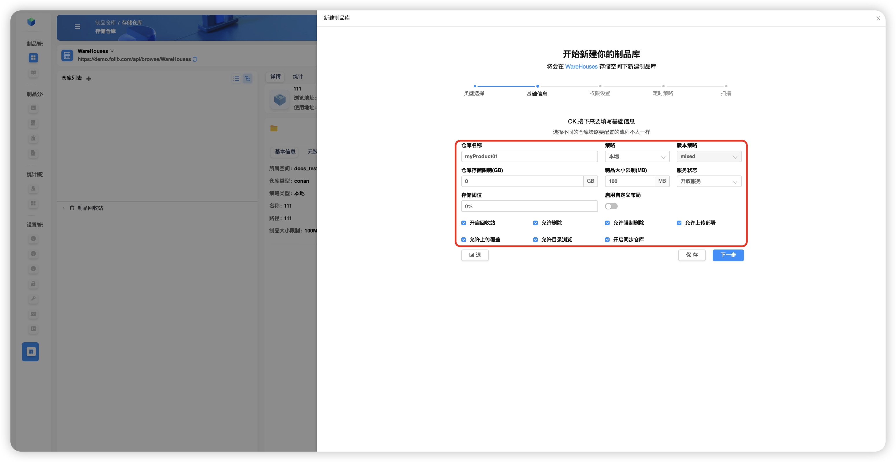

    |  术语名  | 术语阐释                                                                |
    | :------: |:--------------------------------------------------------------------|
    |  回收站  | 开启回收站在制品包删除后可以通过后,制品包处于逻辑删除状态，必要条件下可以通过api进行从回收站回收                  |
    |   删除   | 有的仓库可以设置不允许删除，则用户在使用过程中无法删除。通常使用一些重要的仓库，只允许新增不允许删除                  |
    |强制删除| 启用后，若在删除时选择强制删除，则无法恢复仓库列表                                           |
    | 上传部署 | 在本地类型仓库中，可以开启允许上传，则可以通过命令行工具，或者依赖工具进行上传制品安装包到仓库中                    |
    | 上传覆盖 | 开启该功能，则同版本好的制品安装包将会被直接覆盖，旧版本的则不保留，如果不开启，则默认通过小版本号（时间戳）进行，时间最新的则优先下载 |
    | 目录浏览 | 该功能是html Bower模式，可以通过浏览器进行浏览与下载该仓库的目录的文件。主要用来对外界开放使用                |
    | 同步仓库 | 该仓库可与设置好的其它仓库同步制品、元数据等                                              |

    完成后点击 **下一步** ，想更改类型点击 **回退** 。

    + **代理策略**

    **代理** 主要在当前制品库无法访问代理地址的情况下（例如内网环境），通过开启代理经过一个proxy来访问代理地址而使用的

    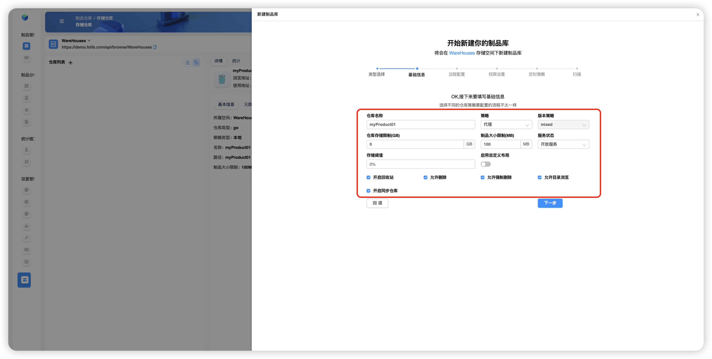

    **💡 代理策略需要进行远程配置**

    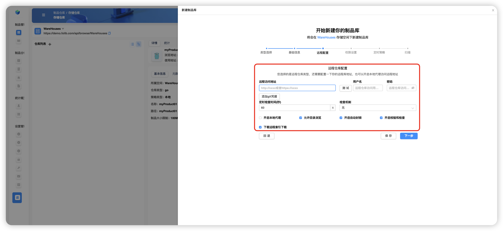

    |    术语名    | 术语阐释                                  |
    | :----------: |:--------------------------------------|
    | 远程访问地址 | 远程代理地址                                |
    | 定时检查时间 | 检查代理地址是否有效的时间周期                       |
    |   检查机制   | 检查代理地址是否有效的机制                         |
    |   本地代理   | 使用本地的代理。只有在当前制品库无法访问远程代理库的情况下，可以使用该功能 |
    | 远程索引下载 | 这里指的索引是maven索引                        |

    😺 开启 **本地代理** 需要的配置

    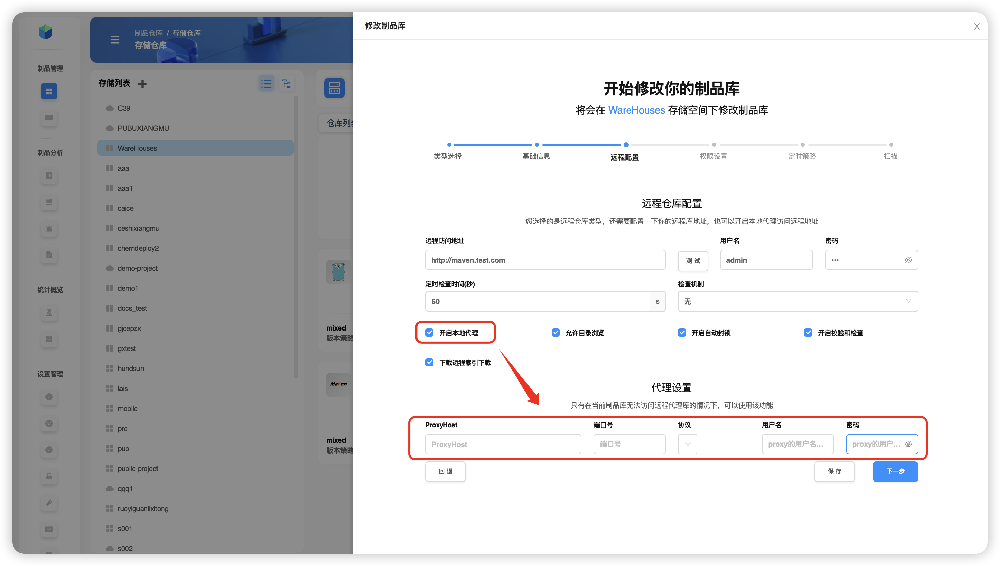

    完成后点击 **下一步** ，想更改基础信息点击 **回退** 。

    + **组合策略**

    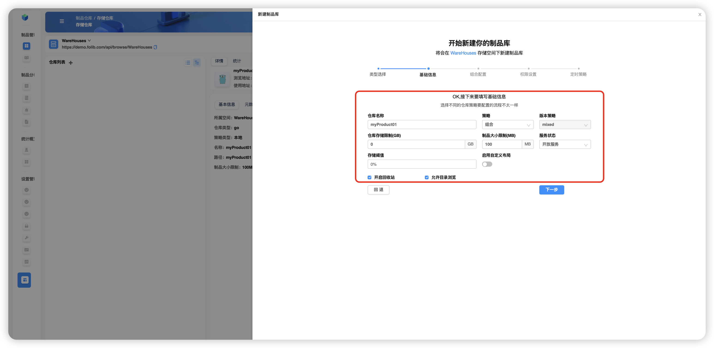

    **💡 组合策略需要进行组合配置**，从 **可选择制品仓库** （与创建制品库同类型）选择仓库，**拖拽** 到右边的组合仓库。

    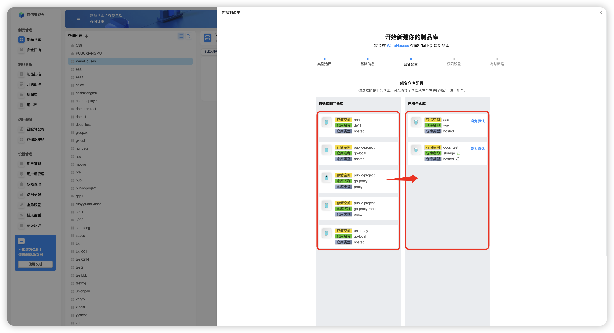

    完成后点击 **下一步** ，想更改基础信息点击 **回退** 。

  

+ **流程3：** 权限设置，选择 **开启** 还是 **关闭** 允许匿名访问，选择 **存储空间** 可见还是 **公开** 仓库的可见范围。详情可见本页 [权限设置](#权限设置)

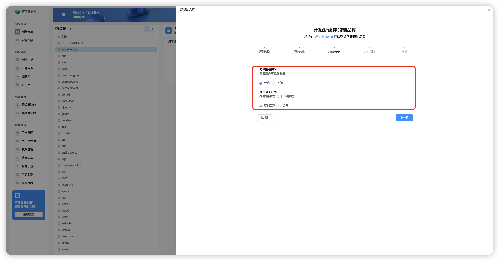

完成后点击 **下一步** ，想更改基础信息点击 **回退** 。

  

+ **流程4：** 设置定时策略。详情可见本页 [定时策略](#定时策略)

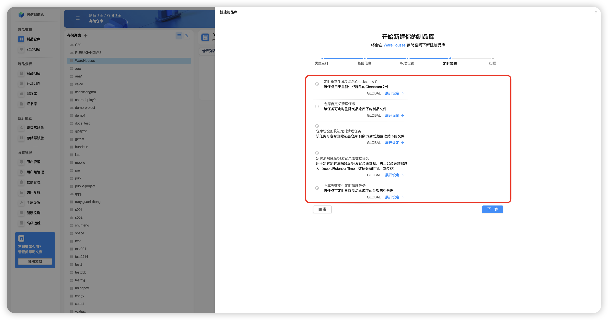

完成后点击 **下一步** ，想更改权限设置点击 **回退** 。

  

+ **流程5：** 扫描，选择 **开启** 或者 **关闭** 扫描功能。详情可见本页 [扫描](#扫描)

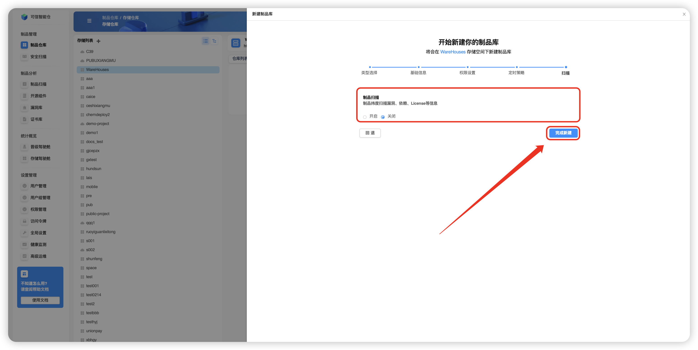 

点击 **完成新建** 按钮，即可成功创建制品库 🎉，若想更改定时策略点击 **回退** 。

:::tip
‼️ 组合策略不存在 **扫描** 功能
:::

## 修改制品库

### 修改入口

以修改存储空间 `WareHouse` 中的制品库 `myProduct01` 为例

+ 平面视图

在平面视图下，选中存储列表中的 `WareHouse` ，点击右侧的制品库 `myProduct01` 右上角的 **更多** 图标，会显示 **编辑按钮**。

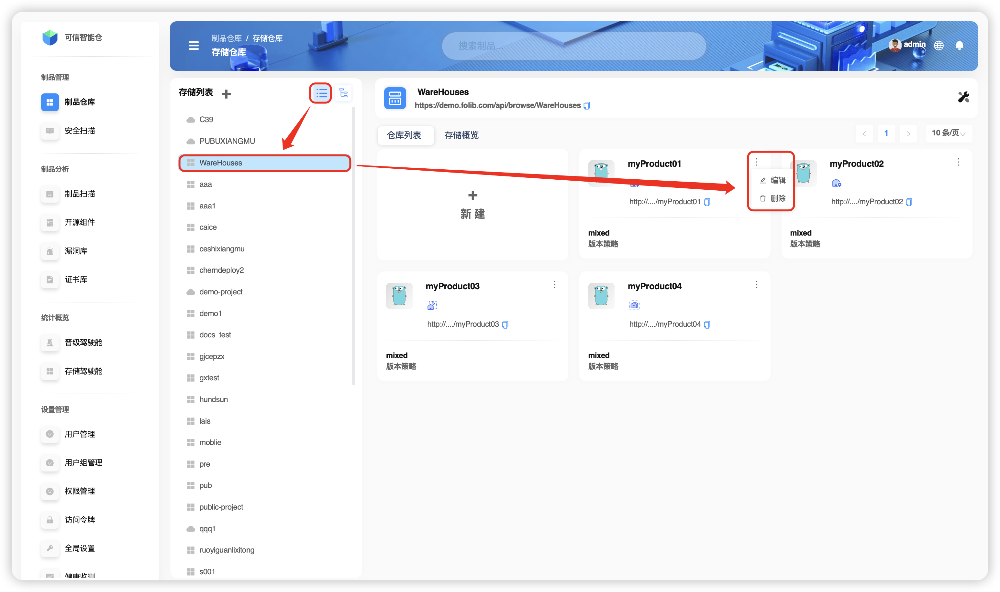

+ 树形视图

在树形视图下，需先选中存储列表中的 `WareHouse` ，点击 **树形展开** 按钮，再选中制品库 `myProduct01` ，点击右上角的 **修改** 图标。

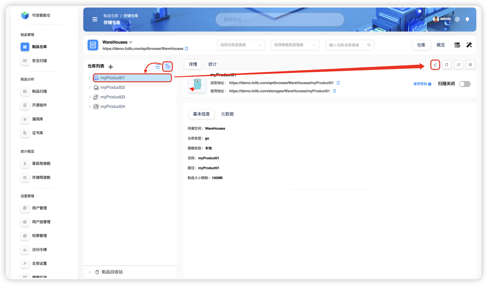

### 修改三种策略的制品库配置

:::tip
‼️ 不支持修改 **制品库类型**、**制品库名称**、**策略** 以及 **版本策略** 选项

💡 **修改流程** 与 **创建流程** 完全相同
:::

+ **本地策略**

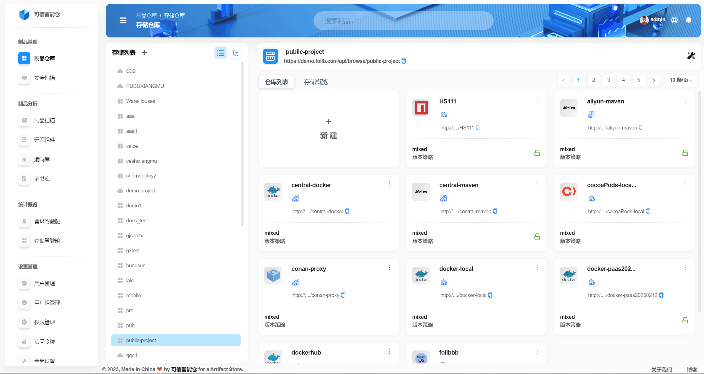

+ **代理策略**

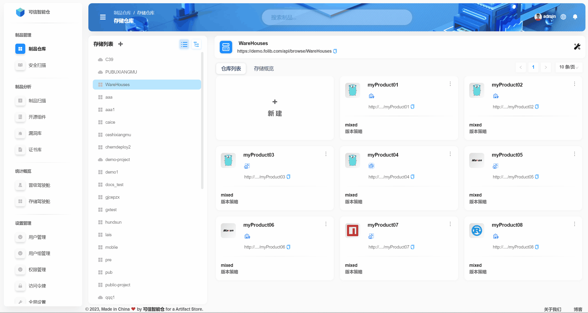

+ **组合策略**

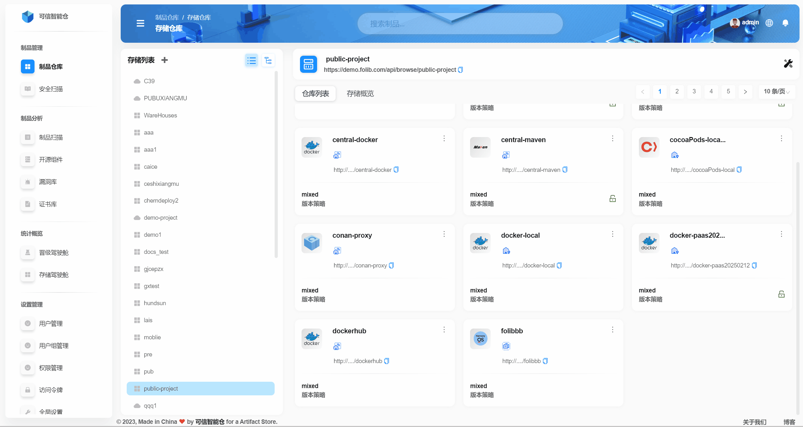

## 删除制品库

以修改存储空间 `WareHouse` 中的制品库 `myProduct06` 为例（该制品库创建时选择了允许 **强制删除**）

### 删除入口

+ 平面视图

在平面视图下，选中存储列表中的 `WareHouse` ，点击右侧的制品库 `myProduct06` 右上角的 **更多** 图标，会显示 **删除按钮** 。

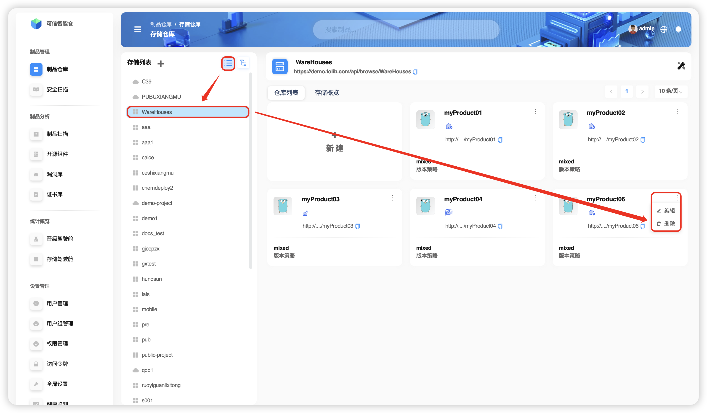

+ 树形视图

在树形视图下，需先选中存储列表中的 `WareHouse` ，点击 **树形展开** 按钮，再选中制品库 `myProduct06` ，点击右上角的 **删除** 图标。

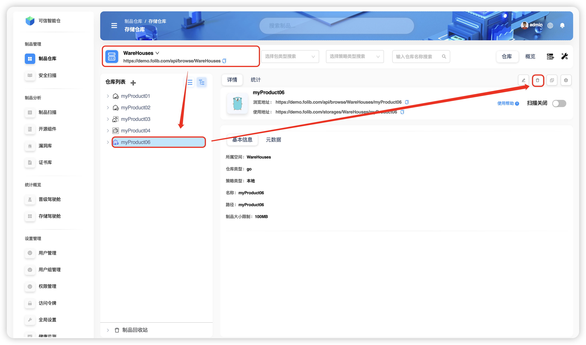

### 删除与强制删除

:::tip

若在创建时选择了 **允许强制删除**，可选择 **强制删除** 。但是为了不丢失内容，我们推荐普通 **删除**。

:::

输入制品库名称 `myProduct06` 后点击删除，即可删除成功 🎉。

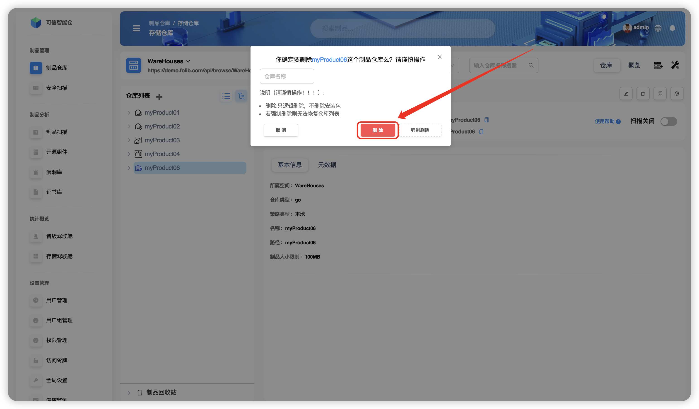

|    方式    | 对比                              |
| :--------: | :-------------------------------- |
|  删除 👍🏻   | 只删除存储配置，每日0点会定时清理 |
| 强制删除 ⚠️ | 完全删除且无法恢复仓库列表        |

## 制品仓库搜索

具体查看 [🔍 制品仓库搜索文档](../../docs/search-summary/search-summary-warehouse.md)

## 分发/晋级记录

支持针对单个仓库 **分发/晋级记录** 。

入口 ：选中要查看的 **制品库** ，点击右上角的 **记录** 按钮

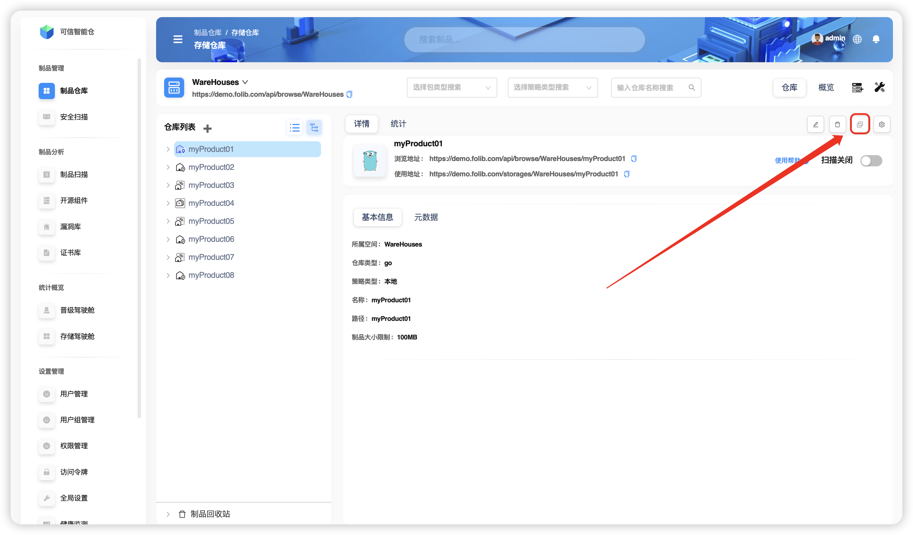

默认进入**分发/晋级记录**界面。支持查看目标路径信息以及进行对失败的记录进行补偿和查看具体失败原因的操作。

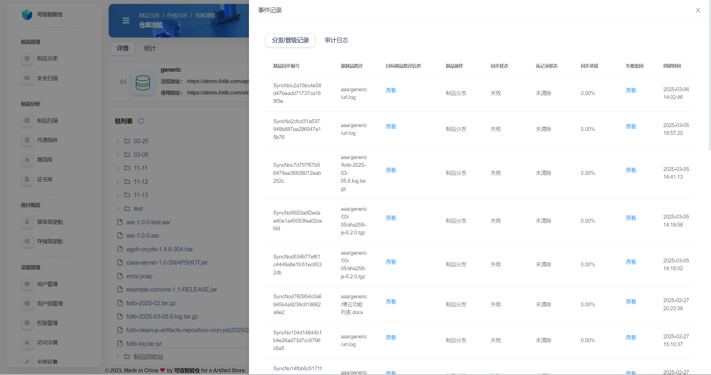

## 仓库设置

选中需要设置的仓库，点击右上角的 **齿轮** 图标进入。

支持进行 [权限设置](#权限设置)、[定时策略](#定时策略)、[扫描](#扫描) 操作设置，详情见本页使用手册后文。

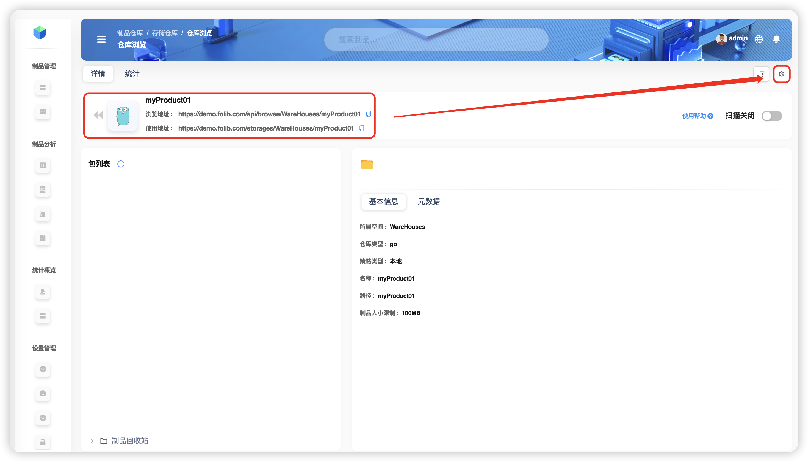

:::tip
💡 **仓库设置** 中的选项在 **创建** 时被设置，在 **修改** 和 **仓库设置** 中都可以修改。
:::

## 权限设置

点击 [仓库设置](#仓库设置) 中的左上角 **权限设置** 按钮。可设置是否允许匿名范围和仓库可见范围。

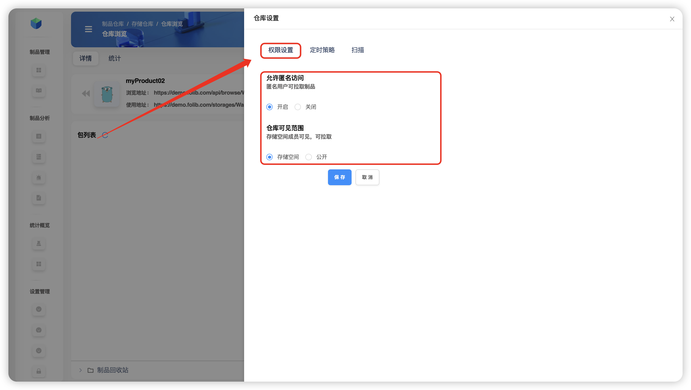

## 定时策略

点击 [仓库设置](#仓库设置) 中的 **定时策略** 按钮

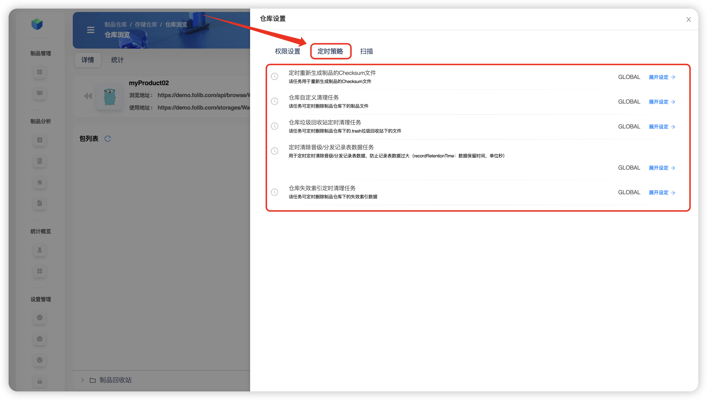

点击右侧 **展开设定** 查看进行详细配置。

:::tip
下图红线框是**Cron表达式**，用于配置定时策略的时间周期。Cron 表达式通常由 6 个部分组成，每个部分代表一个时间单位，从秒到年。
如：`0 0 2 * * ?` 表示每天凌晨 2 点执行任务：
* 0（秒）：在每分钟的第 0 秒。
* 0（分）：在每小时的第 0 分。
* 2（小时）：在每天的凌晨 2 点。
* *（日期）：表示每天。
* *（月份）：表示每个月。
* ?（星期几）：表示不指定星期几，即忽略星期几的限制。`
:::

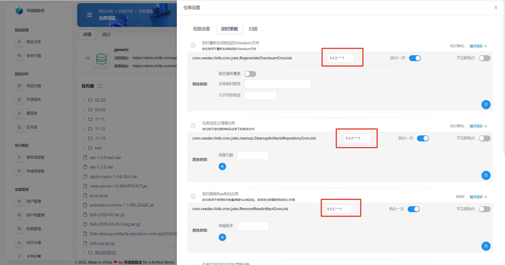

其它参数解释：

| 参数名称          | 描述                 |
|-------------------|--------------------|
| 循环执行          | 该任务会按照Cron表达式循环执行。 |
| storageDay        | 制品存储天数。            |
| forceRegeneration | 是否强制重新生成制品。        |
| basePath          | 用来指定仓库下的基础路径。      |

## 扫描

点击 [仓库设置](#仓库设置) 中的 **扫描** 按钮。可选择是否开启制品维度的漏洞、依赖、licence扫描功能。

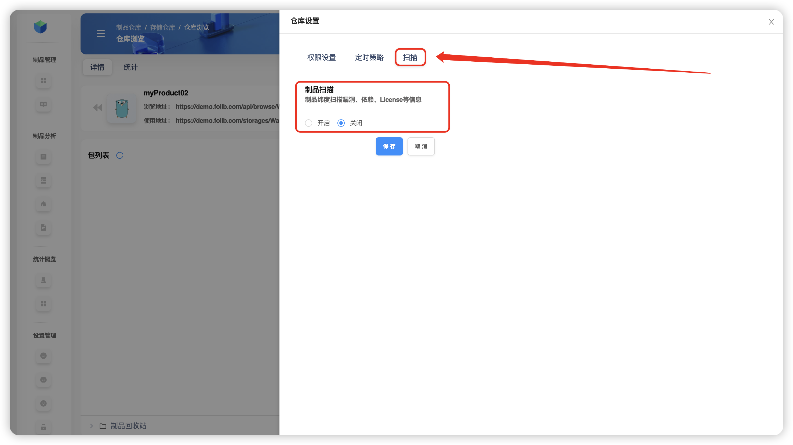

+ 扫描开关

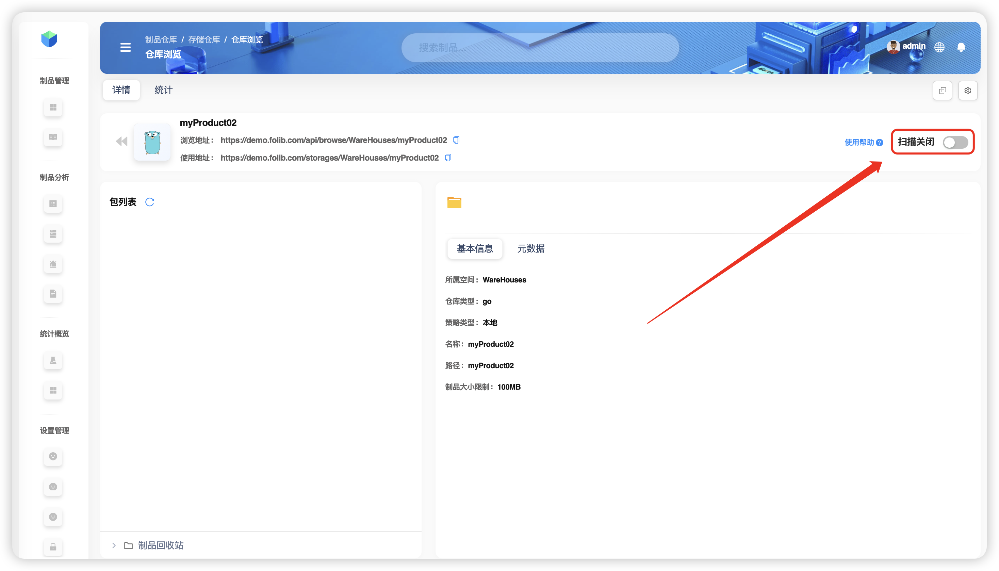