# 仓库概述

**制品仓库** 是一个集中存储和管理软件开发过程中产生的各种制品的平台。这些制品包括但不限于源代码、编译后的二进制文件、依赖库、配置文件、文档等。制品库的主要作用是提供一个统一的存储和版本控制平台，方便团队成员共享、获取和管理所需的制品。

本界面主要是对 **制品仓库** 的 **存储空间内部视角**、**仓库详情**页、**仓库统计**页的界面元素介绍。

## 界面说明

在 **存储空间内部视角** 下，该存储空间所拥有的仓库都陈列在页面的右侧。点击需要操作的 **仓库** 卡片，则进入该仓库的 **详情** 页面。

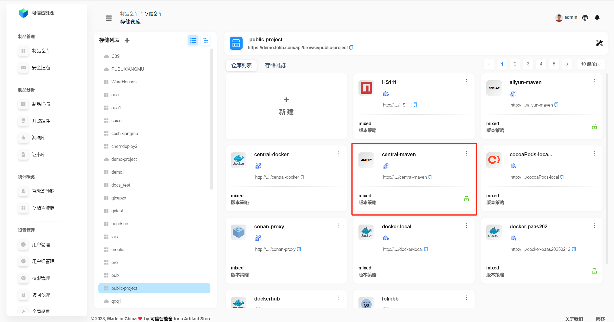

💡**存储空间内仓库的元素解释：**

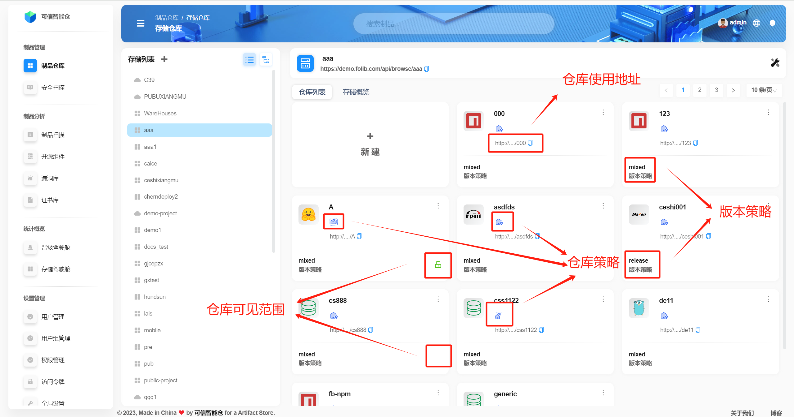

<table border="1">
    <tr>
        <th>元素</th>
        <th>解释</th>
    </tr>
    <tr>
        <td><strong>仓库使用地址</strong></td>
        <td>它是仓库在使用中的地址。使用的具体方式点击 <strong>仓库</strong> 卡片，进入 <strong>仓库详情页</strong> ，点击“<strong>使用说明</strong>”可见。</td>
    </tr>
    <tr>
        <td><strong>仓库可见范围</strong></td>
        <td>有  标识的仓库是 <strong>公共可见仓库</strong> ，所有成员可见，所有成员可拉取；没有此标识的仓库是 <strong>存储空间成员可见仓库</strong> ，仅存储空间成员可见，仅存储空间成员可拉取；此权限可在 <strong>仓库设置页</strong> 的 <strong>权限设置</strong> 中进行设置。</td>
    </tr>
    <tr>
        <td rowspan="3"><strong>仓库策略</strong></td>
        <td>
            
            <strong>本地策略：</strong> 本地表示本地私有化，通常情况下本地仓库主要用于一方、二方包的存放。
        </td>
    </tr>
    <tr>
        <td>
            
            <strong>代理策略：</strong> 代理仓库主要代理第三方依赖进行使用，比如代理 `aliyun`, `qinghua` 等外网源。当然，也可以代理公司内部的其他网络区域的制品仓库。
        </td>
    </tr>
    <tr>
        <td>
            
            <strong>组合策略：</strong> 组合仓库是一个虚拟的仓库，可以将同语言类型的不同仓库进行排序组合，以组合仓库统一对外开放使用。
        </td>
    </tr>
    <tr>
        <td rowspan="3"><strong>版本策略</strong></td>
        <td><strong>release：</strong> 仅允许存储和管理 <strong>发布版本（Release）</strong> 的制品包。适用于生产环境，确保版本的稳定性和一致性。</td>
    </tr>
    <tr>
        <td><strong>snapshot：</strong> 仅允许存储和管理 <strong>快照版本（Snapshot）</strong> 的制品包。适用于开发环境，支持快速迭代和频繁更新。</td>
    </tr>
    <tr>
        <td><strong>mixed：</strong> 允许同时存储 <strong>发布版本（Release）</strong> 和 <strong>快照版本（Snapshot）</strong> 的制品包。如果是代理库、组合库，通常选择 mixed 混合模式，兼顾灵活性和通用性。</td>
    </tr>
</table>

## 仓库详情

进入仓库后，默认显示 **详情** 。

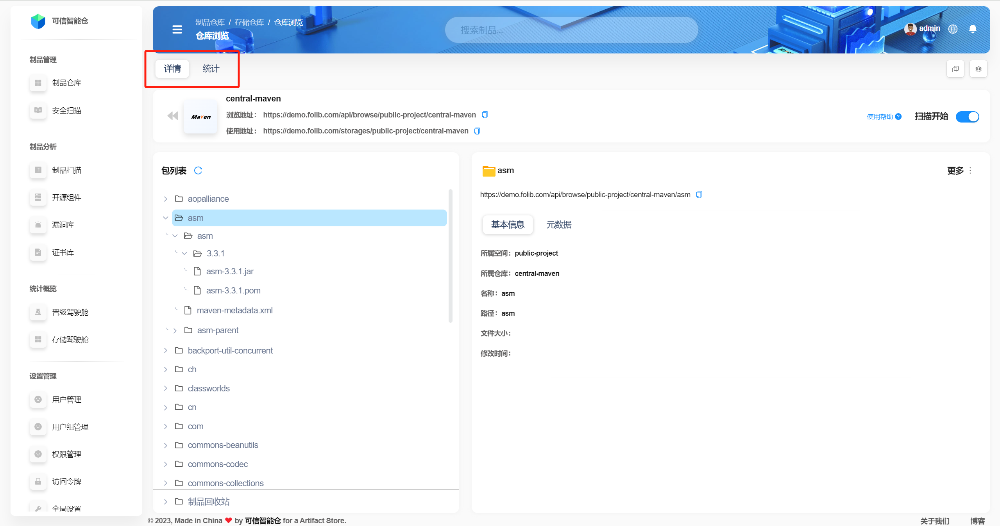

  

+  **浏览地址** 

是浏览 **仓库目录** 的地址。**点击** 此地址或 **复制粘贴至浏览器** 即可浏览 **仓库目录** 。也可点击地址上方的 **仓库名称**（如此图的generic） 浏览 **仓库目录** 。

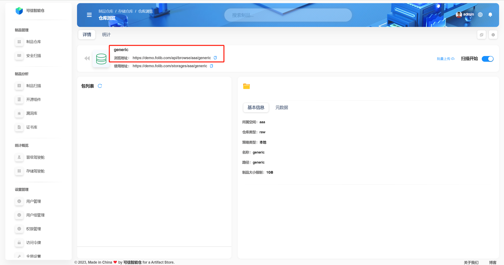

**仓库目录** 与 **仓库详情** 的 **包列表** 基本一致，展示此仓库所含的文件夹和文件。点击目标文件即可下载。

<table>
  <tr>
    <td>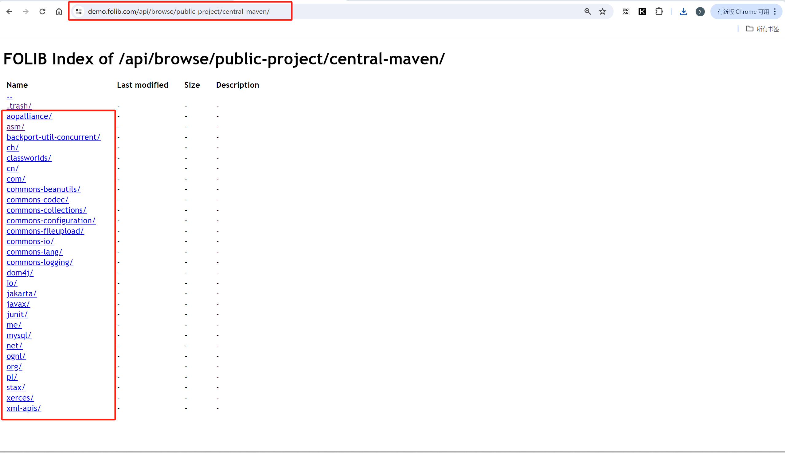</td>
    <td>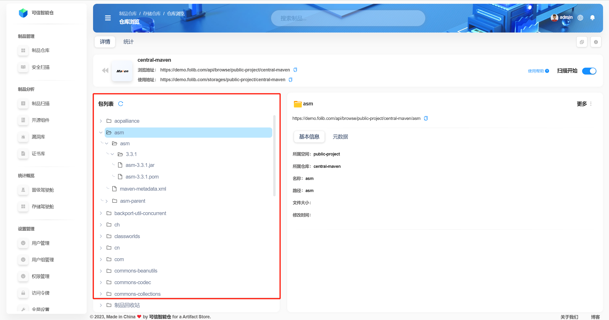</td>
  </tr>
</table>

  

+  **使用地址**

是仓库在使用中的地址。使用的具体方式点击右侧“**使用帮助**”，“**使用帮助**”根据仓库的类型不同而不同，如Maven类型的仓库的使用帮助与HuggingFace类型的仓库不同。
  
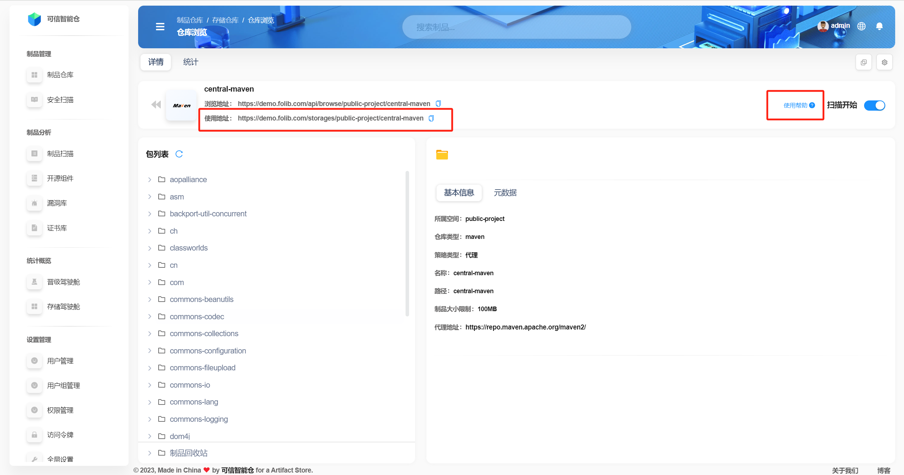

<table>
  <tr>
    <td></td>
    <td>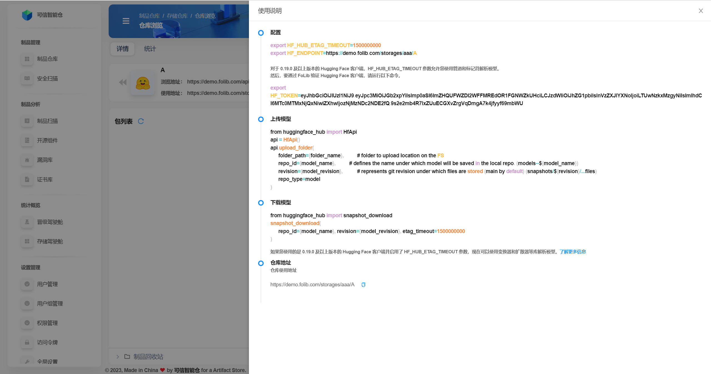</td>
  </tr>
</table>

  

+  **包列表** 

展示此仓库中所含的文件夹和文件。

点击列表中的文件夹/文件 **主体部分** ，可在右侧卡片中查看 **对应的文件夹/文件的基本信息和元数据** 。

点击文件夹左侧“<strong>&gt;</strong>”图标，展开该文件夹，显示其包含的子文件夹或子文件。

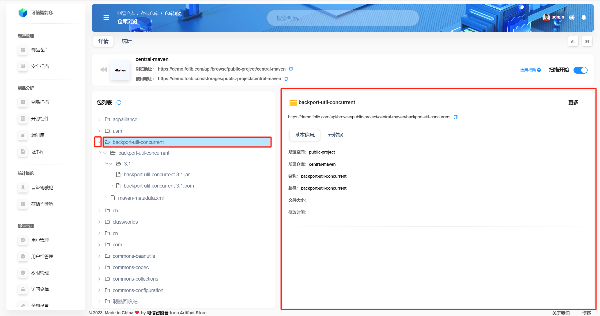

  

+  **基本信息** 

从仓库外部视图点进仓库时，默认显示该仓库的基本信息，展示在右侧卡片中。

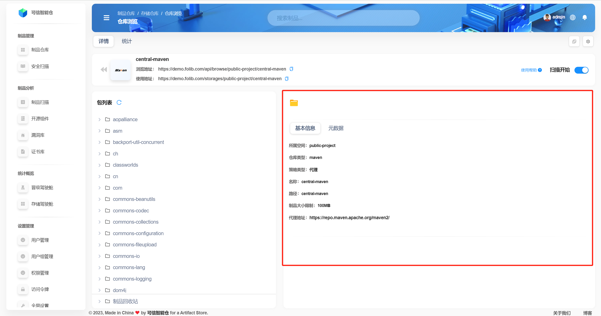

不同类型的仓库所显示的基本信息不同，名词解释如下：

* **三类仓库**均含的基本信息：

| 名词             | 解释                           |
|------------------|------------------------------|
| 所属空间         | 仓库所属的存储空间，用于组织和隔离不同项目或团队的资源。 |
| 仓库类型         | 仓库的类型，例如 Maven、Docker、npm 等。 |
| 策略类型         | 仓库的策略类型，含本地、代理、组合三种。         |
| 名称             | 仓库的名称，用于标识和引用。               |
| 路径             | 路径指其在包列表中的位置，仓库路径就是仓库名称。     |
| 制品大小限制     | 仓库允许存储的最大文件大小限制。             |

* 仅**代理仓库**含的基本信息：

| 名词            | 解释                                                                 |
|---------------|----------------------------------------------------------------------|
| 代理地址          | 代理仓库的上游地址，用于转发请求并获取资源。在内网环境中，当当前制品库无法直接访问外部资源时，可以通过配置代理服务器（proxy）来间接访问代理地址。                           |

* 仅**组合仓库**含的基本信息：

| 名词             | 解释                                                                 |
|------------------|----------------------------------------------------------------------|
| 组合仓库列表     | 组合仓库中包含的子仓库列表，这些子仓库可以是本地仓库、代理仓库或其他组合仓库。 |

  

+ **元数据** 

**仓库**、**非制品文件**（如xml文件等）没有元数据，**文件夹**和**制品文件**（如jar包、war包等）有元数据。

若要查看 **文件夹** 或 **制品文件** 的元数据解释，可查看使用手册[制品文件管理 - 制品概述](../warefile/warefile-outline.md) 。

  

+ **制品回收站**

选中目标文件，点击右上角“ **更多** ”，点击“ **删除** ”按钮，二次确认后即可删除。删除后的文件会进入 **制品回收站** ，可在 **包列表** 的最下一栏查看和恢复。

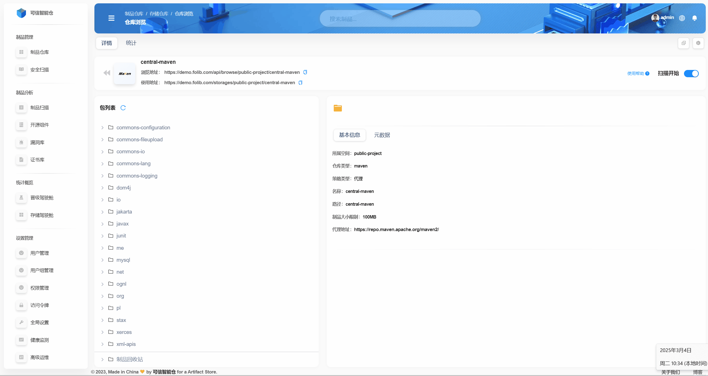

  

+ **分发/晋级事件查看**

点击右上 **方块** 图标，滑出**仓库事件记录页**。详情请见使用手册 [操作指南 - 分发/晋级记录](./warehouse-operation.md) 。

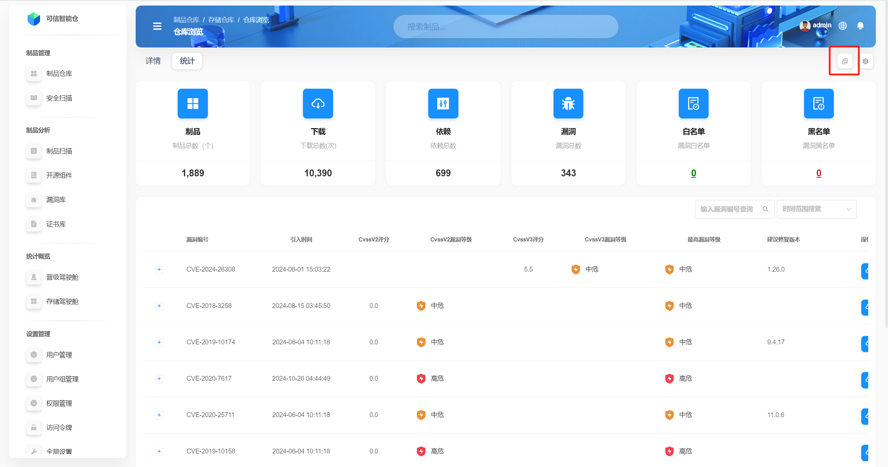

  

+ **仓库设置**

点击右上 **设置** 图标，滑出**仓库设置页** 。详情请见使用手册 [操作指南 - 仓库设置](./warehouse-operation.md) 。

  

+ **仓库扫描快捷键**

点击右上 **开启扫描** 切换状态，即可开启或关闭仓库的安全扫描。

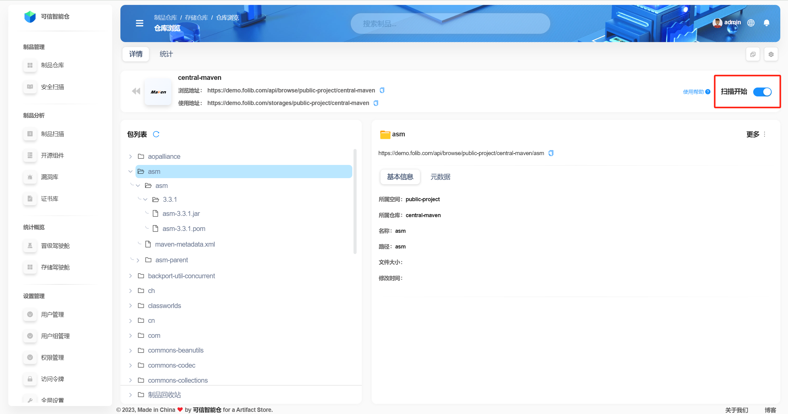

## 仓库统计

点击 **统计** 按钮，切换至 **仓库统计** 。

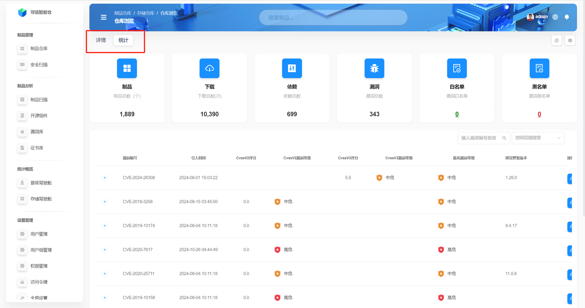

  

+ **统计数据**

下图数据是特定制品仓库的扫描结果。

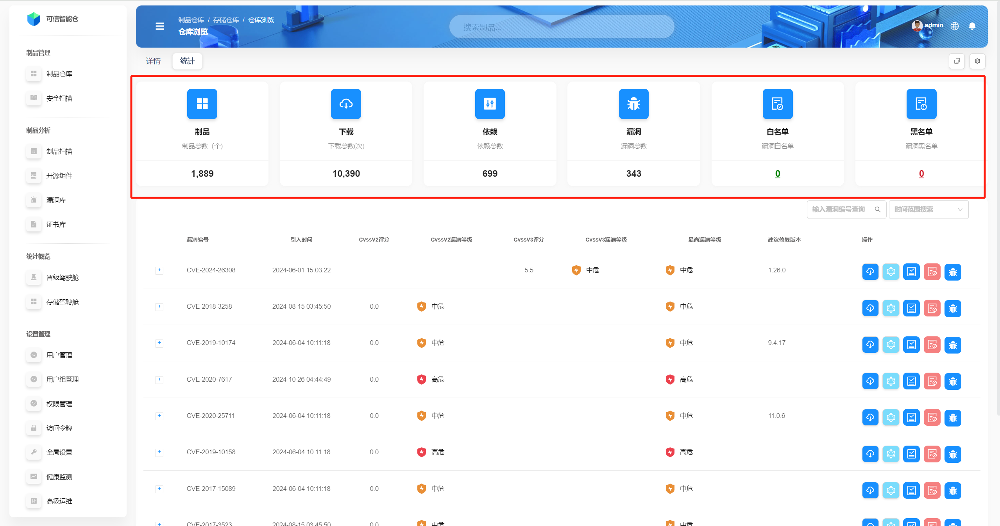

| 名词           | 解释                                                                 |
|----------------|----------------------------------------------------------------------|
| 制品总数       | 包列表下制品的总数，表示该列表中包含的制品数量。                     |
| 下载次数       | 包列表下制品的总下载次数，表示这些制品被下载的总频次。               |
| 依赖总数       | 包列表下依赖的总数，表示这些制品所依赖的其他组件或库的总数。         |
| 漏洞数         | 包列表下制品扫描出的漏洞数，表示这些制品中存在的安全漏洞数量。       |
| 白名单数       | 漏洞被添加到白名单的数量，表示被认定为可接受的漏洞数量。     |
| 黑名单数       | 漏洞被添加到黑名单的数量，表示被认定为不可接受或需要重点关注的漏洞数量。 |

  

+ **漏洞数据**

下方卡片呈现的数据是特定制品仓库中的漏洞数据。

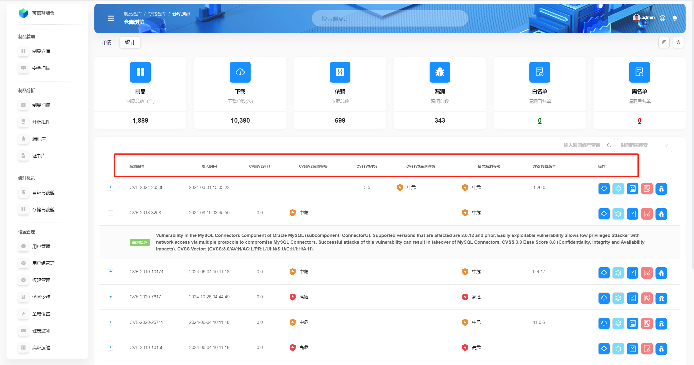

| 参数名称         | 解释                                 |
|------------------|------------------------------------|
| 漏洞编号         | 漏洞的唯一标识符，通常是一个编号或ID，用于区分不同的漏洞。     |
| 引入时间         | 漏洞被引入的时间。                     |
| CvssV2评分       | 根据CVSS（通用漏洞评分系统）版本2的评分，用于衡量漏洞的严重性。 |
| CvssV2漏洞等级   | 根据CVSS V2评分得出的漏洞等级，通常分为低危、中危、高危等。  |
| CvssV3评分       | 根据CVSS版本3的评分，用于衡量漏洞的严重性。           |
| CvssV3漏洞等级   | 根据CVSS V3评分得出的漏洞等级，通常分为低危、中危、高危等。  |
| 最高漏洞等级     | 在多个漏洞等级中，最高的漏洞等级，用于快速评估风险。         |
| 建议修复版本     | 建议升级到的版本，以修复该漏洞。                   |
| 操作             | 对漏洞的处理操作，详见下节“数据操作说明”。             |

  

+ **黑白名单查看**

	点击 **白名单** 、 **黑名单** 统计数据的卡片，即可查看该仓库对应的黑白名单列表。

    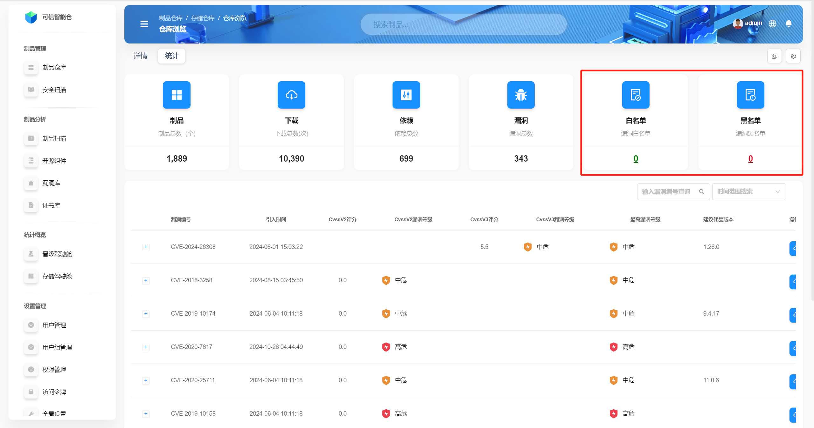

    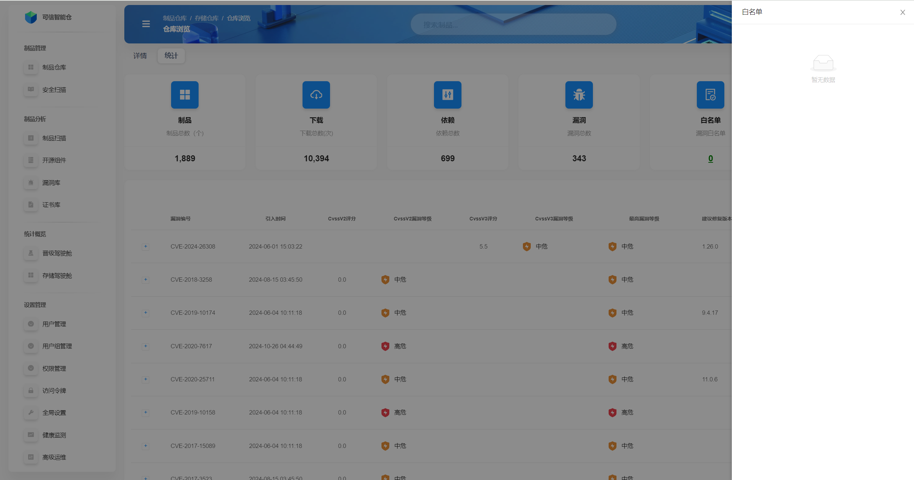

  

+ **漏洞描述查看**

  	点击漏洞左侧的“＋”图标，即可查看漏洞描述。

	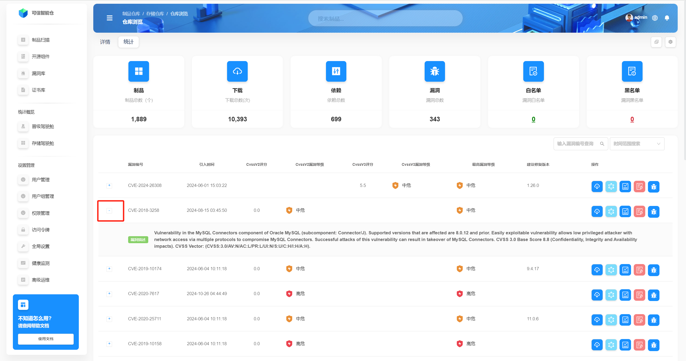

  

+ **漏洞查询**

	提供漏洞编号和时间范围两种查询方式。

	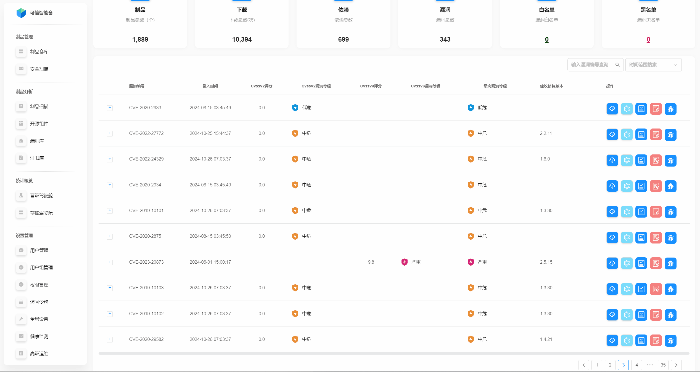

  

+ **漏洞操作**

  提供五种漏洞的相关操作，从左至右分别为：**下载**、**图谱**、**加入白名单**、**加入黑名单**、**漏洞制品列表查看**。

  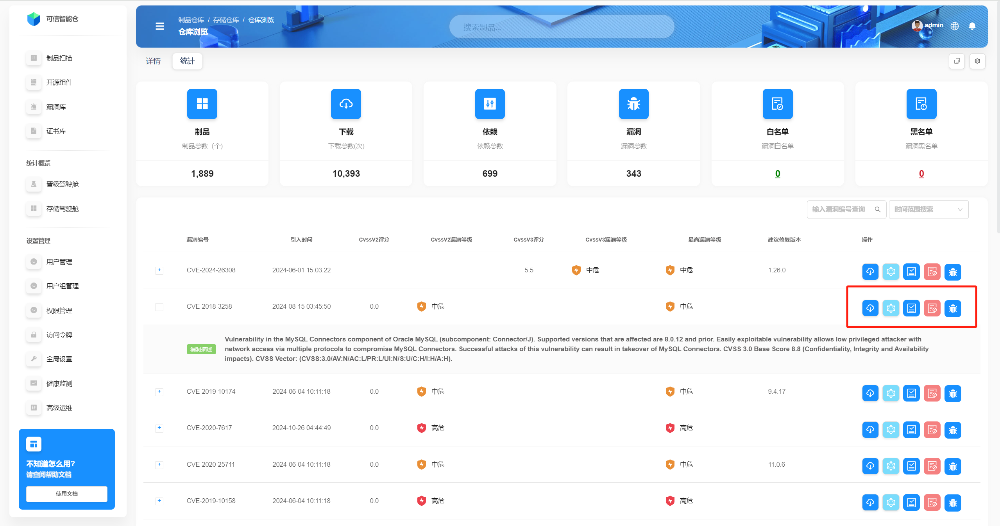

  * **下载**：点击下载按钮，即可将漏洞影响范围的excel表下载到本地。excel表示例如下：

  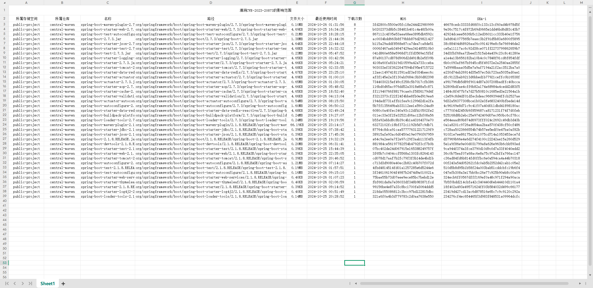

  * **图谱**：点击图谱按钮，即可查看漏洞影响范围的图谱。图谱示例如下：

  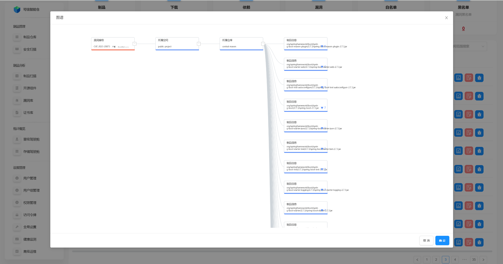

  * **加入黑/白名单**：点击加入黑/白名单按钮，即可将漏洞加入黑/白名单。操作示例如下：

  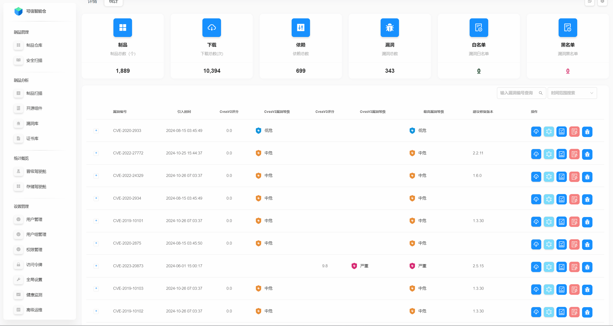

  * **漏洞制品列表查看**：点击漏洞制品列表查看按钮，即可查看漏洞影响的制品列表。列表示例如下：

  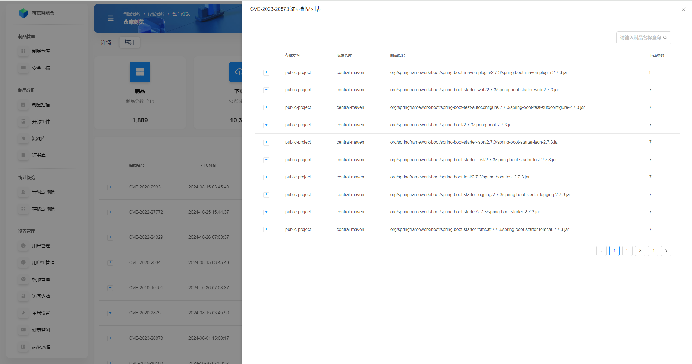