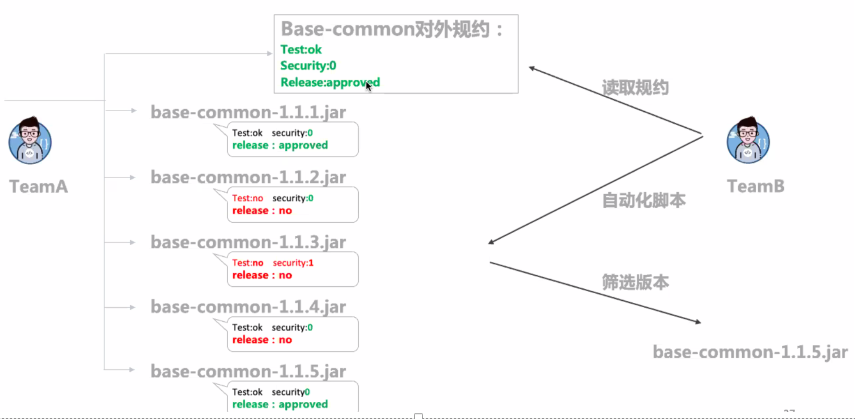
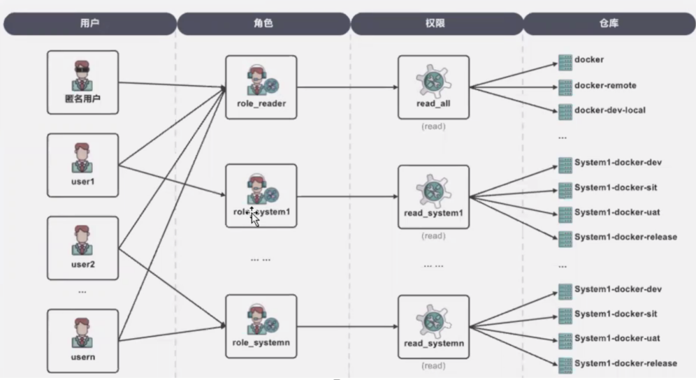
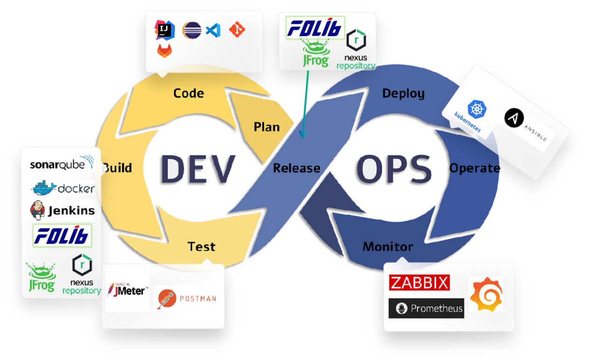
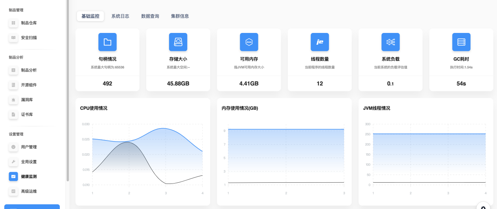

# 最佳实践

在针对制品管理时，我们应该遵循一些规范。

## 清晰的命名

制品库的命名应当清晰明了，易于理解和识别。可以采用一致的命名约定，包括对仓库、包和版本的命名。例如，命名可以包含项目名称、制品类型、版本号等信息，以便团队成员快速定位和识别所需的制品。

| 仓库名称 | 用途 | 注意事项 |
| :----: | :----: | :----: |
| `thirdparty-mvn-upload-local` | 用于配置管理人员手工上传第三方依赖组件 | 一般只对对部分团队临时开放，或者待审批的第三方组件，审批通过后升级到 `whitlist` 仓库|
| `thirdparty-mvn-whitelist-local` | 用于存放白名单组件向全公司共享公共组件 | 应由企业安全部门对该库进行监管，详细见第三方依赖引入 |
| `public-mvn-internal-local` | 用于存放企业内部分享的公共组件，向全公司共享公共组件 | `thirdparty-mvn-upload-local` 工具团队以及各个部门可以通过 `public-mvn-internal-local` 向全公司共享公共组件 |
| `teamN-mvn-snapshots-local` | 存放开发人员本地或持续集成系统 `develop` 分支构建产生的组件或制品 | 无 |
| `teamN-mvn-stage-local` | 存放持续集成系统构建产生的组件或制品一般是test分支或release分支 | 无 |
| `teamN-mvn-release-Ioca` | 存放测试通过的组件或制品 | 不允许覆盖，如需变更，应以版本号升级方式 |

## 规范的版本号

制品的版本号应当遵循一定的规范，有助于团队成员理解版本之间的变化和差异。常见的版本号规范包括语义化版本规范（`Semantic Versioning`），即主版本号.次版本号.修订版本号格式，以及可能的预发布版本和元数据版本等。通过规范化的版本号，可以更好地管理制品的迭代更新和发布流程。

1. **语义化版本规范（Semantic Versioning，SemVer）**：这是一种广泛采用的版本号规范，格式为 **主版本号.次版本号.修订版本号** 。具体规则如下：
	+ **主版本号（Major）**：当进行不兼容的 *API* 变动时，增加主版本号。
	+ **次版本号（Minor）**：当增加新功能，但保持向下兼容时，增加次版本号。
	+ **修订版本号（Patch）**：当进行向下兼容的 *bug* 修复时，增加修订版本号。
2. **预发布版本和元数据版本：** 在 *SemVer* 规范中，还可以包含预发布版本号和元数据版本号。预发布版本号用于标识尚未正式发布的预览版本，而元数据版本号用于在版本号之后添加额外的信息，例如构建号或提交哈希值等。
3. 遵循一致的发布流程：制定一致的发布流程，包括版本号的分配、测试、打标签和发布等步骤。确保团队成员了解并遵循这些流程，以保证版本号的一致性和可靠性。

## 权限管理与团队协作

制品库的权限管理是确保信息安全和团队协作的重要环节。根据团队成员的角色和职责，设置不同的权限级别，例如只读权限、读写权限等。同时，建立清晰的团队协作机制，促进团队成员之间的沟通和协作，确保制品库的有效管理和利用。

1. **角色和权限定义：** 根据团队成员的角色和职责，定义不同的权限级别。例如，制品库管理员可能需要完全的读写权限，而普通团队成员可能只需要读取权限。确保权限设置符合最小权限原则，即每个成员只拥有完成工作所需的最低权限。
2. **权限控制：** 利用制品库提供的权限控制功能，确保只有授权的人员能够访问和操作相关制品。定期审查和更新权限设置，以适应团队成员的变动和制品库的需求变化。
3. **清晰的团队协作机制：** 建立清晰的团队协作机制，包括沟通渠道、工作流程和责任分工等方面。确保团队成员了解彼此的工作进展和需求，协调工作计划并共同解决问题。

## 持续集成与持续交付

制品库与持续集成/持续交付（`CI/CD`）流程紧密结合，有助于提高开发效率和交付速度。通过自动化构建、测试和部署流程，及时发布和更新制品，确保团队的开发工作顺利进行，并降低人为错误和手动操作带来的风险。

1. **自动化构建和测试：** 将制品库与 *CI/CD* 流程集成，可以自动触发构建和测试过程，确保代码变更能够快速地进行编译、测试和验证。
2. **快速发布和更新：** 通过自动化部署流程，可以将经过测试的制品快速部署到生产环境，实现快速发布和更新，缩短交付周期。
3. **减少人为错误：** 自动化构建、测试和部署流程可以减少人为错误的可能性，提高软件质量和稳定性。
4. **降低风险：** 自动化流程可以降低手动操作带来的风险，确保每一次发布都是可重复、可靠的，减少潜在的故障点。
5. **增强团队协作：** *CI/CD* 流程的自动化可以增强团队成员之间的协作，使他们更加专注于编写代码和解决问题，而不是花费时间在手动构建和部署上。
6. **提高开发效率：** 自动化流程能够节省开发人员的时间和精力，提高开发效率，使团队能够更快地交付功能和解决问题。

## 监控与审计

建立制品库的监控与审计机制，定期检查制品库的运行状态和数据完整性，及时发现和处理异常情况。同时，记录和审计制品库的操作日志，追踪制品的变更历史和操作记录，确保制品的安全性和可追溯性。

1. **定期检查运行状态：** 设置监控系统，定期检查制品库的运行状态，包括性能、可用性和运行状况等方面，及时发现潜在的问题。
1. **数据完整性检查：** 定期验证制品库中的数据完整性，可以通过比对备份数据或使用哈希算法等方法来实现。
1. **异常检测与处理：** 建立异常检测机制，监控制品库操作和数据访问的异常情况，一旦发现异常，及时采取措施处理，并调查根本原因。
1. **操作日志记录：** 记录所有对制品库的操作，包括谁、何时以及做了什么样的操作，确保操作的可追溯性。
1. **变更历史追踪：** 记录制品库中制品的变更历史，包括新增、修改和删除操作，以便追踪制品的变更过程。
1. **审计制品库操作：** 定期进行审计，检查操作日志和变更历史，确保制品库的操作符合规定和政策要求。
1. **加强安全培训：** 对制品库管理员和用户进行安全培训，加强他们对安全意识和操作规程的理解和遵守。