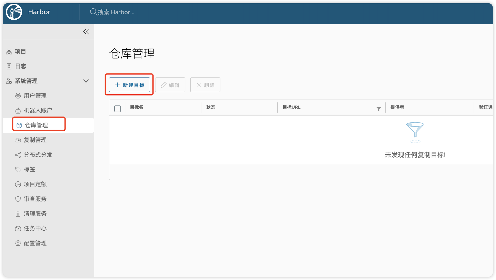
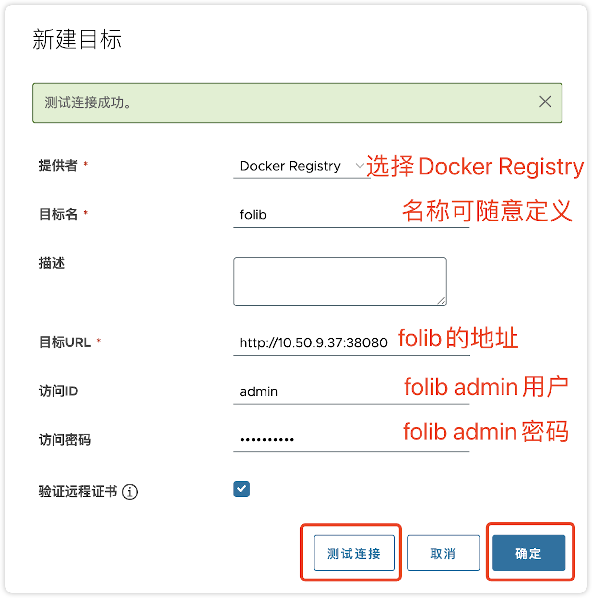
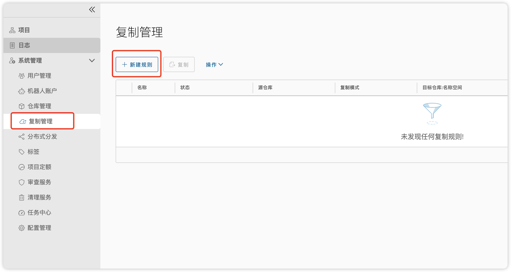
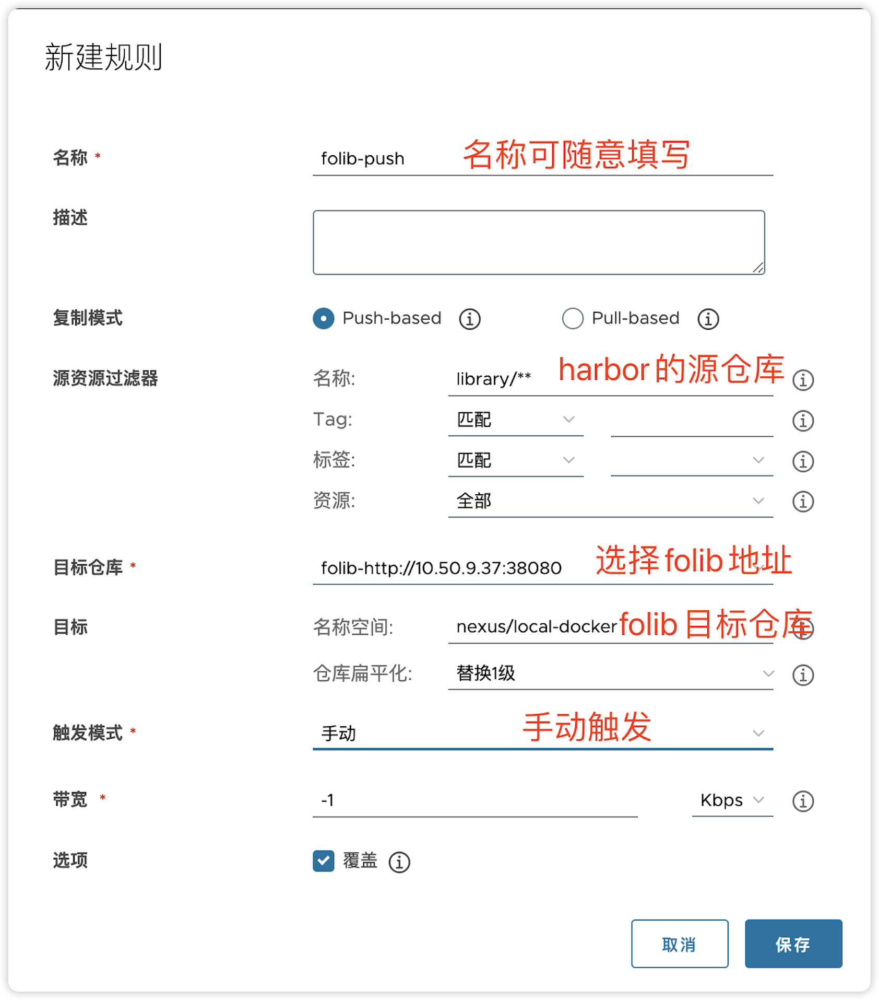
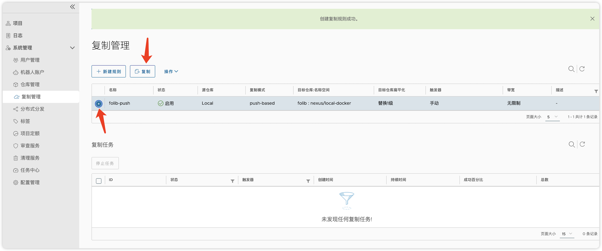
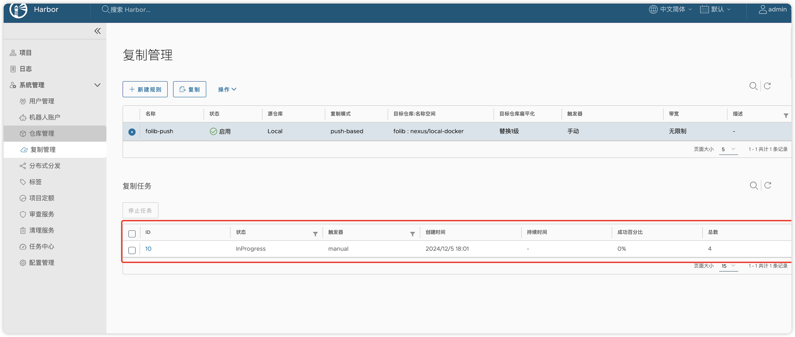

# Harbor容器镜像同步
## 一、在Harbor上新建Folib仓库信息
1. 登录Harbor管理界面，进入“系统管理”->“复制管理”页面。

 

  
  
 

2. 点击“新建目标”按钮，按以下信息填写：
    - **提供者**：选择“Docker Registry”。
    - **目标名**：自定义，如“folib”。
    - **目标URL**：填写Folib仓库地址，例如“http://10.50.9.37:38080”。
    - **访问ID**：Folib的admin或管理员用户账号。
    - **访问密码**：Folib的admin或管理员用户密码。
    - **验证远程证书**：根据实际情况勾选（若Folib使用自签名证书，需取消勾选）。

  

  
 

3. 点击“测试连接”，确保连接成功后点击“确定”保存。

## 二、创建同步规则

 

  
  
 

1. 在“复制管理”页面，点击“新建规则”按钮，按以下信息填写：
    - **名称**：自定义，如“folib-push”。
    - **复制模式**：选择“Push-based”（推模式，由Harbor主动推送镜像至Folib）。
    - **源资源过滤器**：
        - **名称**：填写源仓库路径，例如“library/**”表示同步library项目下的所有镜像。
        - **标签**：可选填镜像标签过滤规则（如“latest”），留空表示同步所有标签。
    - **目标仓库**：选择已创建的Folib目标（如“folib-http://10.50.9.37:38080”）。
    - **名称空间**：填写Folib的仓库路径，格式为“存储空间名称/Docker仓库名称”（如“nexus/local-docker”）。
    - **仓库扁平化**：
        - **作用**：减少镜像仓库层级结构，默认选择“替换1级”。
        - **示例**：若源仓库路径为“a/b/c/d/img”，目标名称空间为“ns”，选择“替换1级”后路径变为“ns/b/c/d/img”。
    - **触发模式**：选择“手动”（如需自动同步，可配置定时任务）。
    - **带宽**：默认“-1”表示无限制，可根据网络情况设置限速（单位：Kbps）。
2. 点击“保存”完成规则创建。

## 三、手动触发同步
1. 在“复制管理”页面找到已创建的同步规则（如“folib-push”），点击“操作”列的“复制”按钮手动触发同步。

 

  
 

2. 查看同步状态：
    - **InProgress**：同步中，可在“复制任务”列表查看进度。
    - **Succeeded**：同步成功，显示“成功百分比100%”及总镜像数。
    - **Failed**：若同步失败，检查网络连接、认证信息或镜像权限。
 

  
 

## 四、注意事项
1. **源仓库路径**：需从Harbor的“项目”中获取正确的仓库名称（如“library”项目对应“library/**”）。
2. **仓库扁平化配置**：若无特殊需求，保持“替换1级”即可，避免层级过深导致镜像路径混乱。
3. **权限问题**：确保Harbor用户对源仓库有读取权限，Folib用户对目标仓库有写入权限。
4. **证书问题**：若Folib使用HTTPS且证书不受信任，需在Harbor配置中取消“验证远程证书”勾选。
