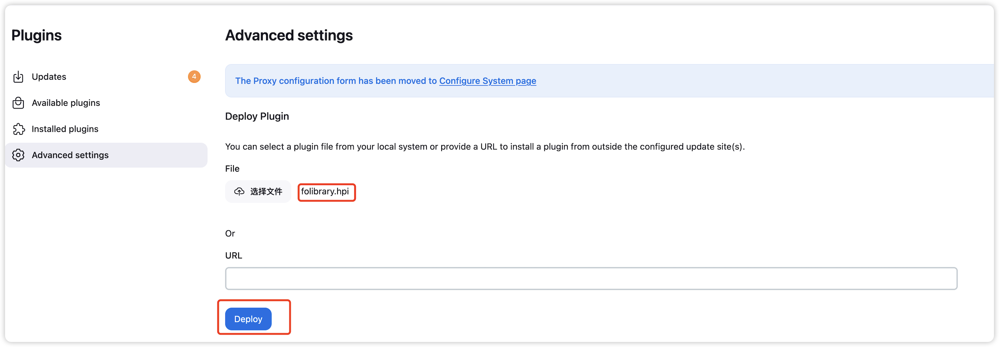
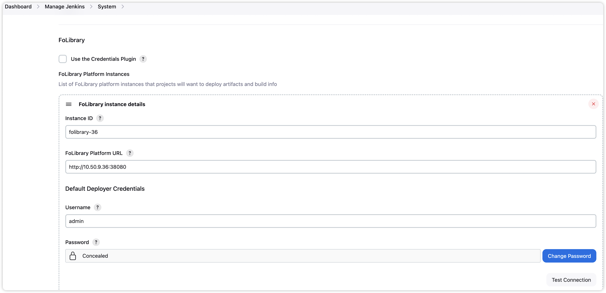
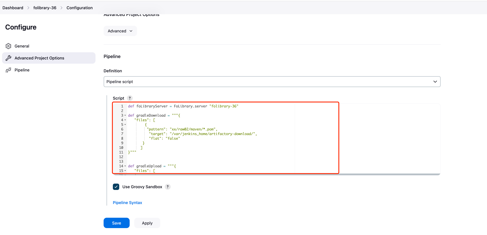

# FoLibrary的Jenkins插件使用说明
该插件主要用于Jenkins流水线中进行使用

## 插件安装方法

1. 登录jenkins后，点击**Manage Jenkins**，进入管理菜单 点击 **Plugins** 。进入插件安装界面。
<div style="display: flex; justify-content: space-between;">
  
</div>
2. 上传名称为`folibrary.hpi`的Jenkins插件，点击部署，等待部署完成。
:::tip
   若多次安装可能需要重启Jenkins才能生效
:::

## 插件配置方法

### **进入系统设置**

进入**Manage Jenkins** ➡️**System**菜单，找到**FoLibrary的配置项**
<div style="display: flex; justify-content: space-between;">
  
</div>

### **字段说明：**
- **Use the Credentials Plugin:**
使用Jenkins的认证凭据插件，则可以选择在Jenkins中已经设置好的凭据信息
- **Instance ID:**
FoLibrary实例ID，在流水线会用到，可设置多个实例，通过实例ID来指定使用		某个实例
- **FoLibrary Platform URL:**
FoLibrary的服务地址，格式为 {协议类型}://{IP|域名}:{端口号}
- **Username:**
FoLibrary的用户名，可以在不使用Jenkins的认证凭据插件的情况下使用
- **Password:**
FoLibrary的用户名对应的密码，可以在不使用Jenkins的认证凭据插件的情况下使用

:::tip
💡 Test Connection按钮可以测试实例的联通性
:::
## 如何在流水线中使用插件
在Jenkins job流水线中的 `pipeline script`脚本中进行使用该插件的相关方法即可。
<div style="display: flex; justify-content: space-between;">
  
</div>

## 插件常用的语法说明
+ 指定使用的folib节点
```groovy
def foLibraryServer = FoLibrary.server "实例名称"
例如：
def foLibraryServer = FoLibrary.server "folibrary-36"
```
+ 批量下载的语法
```groovy
def gradleDownload = """{
	"files": [{
		"pattern": "必传参数，匹配路径",
		"target": "必传参数，文件下载到本地的位置",
		"flat": "非必传参数，是否创建子目录，true创建子目录，false不创建子目录。默认为false
       },"
	}]
}"""
例如：
def gradleDownload = """{
	"files": [{
		"pattern": "jfrog/local-generic/12-19/*.xml",
		"target": "/var/jenkins_home/artifactory-download/",
		"flat": "false"
	}]
}"""
```
+ 批量上传的语法
```groovy
def gradleUpload = """{
	"files": [{
		"pattern": "必传参数，匹配路径",
		"target": "必传参数，文件上传到仓库的位置，格式 {存储空间}/{仓库}/{目录路径}",
		"flat": "非必传参数，是否创建子目录，true创建子目录，false不创建子目录。默认为true",
		"props": "非必传参数，元数据信息，格式 key=value;key=value;key=value"
	}]
}"""
//例如：
def gradleUpload = """{
	"files": [{
		"pattern": "/var/jenkins_home/artifactory-download/*.html",
		"target": "jfrog/local-raw/03-24",
		"flat": "false",
		"props": "type=file;version=1.0"
	}]
}"""
pipeline {
    agent any
    stages {
        stage('Demo') {
            steps {
                script{
                    echo "Step start upload------------------------"
                    #执行批量上传
                    foLibraryServer.upload(spec: gradleUpload)
                    echo "Step start download------------------------"
                    #执行批量下载
                    foLibraryServer.download(spec: gradleDownload)
                }
            }
        }
    }
}


```

:::tip
除了该插件的使用以外， 您也可以使用 `folib`命令行工具在流水线中通过`shell` 脚本进行操作
:::


