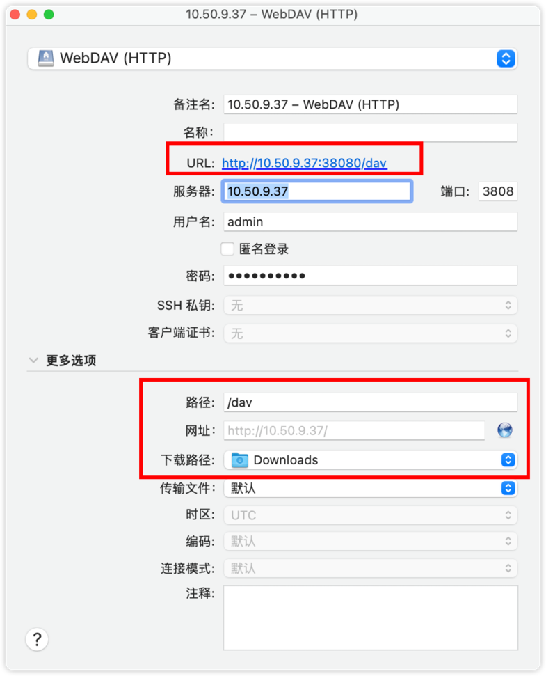
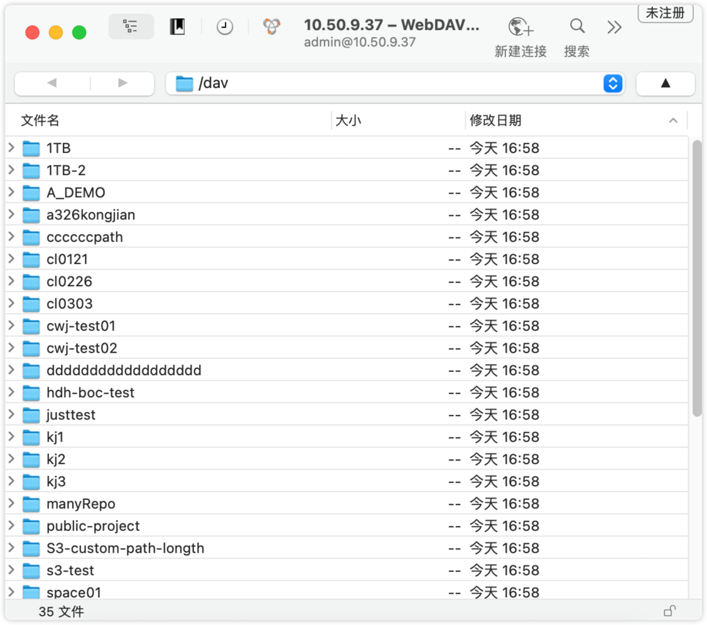
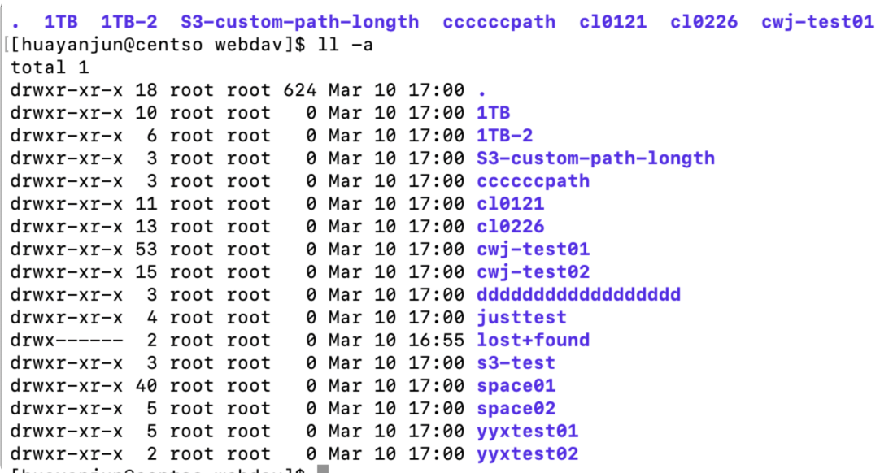

# WebDAV 支持文档

您可以将仓库当做网盘直接挂载到您的设备上进行使用
## 文档概述

`Folib` 支持 `WebdAV` 。本文档是对 `webdav` 操作的示例，在示例中 `webdav` 的根目录是 `/dav` 。

## 功能介绍

+ **客户端访问**

以下载和安装 `syberduck` 为例：

通过客户端连接 `webdav`服务，测试目录展示复制、上传、下载、移动、删除等功能

:::tip
💡 仓库仅展示本地仓库,先进行配置，在进行查看，如下图
:::
<div style="display: flex; justify-content: space-between;">
  
  
</div>

+ *linux* **挂载**

	+ **安装** *davfs2*

	```sh
    sudo yum install epel-release -y

    sudo yum install davfs2
    ```

    + **创建挂载目录**

    ```sh
    sudo mkdir -p /mnt/webdav
    ```

    + **挂载时按要求输入账号名和密码**

	```sh
    sudo mount -t davfs http://10.50.9.37:38080/dav  /mnt/webdav
    ```

:::tip
注意，http://10.50.9.37:38080 这个指的是folib的服务地址，如果采用的是负载均衡，需要改为负载均衡地址和端口
:::
    + **进入** */mnt/webdav* **可以展示存储空间开始的目录结构**


